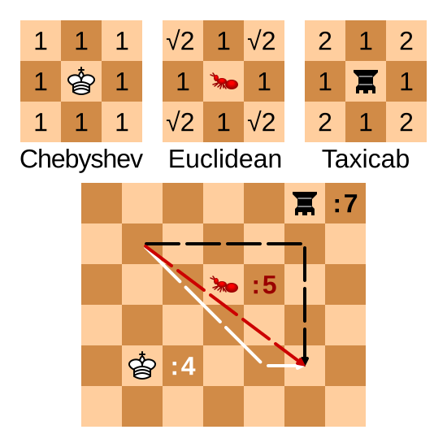

# Design and Analysis of Algorithms  

## Module 10: 

### Graph search odds and ends; Graph modelling

<br>
<br>

Slides © Grant Williams, [CC BY-SA 4.0](https://creativecommons.org/licenses/by-sa/4.0/).  

<br>

This is an open educational resource.
Feel free to submit fixes, improvements, and new material [here](https://github.com/grantwill74/notes-on-algorithm-design).

---

# Last week

Last week we covered a lot of material in a short space:
- Graph representations in code
- Searching strategies
- The flood-fill algorithm
- The ever-important Dijkstra's algorithm

---

# This week

Ever-important? Yes! This week we're going to see how we can solve problems that don't even look like graph problems using Dijkstra's algorithm.

We're also going to see how to solve problems that *do* look like graph problems but that are much more difficult.

But first, there's an important odd or end I want to cover before we move on: A\*

---

# Motivating A\*

Recall that Dijkstra's algorithm worked roughly like this:
- Consider every path we know about, sorted by total length
- Take the shortest path we haven't explored
- If it's the destination, great.
- If not, record where we came from and add paths to all the neighbors.

The reason Dijkstra's algorithm works is that we explore every path strictly in
order of how long it is. Therefore, once we find a path that reaches the goal,
we know we're done (any other paths are longer).

But that doesn't seem very...*intelligent*.

---

# How do we solve the problem?

Watch this animation of Dijkstra's algorithm. What do you notice?


<div class="footnote">

[Animation](https://en.wikipedia.org/wiki/File:Dijkstras_progress_animation.gif) by [Subh83 (Subhrajit Bhattacharya)](https://en.wikipedia.org/wiki/User:Subh83?rdfrom=commons:User:Subh83). 
License: [CC BY 3.0](https://creativecommons.org/licenses/by/3.0/deed.en).

</div>

---

# It's very similar to breadth first

Remember the problem we discussed last class: the two islands with the bridge?

We solved that problem with a breadth-first search. Because there was no notion of "cost" (every tile "cost" the same), this gave us what we wanted. We wanted to search in concentric "rings" around the first island.

When the weights are all the same, that's what Dijkstra's algorithm does. It's lowest-cost-first search, which is breadth-first search when the costs are all the same.

And why might that not be desireable?

---

# It's slow

Notice that we end up searching almost every node.

This is *not* how a human would approach the problem. Most of us would start moving in the direction of the goal. 

If we hit an obstacle, we'd try to go around it.

---

# Why not do that?

The problem with just going straight to the goal and trying to work our way around obstacles is that we can get caught in  *concavities*. 

When that happens, we need to remember where we came from and backtrack.

If we don't backtrack, we end up getting stuck, like these monsters in Gauntlet.


<div class="footnote">

[Animation](https://www.c64-wiki.com/wiki/File:Gauntlet.gif) from [c64-wiki.com](https://www.c64-wiki.com/wiki/Gauntlet)

</div>

---

# Backtracking

The issue with backtracking is that is has the potential to go very wrong.

We could end up getting lost down many dark hallways over and over again, making progress very slowly. 

Also, suppose we find the goal: we might not have taken the shortest path! So we would still need to "relax" our solution by exploring more, which takes longer.

---

# Algorithm design goal

Ideally, we want some way to combine two behaviors:
- Considering all possible paths simultaneously, so that we get that nice feature of Dijkstra's of being able to stop when we reach the goal.
- "Bee-lining" toward the goal when available. Or at the very least, being biased towards searching paths that move us physically closer to the goal.

There is at least one algorithm that accomplishes both of these: A\*.

---

# A\*

[A\*](https://en.wikipedia.org/wiki/A*_search_algorithm), pronounced "EY-star", was the result of a [Stanford Research Institute](https://en.wikipedia.org/wiki/SRI_International) project to get [Shakey the Robot](https://en.wikipedia.org/wiki/Shakey_the_robot) to move around an interactive maze successfully.

You might be expecting a radically different algorithm than Dijkstra's, because of the need to balance efficient searching with guaranteeing optimal paths.

Actually, A\* is literally just Dijkstra's algorithm, but we compute the cost of a path slightly differently.

---

# Path costs

Instead of sorting paths by their total cost so far, we sort them by this:
Total cost so far + estimated cost to goal

In math, instead of total cost by itself, we compute: $\mathrm{cost} = g(x) + h(x)$,
where $g(x)$ is the cost so far, and $h(x)$ is an estimate of the cost to the goal. The $h$ stands for "heuristic", which basically means "guess".

That's it. We just add this additional estimate of "how far is the goal from here" to the cost of the path, and just run Dijkstra's like normal.

Why does that help? Because it means we're less likely to go backwards. The nodes in the opposite direction of the goal will have a very high $h(x)$, so we'll consider fewer of them.

---

# A\* animation

Notice how it "bee-lines" straight to the path before getting stuck.

It does this several times, because each "bee-line" potentially be the one that gets through.

This might seem inefficient, but notice that it searches fewer nodes total than Dijkstra's algo did.

![bg right height:100% width:100% An animation similar to the one showing off Dijkstra's algorithm's search strategy, but using A-star instead. There is still a concave obstacle in the same place, but now, instead of searching in "rings" around the source, it "bee-lines" straight to the destination, running into the concavity. It runs into the concavity several times, bee-lining it over and over with adjacent paths, before finally trying a couple that go around, eventually reaching the destination. Despite this "hitting the wall" behavior, it ends up searching fewer nodes than Dijkstra's algorithm did, indicating greater efficiency.](Astar_progress_animation.gif)

<div class="footnote">

[Animation](https://commons.wikimedia.org/wiki/File:Astar_progress_animation.gif) by [Subh83 (Subhrajit Bhattacharya)](https://en.wikipedia.org/wiki/User:Subh83?rdfrom=commons:User:Subh83). 
License: [CC BY 3.0](https://creativecommons.org/licenses/by/3.0/deed.en).

</div>

---

# Another A\* animation

Notice how it doesn't search the little "caves" that move backwards from the goal.

Dijkstra's algorithm would have searched those.

The reason A\* doesn't is that they have a higher estimated cost than the nodes in a "forward" direction, even if their known cost is small.

![bg right:50% width:100% height:50% Another animation demonstrating A-star, this time searching through a grid-like environment with many obstacles. We see a series of paths snaking through the grid, gradually getting longer. The paths it considers start in the north-west and are generally moving in the direction of the south-east (the goal). Of note is the fact that it does not search in little "caves" that are moving "backwards" from the goal, wheras Dijkstra's algorithm would search those "caves".](Astarpathfinding.gif)

<div class="footnote">

[Animation](https://en.wikipedia.org/wiki/File:Astarpathfinding.gif) by "Wgullyn". License: [CC BY-SA 4.0](https://creativecommons.org/licenses/by-sa/4.0/deed.en)

</div>

---

# How to do A\*

- Literally just do Dijkstra
- But when it comes time to add your path to the queue, don't do this:
  `path = {source: X, dest: Y, cost: cost_so_far + cost[X][Y]}`
- Instead, do this:
  `path = {source: X, dest: Y, cost: cost_so_far + cost[X][Y] + estimate[Y]}`
- That's it. You're using A\* now.

---

# Generating that estimate

Okay, so how do we generate an estimate?

First, we call it a *heuristic* from now on. Not an estimate. That's the technical term for the estimate that A\* uses. We see this term a lot in algorithms when you have a choice, and some choices are better than others, but the algorithm leaves it up to you.

The most common heuristic is the straight-line, as-the-crow-flies distance to the goal. 

That is, if we're on a grid, and each cell $i$ is at $x_i, y_i$, and the goal is $x_d, y_d$, then we compute the distance between $x_i, y_i$ and $x_d, y_d$ as the heuristic for cell $i$.

How do we do that?

---

# The Pythagorean theorem

We can use the [Pythagorean theorem](https://en.wikipedia.org/wiki/Pythagorean_theorem).

The value we want is the hypotenuse, and the side-lengths are the axis-distances:
$d = \sqrt{(x_d - x_i)^2 + (y_d - y_i)^2}$

This is the most common choice of heuristic. It also has some nice properties in Euclidian space, which we'll look at next:
- It is *admissible*
- It is *consistent*

---

# Admissibility

It turns out, we can't just use any heuristic as $h(i)$.

For classic A\*, one standard requirement for $h(i)$ is that it be "admissible", which means that it never overestimates the true cost.

Note: *under*estimates are fine and expected. We certainly don't want an heuristic that has to be exactly right, or else we might as well not have one at all.

But we're not supposed to use a heuristic that *over*estimates the distance.

Why do you think that is?

---

# Admissibility (2)

Because the heuristic $h(i)$ for a cell $i$ is used along with the total cost to sort the paths in the priority queue.

Recall that with Dijkstra's algorithm, we want to stop as soon as we process a path to the goal.

If we have a heuristic that overestimates the distance of some cells, we might choose not to explore them, even if they contained the actual shortest path.

This means we "missed" the shortest path, and the path we found is sub-optimal.

---

# Consistency

For A\* based on classic Dijkstra's algorithm, where we only permit one of each destination cell in the priority queue at a time, admissibility is all we need to guarantee the correct shortest path.

However, if we want to use the lazy version (and we probably do), then admissibility is not enough, we instead need *consistency*.

A heuristic is consistent if it not only does not overestimate the distance to the goal, but also doesn't overestimate the distance between any nodes in the graph.

---

# Why do we need consistency in lazy A\*?

For the lazy-A\*/Dijkstra, we assume that we have found the shortest path to a node whenever we take it out of the priority queue.

Once we add the heuristic function, we have the possibility of visiting nodes out of order of their total cost. 

Suppose the heuristic "wobbles", meaning that for some nodes it's relatively high, and for others it's relatively low. It never overstates the distance to the goal, but it might make it seems like some nodes are better for reaching the goal than others.

Now we search in a weird order. We might avoid a node thinking it's far away, only to realize later that we found a shorter path to it. We cannot assume that just because a node has come up, that we've found the shortest path to it. 

---

# Classic A\*/Dijkstra

We haven't really discussed why I prefer lazy Dijkstra.

If we use classical Dijsktra, we actually need a strange data-structure called a [Fibonacci Heap](https://en.wikipedia.org/wiki/Fibonacci_heap) for our priority queue. Otherwise we don't get $O(|E| + |V| \log |V|$) time anymore; instead it's $O(|V|^2)$.

Using the lazy algorithm allows us to achieve the fast time bound, while using an ordinary binary heap as our priority queue. In practice, I have never seen someone use a Fibonacci heap outside of an algorithms textbook.

But when doing A\*, we have the additional requirement that we use a *consistent* heuristic, and not merely an *admissible* one, in the lazy variant of Dijkstra

---

# Consistent heuristics

In practice, anytime our heuristic is based on something like straight-line distance, it is going to be consistent.

It only won't be consistent if we're using a strange heuristic that assumes that space is warped in some kind of non-uniform way.

Two things though:
1. *Uniform* space warping is often useful.
2. Sometimes we don't care if the path we find is perfect

Let's examine both situations. But first...

---

# Questions?

<!-- _class: invert questions -->

---

# Manhattan distance

Consider a grid-like space, where we cannot go diagonally.

That green path is impossible. The three other paths all have the same distance.

We don't use the pythagorean distance here, because it will vastly underestimate.

This is called Manhattan or Taxicab distance.

![bg right width:100% An image illustrating Manhattan distance. There is a grid, like the streets of Manhattan seen from above. The paths travelling 6 blocks north and 6 blocks east, one block north and one block east six times, and 5 blocks east, two blocks north, one block east, and 4 blocks north, all have the same distance of 12 blocks. There is a green line travelling as the crow flies, from the same source and to the same destination as the other lines. In Euclidean geometry, this would be the shortest path. However, this space is non-Euclidean, because diagonal motion is not available to us, so the green path doesn't represent a valid path.](Manhattan_distance.svg)

<div class="footnote">

[Image](https://en.wikipedia.org/wiki/File:Manhattan_distance.svg) by [Psychonaut](https://commons.wikimedia.org/wiki/User:Psychonaut). License: public domain.

</div>

---

# Manhattan distance (2)

But wait, I thought it was fine for the heuristic to underestimate?

It is fine, but ideally it would estimate accurately. If it underestimates too much, we end up searching a lot of nodes that weren't going to get us to the destination.

The Manhattan distance between cell $i$ and destination $g$ is computed like this:
$d = |x_g - x_i| + |y_g - y_i|$

So we don't square the differences, and we don't take the square root. We just add the x difference to the y difference. That's Manhattan distance vs Euclidean distance.

If we can't move diagonally (or if moving diagonally costs the same as moving up and then left, etc.), Manhattan distance is the better estimate, and it still won't be an over estimate.

---

# Minkowsky distance

But what if we *can* move diagonal, but it's more expensive? Or what if moving diagonally is *cheaper* than moving vertically or horizontally?

There is a generalized distance function that looks like this:
$d = (|x_g - x_i|^p + |y_g - y_i|^p)^{(1/p)}$

The value of $p$ determines how space is warped. $p=1$ means diagonals aren't helpful. $p=2$ means prefer straight line. $1 \lt p \lt 2$ means diagonals aren't always helpful, but sometimes they can be.  $p\gt 2$ means diagonals are *super* helpful, and we should try to find perfectly diagonal paths. $p \lt 1$ means diagonals are *anti* helpful.

This generalized distance function is called Minkowsky distance. Consider it when working on project 5!

---

# Metric space examples

Notice how, as the value of diagonals changes, the distance of the shortest path changes. 

In video and board games especially, the "true" distance is not always Euclidean.

It's okay to underestimate with A\*, as long as you are consistent, but it's better to be as accurate as possible.



<div class="footnote">

[Image](https://en.wikipedia.org/wiki/File:Minkowski_distance_examples.svg) by [Cmglee](https://commons.wikimedia.org/wiki/User:Cmglee). License: [CC BY-SA 4.0](https://creativecommons.org/licenses/by-sa/4.0/deed.en).

</div>

---

# Chebyshev distance

Chebyshev distance is how many moves it takes a Chess King to cover a distance.

That is, when diagonals have the same movement cost as verticals or horizontals.

To compute it, $d_c = \max(|x_g - x_i|, |y_g - y_i|)$

That is, just look at whether the x distance is longer or the y distance. The longer is the answer. 

The reason: we can cover the shorter distance using diagonals for free. 

As an exercise, prove to yourself that this formula works. 

---

# What if we don't really care?

Remember that screenshot of Gauntlet earlier in the presentation?

That is a fast-moving arcade game. And in that screenshot, it was running on a Commodore 64, which only had a 1 Mhz. processor.

Are we seriously going to run A\* for each enemy, each frame? 

No, that would be impractical. In the game, it just had enemies bee-line the player.

But that meant enemies got stuck in corners! What if we want bee-lining, but with the ability to recover if we get stuck?

---

# Using non-admissible heuristics

Use an overestimate. Sometimes we just need *a* path. Here's an example where the heuristic is 5-times the distance to the goal.

Notice that the behavior is very "realistic": it hits the wall and then goes around. Fast, too!

And it still finds its way to the goal, even if the path isn't optimal.


<div class="footnote">

[Animation](
https://en.wikipedia.org/wiki/File:Weighted_A_star_with_eps_5.gif) by [Subh83 (Subhrajit Bhattacharya)](https://en.wikipedia.org/wiki/User:Subh83?rdfrom=commons:User:Subh83).
License: [CC BY 3.0](https://creativecommons.org/licenses/by/3.0/deed.en).

</div>

---

# Trade-offs

Ultimately, A\* is a useful variant of Dijkstra's algorithm that lets us bias the search algorithm towards nodes that are likely to be closer to the goal.

If we set the heuristic to 0, we just get DIjkstra's algorithm, so we can think of Dijkstra as a special case of A\*.

When should we use A\*? When we have a heuristic that gives us useful information.

If we're in a labyrinth in which each turn is equally likely, the straight-line distance gives us no information and computing it just slows us down.

But in "real world" type spaces, like video game maps or spaces with limited obstacles, A\* can be a big improvement.

---

# Questions?

<!-- _class: invert questions -->

---

# Switching gears

I'm going to give you a kind of problem that can appear on "hard" coding interviews and which is common in competetive programming.

Solving it is actually quite easy if you conceptualize it correctly, but it's very hard to conceptualize it correctly if you haven't seen it before.

---

# A strange question

You are playing a turn-based role playing game.

You have 100 hit points (health) and 3 magic points.

You are up against $n$ enemies, whom you will fight in sequence.

Each enemy $i$ has $h_i$ health and does $d_i$ damage when they attack

You and the enemy take turns. You go first. You will take an action, and then the enemy will attack you for $d_i$ damage (subtracting that many hit points)

If your hit points is $\le 0$, you lose. Same for the enemy.

You have to fight a series of enemies, and your health and magic carry over between fights.

---

# A strange question (2)

You have several combat actions you are allowed to take:
1. Attack: you do 10 damage to your opponent
2. Heal: drink a healing potion. Restore 50 health, but only 2 times per rest.
3. Blast: you do 20 damage to your opponent, but lose a magic point.
4. Defend: regain a magic point, and take half damage from the next attack.
5. Flee: run away, rest, and regain all your health, heals, and magic, but your opponent is also likewise fully restored. Opponents you have defeated stay defeated, so this "resets" the current combat.

---

# A strange question (3)

The question is, given a list of opponents, to find out:
1. Whether it is possible to beat them at all. I.e., is there some order of actions that defeats all the enemies without running out of hitpoints
2. If so, to determine *the shortest number of actions* it takes to do so.

Let's spend some time thinking about how we would approach this problem.

[any ideas?]

---

# This is actually a graph problem

Believe it or not, this is a graph problem, and we can use Dijkstra's/A\*.

How? Fundamentally, our little scenario describes a finite state machine. There are only certain states that are possible to reach. That is, our health and magic can only have certain values, and so can the healths of our enemies.

State machines are graphs. Therefore, we can reframe our problem as trying to find the shortest path from the start state to an accepting state.

As an example, suppose we are up against a single Goblin who has 25 health and who does 20 damage...

---

# A fraction of the space

I'm only showing a couple of moves here. This flowchart shows what it looks like to model the problem as a graph.

I'm only showing attack and blast and one flee. In reality, every non-victory state can "flee" back to the start state. I also left out heal and defend for space.

![bg right height:80% width: 100% A flow chart showing only some of the possible actions and states that can be reached. For example, from the start state where we have 3 magic points, 100 hit points, and an enemy with 25 HP, we can attack, which will make the enemy's hp become 15, but the enemy will attack, making our health be 80. This is labelled as a separate state. Likewise, we could flee, which would return us to the start state. We could blast the enemy; they would still do 20 damage, but they would only have 5 hp. In that state, we could either attack or blast to defeat them, but if we blast, we'd have one less magic point. Lastly, if we attacked twice from the start state, we'd have only 60 hp and the enemy would have 5, but we'd have all our magic points.](graph_modelling_1.svg)

---

# How do we solve it?

Each edge has a length of 1: it's one action.

Each "node" is a state, which represents a distinct value assignment for every variable.

What are the neighbors? The actions. Every non-dead-end node has 5 neighbors, one for each action you are allowed to take.

To solve this problem, we use Dijkstra's algorithm. Our "path" variable is the current state of the game (the numbers), plus the action we're considering. 

Each action takes one turn, so technically, Dijkstra's is the same as breadth first search. However, what if an action took multiple turns? Like, if fleeing took 5? Then we would need Dijkstra's algorithm.

---

# Psuedocode

This is how we solve it with one enemy:

- Create a priority queue that stores instances of this structure:
  `{hp, mp, heals, enemy_hp, actions_taken}`
- Make it sorted by `actions_taken`. The least total actions at the top.
- Pull the top value out of the queue, detect if the enemy is dead.
    - If so: `actions_taken` is the answer
- But if not, what do we do then?

---

# Psuedocode (2): consider every action

1. We attack; the new state after attacking is: 
    `{hp - d_i, mp, heals, enemy_hp - 10, actions_taken + 1}`
    - We also need to check if the player dies and not the enemy.
    - If so, that's an invalid state and we throw it out.
    - But if the enemy is also dead, or if neither are dead, it's valid. Insert it.
2. We heal; `{hp - d_i + 50, mp, heals - 1, enemy_hp, actions_taken + 1}`
    - But this state is only valid if `heals >= 0`. Otherwise we're out of potions!
    - Also, the enemy still can out-damage our heal. If hp hits 0, invalid state.
    - I'll stop saying this from now on, but if the state is valid, we insert it into the priority queue, but if it's invalid, we do nothing.

What about the blast state?

---

# Psuedocode (3)

3. We blast; `{hp - d_i, mp - 1, heals, enemy_hp - 20, actions_taken + 1}`
    - Check for validity. If we hit hp 0 and not the enemy, invalid. Also mp >= 0.

4. We defend; `{hp - d_i / 2, mp + 1, heals, enemy_hp, actions_taken + 1}`
    - Check for validity.

5. We flee; `{hp: 100, mp: 3, heals: 2, enemy_hp: h_i, actions_taken + 1}`
    - This one is always valid

---

# What now?

It's the same as Dijkstra.

We keep pulling states out of the priority queue and adding all the valid "neighbors"

Eventually one of the following will happen:
- We defeat the enemy. Then we're done.
- We run out of states in the queue. This means it's *impossible*. [why?]
- We run out of memory: entirely possible

---

# Questions?
<!-- _class: invert questions -->


---

# Too many states

The state space is huge. Think about it: every possible combination of variable values is potentially reachable in the game.

But how huge is it? [How many states are there after, say, a 10 turns in a battle?]

---

# Too many states (2)

We have access to 5 moves, after 10 turns, in theory there could be up to $5^{10}$ states. 

$5^{10} \approx 10\;\mathrm{million}$

That's a lot for such a short battle. And there are only 5 moves: some RPGs have hundreds of spells, special attacks, multiple party members, multiple enemies, etc. 

The number of "neighbors" (i.e, potential actions) could be in the thousands.

However, this relatively simple game structure lets us see how simplifying assumptions can reduce the complexity...

---

# Simplifying assumptions:

- It never makes sense to flee except as the first thing we do in a fight. [Why?]
- If we've already visited a state with `hp: X, mp: Y, heals: Z, enemy_hp: W`, we should never consider a state in which all the following are true: `hp <= X, mp <= Y, heals <= Z enemy_hp >= W`. So we can store a "worst possible" state and throw away any state that is worse in every way.
- If the enemy has $\ge 20$ health, we might as well blast and then defend. It does the same damage but we take less damage. This will add 2 to the turns taken, but it lets us ignore 2 turns of attacking.
- There is no point in defending if we have full magic points.
- [Can you think of more?]

---

# Still pretty big

With these simplifying assumptions, our average number of useful moves per turn will go down. Probably closer to 2 or 3.

Suppose it's $2.5$ for a specific 10 turn scenario. Then there are at most $2.5^{10}$ states.

$2.5^{10} \approx 10\;\mathrm{thousand}$

That's dramatically smaller, and totally doable in practice.

But wait, that's only with one enemy and 10 turns!

---

# Practice

- How do we extend our state space for multiple enemies? How does that state data structure need to change?
- Is there a way to detect whether the enemy will certainly win? If so, we could potentially save time by automatically throwing away "dead-end" states.
- Implement this problem in C. This is challenging, but if you can do it, I can't think of anything you would potentially need to do in a technical interview that is harder.

---

# Questions?

<!-- _class: invert questions -->

--- 

# Using A*

One aspect of our state space that is interesting is that some states seem "worse" than others, even if they aren't obviously worse.

For example, I *could* heal when I have 70 HP, and it might even end up being optimum later when I fight the next enemy.

But I could have gotten another attack in, and healed when I had fewer HP. This seems "better" even if it's not guaranteed to be better.

This kind of weighting factor where some states seem "better" than others suggests that we could improve our algorithm further with a heuristic.

---

# What heuristic?

Remember that our heuristic needs to be consistent. Stated formally:
$\forall s, s', s \to s' \implies h(s) \le c(s, s') + h(s')$

That is, for any two states $s$ and $s'$, if $s$ leads to $s'$, then the heuristic of $s$ can't be larger than the cost of reaching $s'$ plus the heuristic from $s'$.

In other words, the heuristic function not only cannot overstate the cost to the goal, but also can't overestimate the cost of another state.

Our goal is to minimize the number of actions, so the heuristic is going to be in that unit: $h(s)$ will be the estimated number of turns needed to win (and maybe infinity if winning is impossible).

[But what heuristic should we use?]

---

# How about number of blasts?

In theory, the fastest way to win is to blast the enemy.

Yes, it takes magic points to do that, so the most we can blast is three.

But suppose we estimate the number of turns to beat an enemy as number of blasts. We'll never *overestimate* the number, but we'll often undersestimate it, and sometimes we'll be right.

So $h(s) = \lceil\mathrm{enemy\_hp(s)} / 20\rceil$

That is, divide the enemy's health by 20 and take the ceiling. That's the minimum possible number of turns it would take to win if we had infinite magic.

Definitely seems admissible, but is it consistent?

---

# Proving consistency

Recall that consistency is this property:
$\forall s, s', s \to s' \implies h(s) \le c(s, s') + h(s')$

Where $s \to s'$ means that state $s$ immediately leads to state $s'$

So, we need to prove that for our $h(s) = \lceil\mathrm{enemy\_hp(s)} / 20\rceil$ heuristic.

Let's "suppose" our states and hypothesis. How can we show

$\lceil\mathrm{enemy\_hp(s)} / 20\rceil \le c(s, s') + \lceil\mathrm{enemy\_hp(s')} / 20\rceil$   ?

---

# Proving consistency (2)

First of all, since $s'$ is a state that comes immediately after $s$, that means the cost $c(s, s') = 1$. It takes one action to go from $s$ to $s'$.

That means we can apply a proof technique called *inversion*. Inversion is when we say "Hey, we got some statement that says $s \to s'$. Let's prove the goal for every way that could have happened.

That means we have 5 sub-proofs, one for every action we could have taken to go from $s$ to $s'$...

---

# Proving consistency (3)

1. Suppose we attacked. That means we did 10 damage, so we must show:
   $\lceil\mathrm{enemy\_hp(s)} / 20\rceil \le 1 + \lceil\mathrm{(enemy\_hp(s) - 10)} / 20\rceil \equiv$
   $\lceil\mathrm{enemy\_hp(s)} / 20\rceil \le 1 + \lceil\mathrm{enemy\_hp(s) / 20}\rceil -  \lceil 10 / 20\rceil \equiv$
   $\lceil\mathrm{enemy\_hp(s)} / 20\rceil \le 1 + \lceil\mathrm{enemy\_hp(s) / 20}\rceil - 1$
   which is clearly true

2. Suppose we blasted, and that's how we got $s'$. Then:
    $\lceil\mathrm{enemy\_hp(s)} / 20\rceil \le 1 + \lceil\mathrm{(enemy\_hp(s) - 20)} / 20\rceil \equiv$
    $\lceil\mathrm{enemy\_hp(s)} / 20\rceil \le 1 + \lceil\mathrm{enemy\_hp(s) / 20}\rceil -  \lceil 20 / 20\rceil$
    Is clearly true

3. If we heal or defend, the enemy's health doesn't change. So clearly, it's true there.
4. If we flee, the enemy's state is completely restored. So it's true there.

---

# Inversion

In general, inversion is useful when dealing with "states".

That is, we can say "consider all the ways this state would have been generated".

Would induction have worked here? Yes, we can do induction on states, too, but we didn't need an inductive hypothesis.

Inversion is just a form of case analysis. If we have some kind of variable, we consider all the ways we could have constructed it, and prove the goal follows from all of them.

---

# Questions?

<!-- _class: invert questions -->

---

# Practice 

- Recall that we used "number of blasts" as our heuristic. However, this heuristic isn't ideal, because in reality, we can only blast 3 times. How can we take this information into account and improve the heuristic?
- Once you've improved the heuristic, prove that it's correct. You'll need to take magic points into account in your proof.
- Is "number of attacks" a consistent heuristic? That is, if we assume we just attack over and over as our heuristic, instead of blasting?
- Prove it one way or the other.
- Suppose we were willing to accept somewhat sub-optimal results in exchange for searching a smaller space. What would we do to the number of blasts heuristic?

---

# What will actually happen?

With the number of blasts heuristic, which action(s) do we expect will be prioritized in the A\* search?

That is, what do we expect A\* to actually do? 

We know that our heuristic is valid, and that A\* will actually find the correct answer (assuming we don't run out of time or memory first). 

But which actions will it prioritize? Is there an easy way of explaining its behavior?

---

# What will actually happen... (2)

It will always blast if it can, and otherwise attack, because these actions reduce enemy HP, which subtracts the number of "turns to blast" the most.

If a state ends up being a dead end (i.e., we lose or revisit a state no matter what), then the next state we consider will be one in which we did a "waiting move" at an earlier time (i.e., healing or defending).

This kind of analysis is helpful because it tells us what we're actually going to be doing. Now we can more easily estimate the size of the state space increasing. With A\*, it's actually much smaller: $\lt 2$ states per turn on average.

It also helps us understand the problem better. We're developing a kind of AI that actually seems pretty good, and each algorithm design iteration makes it a little smarter (so it finds the result with fewer states considered). 

---

# Modification 1: What if we need the moves?

Recall that the original problem was to determine whether it was possible to win, and if so, what the smallest number of actions was.

Cool, but often we need the actual list of actions.

How does that change the problem?

---

# Modification 1 (2)

We could store the predecessor like we did with Dijkstra's shortest paths.

Alternatively, we could make it part of the state space:
`{hp: X, magic: Y, heals: Z, enemy_hp: W, moves_taken: [A, B, C, ...]}`

I like this version, because it means that we free the list whenever we're done considering a state. It doesn't stay in a global data structure.

But it's important to pick the right data structure.

Remember, we might be searching a *lot* of spaces.

How should we store the moves?

---

# Modification 1 (3)

In my opinion, an actual linked list is probably best here.

This is rare, we often try to avoid using lists. And if we do need links of some kind, to use a variant like a rope or skip-list. 

But here, a plain old linked list is probably best.

Why? Because every time we create a new state, it had to come from some prior state, and it will share all the same moves as that state, but with one more added.

So we really want to be able to "re-use" the existing moves from prior states. Using an array would require making lots of full copies, which would add a factor of $n$ to our runtime.


---

# Modification 2: non-determinism

Come on, actual RPGs have dice rolls!

Does that change anything? Suppose that we can randomly miss attacks now.

It doesn't change our heuristic: assuming we do nothing but blast the enemy is never going to overestimate the time it takes to win, only underestimate.

And that heuristic is still consistent: if we estimate it takes $n$ turns, our new state can never take more than $n - 1$ turns at best.

But what if we can critical-hit, doing double damage? Now it's different: we have to actually use "blast if critical" as our heuristic so we don't overestimate the number of turns.

However, now it's hard to talk about "optimal". We can't guarantee a path works!

---

# Modification 2 commentary

If our goal is just to ask the question "is such a victory possible", then we can still use graph modelling techniques.

If we're simulating a process with "true" randomness, then we can simulate the result of every turn as if it bounced our way, and still do A\* as before. We might have to try a bunch of times to find one that wins.

This is a valid technique of analysis called [the Monte Carlo method](https://en.wikipedia.org/wiki/Monte_Carlo_method).

If we're simulating a game, we can simulate its random number generator, and make that RNG part of the state.

[This technique was used to determine that Blue Dog could win in Majora's Mask](https://www.youtube.com/watch?v=Y1l6Xj4PLEk).
(granted, they didn't need Dijkstra's or A\* here, just brute force, so it wasn't graph modelling, but it *could* be if there were more dependent states than one)

---

# Questions 

<!-- _class: invert questions -->

---

# Another problem

Suppose we're trying to get through a tile map:

```
============
=      o D =
=  S   o   =
=          =
============
```

The `=` is a wall. We can't go through that.
`S` is the start cell.
`D` is the destination.
`o` is a trap! If you step on it, you take 1 damage.

No diagonal movement is allowed. 

What is the shortest path to the goal in terms of number of cells?

---

# It depends

It depends on how much health you have!

If you have at least 1 health, you should step on one of the traps.

Otherwise, you shouldn't.

---

# The problem is now harder

If traps were impassable, or if they had a high cost, this would just be an ordinary shortest path problem.

However, it's not. Traps are now part of the strategy. Sometimes, contrary to what our everyday intuition would teach us, it's actually a good idea to walk over a trap, and sometimes it's not.

To solve this problem, we actually need to use graph modelling, *even though we already have a graph*.

But how do we do that?

---

# Visualizing parallel dimensions

Imagine that we have two health. We can therefore step on one trap.

```
============      ============
=      o D =      =      = D =
=  S   o   =  ->  = s    =   =
=          =      =          =
============      ============
```

One way to visualize this is that we actually have two maps: one in which we have stepped on a trap and one in which we haven't.

Once we've stepped on a trap, we can't do it again, so the traps might as well be walls at that point.

We can think of a trap as a "portal" into the second map.

---

# Solving it

However, what if we have 100 health points? Do we really need to make 100 maps?

No, we really just need to define our state properly. Once we've done that, we can just use Dijkstra's algorithm or A\*.

Given that our map is a 2D grid of cells that we have to walk over, we can store our predecessors as a global array. We don't have to make the path part of the state.

So, what does our state look like?

---

# Example state space

A reasonable choice of state is: `{row, col, health, total_moves}`

We have a priority queue that minimizes `total_moves`. 

Now, when we take the lowest cost state out, what are our neighbors?

---

# The neighbors

Consider if we move north, then the "neighbor" would be:
- `{row - 1, col, health, total_moves + 1}` if there is no trap north, or
- `{row - 1, col, health - 1, total_moves + 1}` if there is

A move is invalid if `row` or `col` hits a wall, or if `health <= 0`

Otherwise, this is just completely ordinary Dijkstra or A\*.

This is a good example for seeing how we can slightly adapt problems to make them "state aware". Without the health variable, this would be a shortest path problem. The health variable adds a tiny wrinkle, but we still get the optimum result, because we always consider the lowest cost options first.

---

# Making it A\*

If we want to optimize it further, we can use A\*.

What kind of heuristic should we use?

And can we prove that it's consistent?

---

# Making it A\* (2)

Here, we should use raw Manhattan distance to the goal as our heuristic.

Manhattan distance is a good choice whenever we cannot go diagonally.

Manhattan distance to the goal is definitely an underestimate, so it's admissible. But is it consistent?

Suppose we have some states $s \to s'$. Is it the case that: $h(s) \le c(s, s') + h(s')$?

Well, $c(s, s') = 1$. Is $h(s) \le 1 + h(s')$? Yes, because either $s'$ is closer to the goal by 1 (hence it is $h(s) - 1$), it is equally far from the goal ($h(s) \le 1 + h(s))$, or potentially we have to double back and it's farther from the goal by 1 ($h(s) \le 1 + h(s) + 1$).

This is a proof by inversion again. We're considering all the ways that we could go from $s$ to $s'$. In this case, there are 3: towards the goal, perpendicular, or away from the goal. The traps don't affect consistency here, because traps are not in the heuristic.

---

# Questions?

<!-- _class: invert questions -->

---

# Practice

- Does this problem have the same state-space explosion as the JRPG example?
- Explain why or why not.
- What if some traps do 2 damage instead of 1? How does that change the problem?

---

# One more example

Suppose we want to get through a maze again:

```
==============   ===========
=            === =        D=
=    H    S    = =         =
=            = ===         =
==============             =
             =============== 
```

We want to get from `S` to `D`.
We can only walk in cardinal directions, and each walk normally takes 2 time units.
But this time, there's a horse! (`H`)
If we step on a tile with a horse, we now have a horse for the remainder of the search!
On horseback, each walk takes 1 time unit instead of 2.

---

# How is that different?

Because now, sometimes it's smart to walk *away* from the goal in order to get a horse.

In the previous slide's graph, the detour to get the horse is worth it. We end up covering the remaining ground so much faster on horseback, that it's worth the 10 time units it takes to mount up.

But it might *not* be worth it. What if the horse is 100 tiles away? The goal is only 42 time units if we go there without the horse.

So the question is: how can we encode a state so that we can solve this problem with graph modelling? And how do we generate new states for the neighbors? What makes a neighbor valid or invalid?

---

# The state encoding

In this case, the state encoding is simple:
`{row, col, on_a_horse (a boolean), total_cost}`

And the neighbors are:
- If the north tile has a horse and we don't: `{row - 1, col, true, total_cost + 2}`
- If we do have a horse: `{row - 1, col, true, total_cost + 1}`
- If neither we nor the north have horses: `{row - 1, col, false, total_cost + 2`}

Repeat this for the other 3 cardinal directions.
(this answer is good enough for a quiz or test BTW, I wouldn't make you write out all 12 combinations of states and directions)

---

# A heuristic

Okay, Dijkstra's algorithm can now solve this problem.

However, what if we wanted to introduce a heuristic?

Can we use walk time to the goal assuming a straight Manhattan path (i.e., from `S` to `D` times 2)?

---

# No

Walk time won't work. It *overestimates* the cost if we're on a horse.

What if our map looked like this?

```
==========================================================
= H  S                                                 D =
==========================================================
```

Here, if we use walk time as our heuristic, we will actually never look back. There will never be any reason to, because going back will only ever increase walk time, even if we get to use the horse later.

But the horse is clearly the play. So what heuristic can we use?

---

# Ride time

Instead, we should use ride time Manhattan distance as our heuristic.

That is, we should assume we're on horseback, and use raw Manhattan Distance (without the times 2). 

This will give us a consistent heuristic. (prove this as a practice problem)


---

# Questions?
<!-- _class: questions invert -->

---

# Guidance for heuristics

This probably goes without saying, but calculating the heuristic should be fast.

Dijkstra's algorithm is already quite quick: $O(|E| + |V| \log |V|)$. If the heuristic takes $|V|$ to calculate, then computing it for every node would take $|v|^2$.

Of course, maybe we don't have to compute it for every node. But usually, it should be quick. Otherwise, we could just do Dijkstra's algorithm without it for the same result but faster.

---

# Practice

- Prove that ride time is a consistent heuristic in the previous horse maze problem.
- Prove that walk time is not consistent. That is, find a path $s \to s'$ where $h(s) \gt c(s, s') + h(s')$

---

# Conceptual practice

The game Super Mario 64 has the A-button challenge. This is a community challenge, where people try to beat the game hitting the A-button (which jumps) the fewest number of times possible.

Specifically, people are interested in if it is even theoretically possible to collect all the stars in the game without the use of the A-button.

To demonstrate possibility, it suffices to create a TAS, or "tool assisted speedrun". This is where someone has the ability to carefully step the game frame-by-frame to create a theoretically perfect sequence of inputs that beats the game with the fewest A-presses in the shortest amount of time.

[Some of these involve pretty ridiculous uses of game bugs and movement that would be nearly impossible for a human.](https://youtu.be/OEDQcxz5MKc?si=aNCmEyvN3P9SgX0I&t=1820) But only "nearly" impossible, not actually!

---

# Conceptual practice

Suppose that there are a number of game variables that determine things like our position, our health, the states of enemies, etc.

How could we treat collecting one star as a graph modelling problem? What would the state space look like? What are the neighbors?

Is there a heuristic you could use that would make the number of states we would need to consider less astronomical?

---

# Conceptual practice

Interestingly: there was an argument in the comments section of that video I just linked as to whether brute forcing this is even possible. 

Someone (probably a CS major) stated that the configurations of memory could form a deterministic finite automaton, and therefore, the problem was decidable. 

This was controversial: some people thought the permutations of inputs were infinite, so it was not decidable.

What do you think? There is a right answer here, so feel free to come talk about it at office hours!

---

# An actual example of someone doing this

[Here's an actual state-space analysis for the puzzle game "Stephen's Sausage Roll"](https://www.youtube.com/watch?v=AK8OLuRBFTw)

This puzzle game is a famous brain-bender. I honestly just pulled this youtube video randomly in my algorithm from a front-page refresh, but it's a perfect example of state-space graph modelling. 

---

# Questions?

<!-- _class: invert questions -->

---

# Sample quizzes

The quiz for this material will take this form:
- Here is a problem requiring graph modelling
    - How do you encode the state space for the priority queue? (25%)
    - How are neighbor states derived? I.e., mathematically show me how to construct them (25%)
- Here is a heuristic for A\* or I will ask for an heuristic.
    - If I give a heuristic: Is it consistent? (10%), Prove it (40%)
    - If I ask:
        - Give me a consistent heuristic (10%)
        - Prove it is consistent (40%)

---

# Sample quiz 1

Suppose we're trying to find the length of the shortest path through a tile maze, like the two in this module. We can walk in any cardinal direction including diagonally for 1 time unit. 

However, we are carrying $n$ bombs that we can use to blow up a wall. When we blow up a wall, we just move into it and take 1 time movement, the same as if it weren't there, but we lose a bomb.

```
=============
= S =    = D= 
== ======== = 
 =          =
 ============
```

In this case, if $n \ge 2$, it's shortest to blow up the two walls between `S` and `D`. 

---

# Sample quiz 1

1. If we treat this as a graph modelling problem, how do we encode a state?
2. Show how the neighboring states are derived. You can show how it works for one cardinal direction, and then state that the others are derived similarly.
3. Suppose we use Chebyshev distance as our heuristic. Chebyshev distance is the one where diagonals cost the same as horizontals or verticals. Is that consistent?
4. Prove it one way or the other.


---

# Sample quiz 1 hints

1. Your state must include at least the number of bombs...
2. Remember to consider situations where we use a bomb versus don't.
3. First, ask yourself if it's admissible. If it is, it's likely consistent, too. If it's not, you know it's not consistent.
4. The proof doesn't need to consider the number of bombs, because we didn't use those in the heuristic.

---

# Sample quiz 2

Suppose you're a formula 1 racer. You have $n$ laps of fuel, you are in position $p$, and there are $r$ laps remaining. You have the following options:
- You may drive agressively for one lap. You use 2 laps of fuel, but you gain a position ($p - 1$).
- You may maintain position by spending 1 lap of fuel. 
- You may conserve fuel. You lose 1 position, but only spend 0.5 laps of fuel.
- You may take a pit stop. You refill your fuel, but you lose $10$ positions ($p + 10$).

Regardless of which action you take, it always decrements the number of laps remaining by 1. Your goal is to determine the minimum amount of fuel needed to win the race (i.e., finish with $p = 1$ and $r = 0$ without running out of fuel).

---

# Sample quiz 2 (2)

Treat this as a graph modelling problem and answer the following questions:
- How do we encode a state in this space?
- How are the neighbors derived. Show all the neighbor derivations for this one.
- Suppose we use "laps of fuel remaining" as a heuristic. Is that consistent?
- Prove it one way or the other.

(Here's a hint that wouldn't be on the actual quiz: you can prove inconsistency by showing inadmissability. Can we show how laps of fuel left might overestimate the fuel it takes to win?)

---

# Sample quiz 3

Suppose we're playing the subtraction game. There is a score, $v$, shared between two players. The players take turns. When a player moves, they may subtract 1 or 2 from the shared score. The goal of the players is to be the one who reduces it to 0.

Now, technically there is a greedy algorithm that can solve this, and it's actually possible for one player to play perfectly and win, but treat it as a graph-modelling problem.

Our goal is to make player 1 win (i.e., the player who moves first) in as few player 1 moves as possible.

---

# Sample quiz 3 (2)

- How do we encode the state space?
- How do we derive all the neighbors? Careful: we need to consider the ways the opponent will move, too.
- Come up with a metric that would be guaranteed to be inconsistent (it would be pointless to use A\* for this problem, and doing this will help us understand why)
- Prove that it is inconsistent


---


# Graph modelling flowchart 1 source

```
flowchart LR
    Start["hp: 100<br> magic: 3<br> enemy: 25"]
    A["hp: 80<br> magic: 3<br>enemy: 15"]
    Start -->|attack| A 
    B["hp: 80<br> magic: 2<br>enemy: 5"]
    Start -->|blast| B 
    C["hp: 80<br> magic: 1<br>enemy: defeated"]
    B -->|blast| C
    D["hp: 80<br> magic: 2<br>enemy: defeated"]
    B -->|attack| D
    A -->|blast| D
    E["hp: 60<br>magic: 3<br>enemy:5"]
    A -->|attack| E
    A -->|flee| Start
```