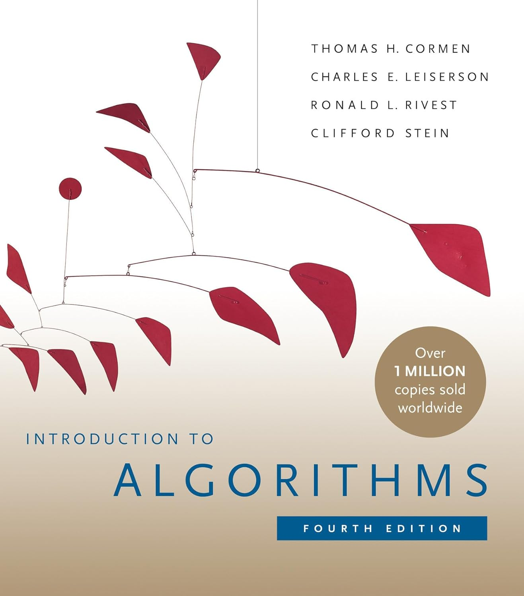

# Design and Analysis of Algorithms  

## Module 1-1: Introduction

<br>
<br>

Slides © Grant Williams, [CC BY-SA 4.0](https://creativecommons.org/licenses/by-sa/4.0/).  

<br>

This is an open educational resource.
Submit fixes, improvements, and new material [here](https://github.com/grantwill74/notes-on-algorithm-design).


---

# Welcome!

Welcome to your senior (or junior year)!
You're at an exciting point in your programming life:
- You can likely do a programming job
- You don't feel as much "blank page" fear when starting out
- A lot of the inner workings of the computer are less mysterious

We'll get to the syllabus, soon, but first, let's talk about what we're going to learn in this class.

---

# What we're going to learn
1. More advanced algorithms than you have been exposed to before.
2. Situations where algorithms need to be customized, modified, or 
    combined (the "design" part).
3. How to analyze algorithms, especially their performance, mathematically.

But why?

---

# Why deepen our knowledge of algorithms?
Someone else already did the hard work of inventing the algorithm,
why do we need to know how to do what they did? There are a few reasons:
1. Your technical interview might make you!
2. There are a lot of ways to combine or remix algorithms [1].
3. Algorithms are often published in very generic form. If you have more
    information, you can often make a specific version that is better [2].
4. Not every algorithm has already been written. We might be waiting on you!

<div class="footnote">
[1] For example, did you know that there is an intermediate data structure between linked-lists and arrays called a *rope*? It's useful when you want cache-efficiency, but need bounded insertion time or don't want to have to copy over the entire array when growing it. 

[2]: You can sort dramatically faster than the standard libarary if the distribution of values being sorted has low entropy.
</div>

---

# Hard Limitations

Another important thing we will learn is that some algorithms aren't just empirically fast or slow, they are theoretically fast or slow.

Some algorithms are just *slow*. 

You've probably already learned about big-O notation. We'll understand more rigorously what it means and how to apply it to know, how fast an algorithm is in theory, not just how fast it is on a particular computer.

Understanding this is important. You want to have an immediate gut-check when certain decisions will cause an algorithm to be *fundamentally, mathematically* slower.

---

# So what is an algorithm? 

[Give your best answer before moving on]

---

# A rigorous definition by Donald Knuth
An algorithm is a procedure with the following properties:
1. Finiteness: it terminates after a finite number of steps.
2. Definiteness: each step is precisely defined.
3. Input: an algorithm has zero or more inputs, taken from specified sets of objects.
4. Output: an algorithm has one or more outputs, quantities that have a specified relation to the inputs.
5. Effectiveness: Its operations must all be sufficiently basic that they can in principle be done exactly and in a finite length of time by someone using a pencil and paper.”

*From The Art of Computer Programming, Vol. 1*

---

# Understanding the definition

Before we continue, let's be sure we understand why those properties are there, what they mean, and why *all five* are necessary (even if some of them look redundant at first glance). 

First of all, procedures don't *have* to be algorithms. A procedure is just a list of steps to perform. For a computer, maybe, but it could also be for a human.

Sometimes we might even *want* a procedure that isn't guaranteed to terminate. Knuth calls these procedures, *computational methods*. Video game main-loops are these kinds of procedure (they run as long as the game does).

But algorithms are *special* procedures: well-defined, terminating, mathematical maps between inputs and outputs, which are built from elementary steps.

---

# Knuth's Rule 1
*Finiteness: it terminates after a finite number of steps.*

Why? Because if I don't know that an algorithm terminates, it's hard for me to use it. How long do I give it before I give up? 

Note: there are many useful procedures that *don't* terminate after a finite number of steps. E.g., cellular automata, video games, simulations, decimal expansions of *Pi*.

But there are also times when we need something to be terminating. Adding two integers for example.

In fact, Knuth points out that we often don't want just *finite*, but *very* finite. We want algorithms that are *fast*, so "finite number of steps" really is the lowest possible bar for a procedure to clear. 

---

# What about infinite steps?
Pay careful attention to the wording. This rule requires that there be a finite number of steps. It doesn't say anything about the steps being fast.

Could an infinite-stepped procedure terminate in a finite amount of time?

[What do you think?]

---

# What about infinite steps? (ctd.)

Yes, it could. We could skip steps, for example.

However, we could not conveniently encode such an algorithm as a program listing for human consumption.

Additionally, we wouldn't be able to encode such a procedure in a Turing machine (which require finite states). So the mathematical tools we will use to analyze algorithms wouldn't always be useful for such procedures.

So there are two ways of breaking this rule: having an infinite number of steps, or doing the same steps without terminating (or both, technically).

---

# Knuth's Rule 2
*Definiteness: each step is precisely defined.*

The idea here is that a procedure is not really *an* algorithm if two people come to two different ideas about what precisely it will do.

If a step is not precisely defined, then different implementations can do different things.

Really, we would have defined a whole family of algorithms rather than one.

So, to be an algorithm, a procedure must be precisely defined, including all of its steps.

---

# Knuth's Rules 3 and 4
*Input: an algorithm has zero or more inputs, taken from specified sets of objects.*
*Output: an algorithm has one or more outputs, quantities that have a specified relation to the inputs.*

These rules mainly establish an algorithm as defining some kind of *relation* or *function* between inputs and outputs.

Most algorithms we learn are mathematical functions. They always return the same output for the same input [What do we call this property, Haskell enjoyers?].

---

# Non-determinism is fine

Algorithms can also be non-deterministic. For example, a procedure that randomly samples a statistical distribution can be an algorithm if the other rules are satisfied. 

So why do we need rules 3 and 4?

Rule 4 requires that a procedure output something to be considered an algorithm. So a busy-wait is not an algorithm.

Rule 4 also requires that what it outputs be related to the inputs. If we're outputting some data from somewhere in memory, that data needs to be listed as an input as part of our formalization.

---

# Knuth's Rule 5
*Effectiveness: Its operations must all be sufficiently basic that they can in principle be done exactly and in a finite length of time by someone using a pencil and paper.*

Wait, isn't this a redundant retelling of rules 1 and 2?

Not quite: rule 1 stated that there are a finite *number* of steps, while this rule states that each step takes finite *time*. Taken together with rule 1, we can infer that algorithms always take finite time.

---

# Knuth's Rule 5 (ctd.)

As for rule 2: just because an operation is well defined does not mean we know how to do it. For example, suppose a step was "find the maximum real number in (1, 2)".

This is neither finitely bound, nor something we can actually do. Is the answer 1.9? 1.99? 1.999? We could go on forever and there would always be a larger number less than 2.* 

A procedure making use of that step could have a finite number of steps, but it would still fail rule 5.

Generally, we think of steps as being short, atomic operations, like assembly instructions. Can another algorithm be a step? Well, it could, but normally we'd consider *invoking* that algorithm to be the step. 

<div class="footnote">
*: for my math majors, is this also true of the interval [1, 2]?
</div>

---

# Summary

So in summary, let's look at the simpler definition our class textbook uses:

*An **algorithm** is any well-defined computational procedure that takes some value, or set of values, as **input** and produces some value, or set of values, as **output** in a finite amount of time.* 

In other words, we want them to be *well-defined* functions or relations that finish in *a finite amount of time*.

---

# Summary (ctd.)

And what differentiates this class from your earlier algorithms classes?

We aren't just going to be learning them: we will be making custom ones and mathematically bounding their time and space (speed and memory).

---

<!-- _class: invert questions -->

# Questions?
<br>

This is our first questions slide. There will be many!  

This is a great place to ask questions.  

If you don't have any, please take a moment to try to recall what we've learned since the start of the presentation or since the last questions slide.

---

# The Textbook


The official textbook is *Introduction to Algorithms*, 4th ed., by Cormen et al.
ISBN: 978-0262046305

However, I will reference other books too. We've already seen *The Art of Computer Programming, Vol. 1* by Donald Knuth

---

# The textbook (ctd.)

You are not required to have any of these books to participate in the class.

The class is designed so that attending lectures, reading these notes, and doing the practice problems will be enough for you to pass quizzes, tests, and assignments.

These notes are original, they aren't copied or adapted from the book. I strongly recommend re-reading them as part of your study routine.

It's a great textbook, but reading the textbook is not a substitute for studying these notes or doing the suggested practice problems.

---

# New grading scheme

One major difference between this class and other classes you may have taken: this is a class that uses standards-based grading.

This is very important to understand, so let's learn about why the class is being graded this way and what it means for you.

---

# The old way

For every class, there was a collection of assignments.

Your weighted average score on assignments determined your final grade.

Assignments often measured many things, and it wasn't always clear how exactly the score on the assignment was related to your own mastery of the material.

You were usually thinking in terms of "points" instead of mastering certain concepts.

---

# The problem

The problem is that now we have large language models for which Elo score on competitive programming contests is a major evaluation criteria.

I used to heavily rely on take-home assignments to make it easier on students who couldn't make every class, but I cannot do that anymore for classes that aren't based on making massive software systems.

I still want you to do take-home assignments, so they are worth some points, but this issue is that I can't *rely* on completing a take-home assignment

Therefore, most of the grade has to come from in-class proctored tests, otherwise I can't prove .

---

# The other problem

However, we are a commuter campus. 

Many of you are working your way through school, and more power to you.

Sometimes your boss just doesn't let you leave.

While I'm technically allowed to require you to be here for tests, I made a committment in my self-evaluations to make my classes open to flexible attendence.

So how can I permit flexible attendence while still *making sure* that you know how to prove the runtime performance of an algorithm or design a custom sort?


---

# The quizzes

This class will measure exactly 8 skills (We'll list them later)

There will be 8 short, in-class, pen-and-paper quizzes, each measuring one  skill.

After the quiz, we will see the answer(s) so you can see how you did, and argue for more correct answers to be considered.

But what if you can't make the quiz? Or bomb it?

---

# The exams

There will be a midterm and endterm exam as well. 

Both of these exams will occur during the term, with the specific schedule being on the syllabus (which we'll look at in a second).

Each exam will contain 4 problems, which cover the same mastery components as the quizzes. 

**The exams will be another chance** to demonstrate that you have learned the skill. I will take the maximum score between the two as your grade for that skill.


---

# The final

There will also be a final exam.

It will contain all of the learning-mastery components.

Your score on each mastery component will be treated similarly: I will take the maximum between the quiz, the relevant exam, and the final

Therefore there will be *three chances* to demonstrate mastery on all the components of this class.

---

# Does that mean I can skip?

Technically, yes.

You can skip the quizzes, and just take the in-terms.

You can skip the quizzes and the in-terms and just take the final.
Unwise, but you can do it.

You can ace all the quizzes and skip every test
(this one is actually cool and you should try to do this).

But what happens if you miss the in-class quizzes, the in-terms, and the final?

---

# Skipping (ctd.)

Then, unfortunately, you will receive a failing grade.

I can only grant an incomplete with a reasonable excuse, and if a certain amount of the course has been attempted (specific amount is in the syllabus).

If there is a medical or other excused reason why you might need to miss out on a large chunk of the class, *please speak to your academic advisor ASAP*. 

There do exist excused withdrawals for specific circumstances that are permitted after the drop/add period and which do not count against your withdraw limit.

---

# Quiz and exam format

Quizzes and exams will be pen and paper, but open book and notes.

You can bring any code-of-conduct-conforming written, drawn, or printed material.

No electronic devices will be permitted. Phones must be off.

If you need access to an electronic device for accessibility reasons, please contact the access center right away. I will ensure that all quizzes and exams are made available to you to be proctored at the access center.

---

# Quiz and exam format (2)

**Be careful**, just because an exam is open-book does not mean it is easy. You will need to study and practice to make sure you can finsh in time.

If you aren't practicing in the exam format (i.e., pen/pencil and paper under a time limit) then you aren't fully studying.

---

<!-- _class: questions invert -->

# Questions?

---

# Let's look at the syllabus together

---

# The syllabus quiz

So there's a quiz on your canvas page...

It's not worth anything, and it's called *The Syllabus Quiz*

Do you have to do it?

---

# The syllabus quiz (ctd.)

Yes, it is required to pass the class.

The rest of the class will not unlock until you have gotten 100% on the syllabus quiz.

This means you will not be able to submit assignments, or receive credit for quizzes or tests, and you will end up with late penalties if you wait too long.

The syllabus quiz is open for a couple of weeks because the drop/add deadline hasn't closed, but there's no reason to wait.

It's open book with unlimited attempts. Do it with the syllabus open right there in another tab.

Because of this quiz, I may assume that you read and understood the syllabus. 

---

# Don't cheat on the syllabus quiz

Yes, it seems like you could feed the syllabus and quiz to an LLM and get 100%.

However, the quiz requires you to certify that you did it totally by yourself, with no help from another person or an LLM.

If you later get in trouble, either with grades or with class policy, you cannot use "I never read the syllabus" as an excuse without admitting to academic dishonesty.

Please forgive the litigousness with which I am treating this subject. The rest of the class won't be like this, I promise. I just really need you to read the syllabus, especially because it's so different from previous semesters'. The whole standards-based grading is completely new for me and for many of you.

--- 
<!-- _class: questions invert -->

# Questions about the syllabus and/or its quiz?

---

# Next class

Next time, we'll see what those learning mastery areas are, and exactly what we'll be learning 

---


# Self mastery questions

We always want to test ourself after learning new material. Testing helps it stick in our brains and reveals misunderstandings for further improvement.

If there's time, let's do these together. Otherwise, treat them as study work.

Some practice problems will be worked, others unworked. I recommend trying to work the worked problems yourself so you can check the answer.

---

# Practice 1: A procedure that is not an algorithm

Here's a procedure [1] that is *not* an algorithm:
```c
void do_nothing_forever() {
    for (;;) // [2]
        ; // [3] do nothing
}
```
The question: **what is/are the reason(s) this procedure is not an algorithm?**

<div class="footnote">
[1]: As you know, this is called a "function" in C. However, functions in C are procedures. 

[2]: for (;;) is the same as "while (1)". It's an infinite loop.
[3]: In C, a compound statement like "if" or "for" can have a semicolon for a body. That's an empty statement. It's like { }.
</div>

---

# Practice 1 answer

There are at least *two* reasons it is not an algorithm. 

First: it does not terminate.
Second, and more subtly, it does not produce output.

---

# Practice 2: golfing practice

Write a C function which meets the definition of an algorithm with the fewest number of keystrokes possible.

This one is tricky. Try your best.

---

# Practice 2 answer
My answer:
```c
a(){return 7;}
```
Why it's an algorithm:
1. It terminates after a finite number of steps. 1 step in fact.
2. Each step is precisely defined. (by the C standard)
3. The algorithm has zero or more inputs. Exactly zero, in fact.
4. The algorithm has at least one output. The are no inputs, so the output is related to all of them, vacuously.
5. Each of the one operations can be done exactly and in finite time.

---

# Practice 2: wait, is that legal?
It depends on the standard. In C89 (and not C99 or beyond), you are technically allowed to leave the return type off of a function declaration/definition. The return type is assumed to be "int" if you do.

I thought about returning by writing to an int* to avoid the "return" keyword, but it ends up being one keystroke longer with the parameter. "int" is the [shortest type built in to the language](https://en.wikipedia.org/wiki/C_data_types#Main_types) to use for the pointer.
```c
b(int*p){*p=7;}
```
(note: we're also relying on the fact that we can omit the return statement and make it undefined. We're in janky territory.)

---

# Practice 3

Create 5 procedures where each one violates a different one of Knuth's rules but satisfies the others. For example, one that breaks rule 1 but satisfies rules 2-5; one that breaks rule 2 but satisfies rules 1, 2, 4, and 5; etc. These procedures can be in English or any other language, it doesn't have to be C or a formal language.

---

# Practice 4

Create or imagine a procedure that is actually useful, but is *not* an algorithm.

What would you have to do to *make* it be an algorithm?

Would it still be useful if you did?

---

# Practice 5: the oldest algorithm

What do you think the oldest algorithm is? 

---

# Practice 5 discussion

The earliest known published algorithm written *for a computer* is "[Note G](https://en.wikipedia.org/wiki/Note_G)", by Ada Lovelace.

However, algorithms don't have to be for a computer. Knuth was careful to base his definition of effectiveness on someone using pencil and paper.

The earliest published procedure that is definitely an algorithm is probably [Ancient Egyptian Multiplication](https://en.wikipedia.org/wiki/Ancient_Egyptian_multiplication) (2000 to 1700 BC). It's actually a cool algorithm for a computer scientist to know because it's based on decomposing an integer into powers of two.

However, algorithms don't have to be published either. So the true earliest algorithm is probably a recipe or religious ritual.