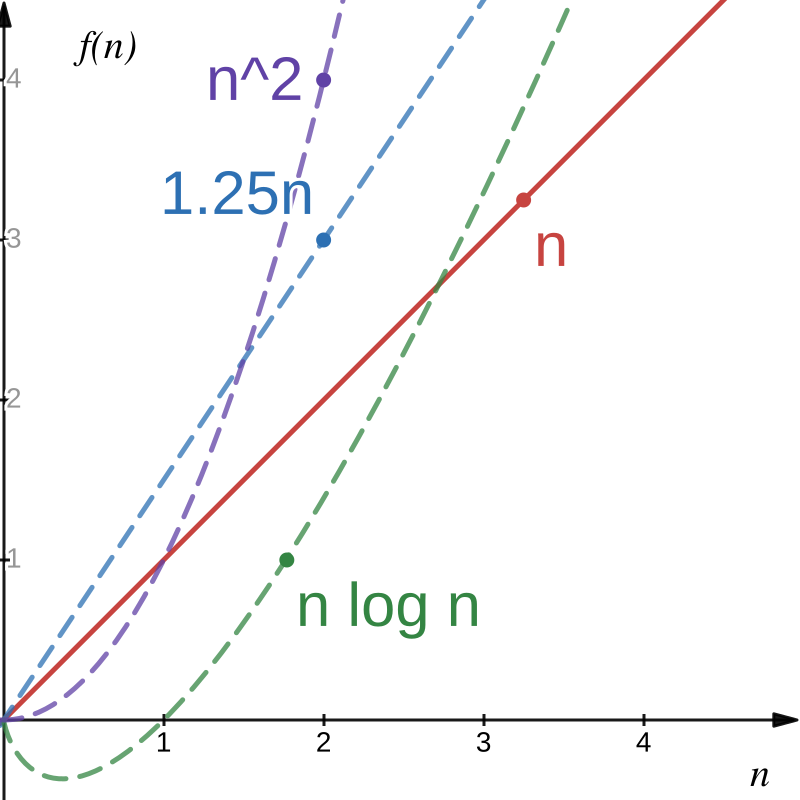

# Design and Analysis of Algorithms  

## Module 2: Bachmann-Landau Notation

<br>
<br>

Slides © Grant Williams, [CC BY-SA 4.0](https://creativecommons.org/licenses/by-sa/4.0/).  

<br>

This is an open educational resource.
Submit fixes, improvements, and new material [here](https://github.com/grantwill74/notes-on-algorithm-design).


---

# Last Class
We talked about an example of a simple algorithm that was slow.

Specifically: concatenating multiple strings without being smart about where we start copying.

It was a little awkward to describe *how* slow it was. We had to calculate time units and we ended up with an expression like:
$T = {130*10000*(10000 + 1) \over 2}$

---

# This class

We're going to learn Big-O notation! 

This will let us describe the time an algorithm takes without extra details.

You've probably heard of Big-O before, but there are other big and small letters, too: Big-O, small-o, Big-Ω*, small-ω*, and Big-θ*. We will learn the whole family!

These conventions are called *Bachmann-Landau* notation after its inventors.
<Br>

<div class="footnote">
* Greek letter Omega, which literally means "big O" in Greek, confusingly. It's different from Big-O, mathematically though.

** This is a lower-case omega.
*** This is an upper-case theta.
**** There is no small-θ
</div>

---

# Empirical measurements are useful

There's nothing wrong with measuring how long an algorithm takes.

In fact: you should do that. It's a good idea. Sometimes algorithms can be theoretically fast an practically slow.

But there's a simple problem with that...

---

# It depends on your computer.

Other people don't have your computer.*

Mathematicians don't want to be like: "proof of running time: go get Alice's computer, then run the algorithm ten times. It will take an average of 2 minutes when n = 10000, with a standard deviation of 1.1."

Also, it's more work to deterine how an algorithm *scales* when doing purely empirical measurement. You have to take multiple measurements to determine exponents, plus additional measurements to get a feel for how much they vary. It's a decent amount of work doing *proper* empirical measurement.

<div class="footnote">
* unless you're hosting an unsecure SSH or something.
</div>

---

# Scaling

What we really care about is modelling how long an algorithm takes. 
Specifically, how it *scales*.

We would like a nice time function that lets us plug any input value we want and get a rough time estimate.

We also don't care about constant multiplication. Your computer may be 10 times faster than your phone; that doesn't change the underlying speed of the algorithm

---

# Scaling (2)

But we *do* care about some kinds of *variable* multiplication.

For example, consider this time function:
$T(n)={{130\over 2}n(n+1)}=65n(n + 1)$

What matters more? The 65 at the beginning (the constant factor), or the factor of n (the variable factor)?

Well, let's say n is 5:
$T(n)=65\times 5(5 + 1)=65\times 5(6)=65\times 30$

Well 65 is bigger than 30, so it seems more important.

---

# Scaling (3)

But what about when n gets big? Say, 10,000 like before.*

$T(n)=65\times 10{,}000(10{,}000 + 1)=65\times 10^4(10^4 + 1)=65\times (10^8 + 10^4)$

$10^8 + 10^4$ is a *lot* bigger than $65$. It's roughly $384{,}654$ times larger in fact.

And that ratio only gets more wild as n gets bigger.

<div class="footnote">
*I moved the denominator of 2 under the 130 to combine the constant factors.
</div>

--- 

# Scaling (4)

It doesn't matter what constant we pick. If n gets big enough, it will matter more than the constant.

Even if it's something like $T(n) = 1000 n$ 

1000 is a large constant, but if n is, say, a million, it's no longer the dominant one.

So we like to ignore constants, and only focus on the variables. Let's do that now...

---

# Removing constants
So instead of writing
$T(n)=65n(n + 1)$

We could delete the constant factor $T(n)=n(n+1)$

And let's expand that multiplication so we can see the exponents:
$T(n)=n^2+n$

So now, we can clearly see that this is a quadratic function

---

# Can we really do this?

It might make you uncomfortable to just remove constant factors like that.

But consider: every machine takes a different amount of time to do something.

If Alice's computer takes 10 time units to copy a byte, then strcpy would have this time:
$T_{strcpy}(n)=10n$

But let's say Bob's computer is faster: it only takes 2 time units:
$T_{strcpy}(n)=2n$

This information is important, but it has nothing to do with the algorithm. 

We want to remove machine-specific information from the time function.

---

# Taking it a step further

If it bothered you that we removed the constant factor, this is *really* going to bother you: we're going to remove a whole variable.

Consider again $T(n)=n^2 + n$

What matters more, $n^2$ or $n$?

Obviously $n^2$, but let's really see how that plays out.

---

# Comparing $n^2 + n$ to just $n$

| n    | $n^2 + n$        | $n^2$     | Ratio   |
|------|------------------|-----------|---------|
| 1    | 2                | 1         | 2       |
| 10   | 110              | 100       | 1.1     |
| 100  | 10,100           | 10,000    | 1.01    |
|$10^3$| 1,001,000        | 1,000,000 | 1.001   |
|$10^6$| $10^{12} + 10^6$ | $10^{12}$ | 1.000001|  

---

# That $n$ term just does not matter

It barely changes the outcome.

Again, if one algorithm took $n^2 + n$ and another took $n^2$, by the time you get to a large input, you can't tell the difference.

But we don't want to abuse mathematical notation and just randomly delete variables...

---

<!-- _class: invert questions -->
# Questions?

---

# Introducing Big-O

The Big-O of $f(n)$, written $O(f(n))$ is the set of functions that are eventually bounded by $f(n)$ if n is large enough and if we multiply by a large enough positive constant $C$.

For example:
- $n \in O(n)$, because $n \leq C \cdot n$ if we choose $C=1$ (or 2, or 3, or anything $\geq$ 1)
- $n \in O(2n)$, because $n \leq C \cdot 2n$ if we choose $C=1$ (or as small as $0.5$)
- $n \in O(.25n)$, because $n \leq C\cdot 0.25n$ if we choose $C \geq 4$
- $n \in O(n \log n)$, because $n \leq C\cdot n \log n$ if we choose any $C \gt 0$, as n gets large
- $n \in O(n^2)$, because $n \leq C \cdot n^2$ if we choose any $C\gt 0$, as n gets large

<div class="footnote">
It actually doesn't matter what base the log is. The log functions with different bases all have constant ratios to each other.
</div>

---

# A graph



Notice how, eventually all those functions get bigger than $f(n)=n$.

This would be true even of a smaller linear function, because we can multiply by any constant.

---

# Knowledge check

Give an example of a function $f(n)$, such that $n^3 \in O(f(n))$

That is, find a function $f(n)$ where $n^3 \leq C\cdot f(n)$ as n gets arbitrarily large.

---

# Some answers 

- $f(n)=n^3$
- $f(n)={n^3 \over 2}$
- $f(n)=n^4$
- $f(n)=n^{\pi}$
- $f(n)=n^3 \log n$
- $f(n)=2^n$
- $f(n)=n!$

All of these functions can be multiplied by a constant to make them $\geq$ than $n^3$

Yes, even ${n^3 \over 2}$. We can multiply it by 2!

---

# Knowledge check (2)

Give an example of a function $f(n)$, such that $n \notin O(f(n))$

That is, find a function that is too small to have its big-O contain $n$.

---

# Some answers (2)

- $f(n)=log (n)$
- $f(n)=\sqrt{n}$
- $f(n)=n^{2/3}$

No matter how much we scale these functions, eventually n will be larger than them.

Example: 
$n \gt 100\sqrt{n}$ when $n>10000$
$n \gt 10000\sqrt{n}$ when $n>1000000$
For a large enough n, for all $C$, $n \gt C\sqrt{n}$, so $n \notin O(\sqrt n)$

---

# Knowledge check (3)

Give an example of a function $f(n)$, such that $f(n) \in O(n^3)$

---

# Some answers (3)

- $f(n)=n^3$
- $f(n)=n^2$
- $f(n)=n$
- $f(n)=1$
- $f(n)=n \log n$

Yes, the functions can just be constants like $1$.

The constant function $f(n)=1 \in O(g(n))$ for any function $g(n) \gt 0$ 

---

# Knowledge check (4)

Is $n^2 \in O(n^2 - n)$?

---

# Some answers (4)

Actually yes. Let $C = 2$. What happens to this when n gets big?

$n^2 \leq 2(n^2 - n)$, distribute the 2
$n^2 \leq 2n^2 - 2n$, subtract $n^2$ from both sides
$0 \leq n^2 - 2n$
can this be made true for every n past a certain point? Add $2n$ to both sides:
$2n \leq n^2$, we only care what happens when n is big, so we can divide (assume $n>0$)
$2 \leq n$

So $n^2 - n$ can be made to eventually bound $n^2$ if we multiply it by a large enough constant. Once $n \geq 2$, $2(n^2 - n)$ will always be bigger than $n^2$.

---

# What Big-O *means*

Intuitively, big-O tells us the upper bound of how long a process will take.

It specifically tells us that upper bound in a way that ignores constants or smaller degree terms.

So it's a mathematically rigorous way of being sort of vague. We get to share a feeling for how slow something is. "This algorithm runs in linear time (i.e., $O(n)$)" conveys a lot of information without bogging down the reader with computer specific information or meaningless time blips.

---

<!-- _class: invert questions -->
# Questions?

---

# The formal definition

Okay, let's get more rigorous. Our definition was good before, but not quite good enough for proofs.

## Rigorous definition:
$$f(n) \in O(g(n)) \iff
\exists C \gt 0, \exists n_0 \in ℕ,\forall n \geq n_0, f(n) \leq C\cdot g(n)$$


In English: "f is in the order of g", is equivalent to saying that there are a pair of numbers: $C$ and $n_0$ which must be large enough so that $C\times g(n)$ is bigger than $f(n)$ for every choice of $n$ that is larger than $n_0$.

<div class="footnote">
Note: We're assuming that f and g are functions that return positive values (because they represent times). If you truly wish to allow f to return even negative numbers, you must put absolute value bars around it. We don't need to worry about this in the study of algorithms, but other fields use this notation too.
</div>

---

# Let's meditate on that

It's a big gnarly definition. Let's think about it.

Anytime someone has shown that $f(n) \in O(g(n))$, they have done the following:
- Found the scaling factor $C$
- Found the starting point $n_0$
- Proved that for every natural number starting at $n_0$ and getting as big as you want, that $f(n) \leq C\cdot g(n)$

We'll look at how to write one of these proofs soon, but first, let's assume someone has done the hard work for us.

---

# Subsets example: the question 

## Is $O(n) \subseteq O(n^2)$?

---

# Subsets example: the answer

Yes, it is. 

But how do we prove it?

[What do you think?]

--- 

# Subsets example: work (1)

What does it mean for $A \subseteq B$?

It means $\forall x \in A, x \in B$.

Another way of putting it: $\forall x \in U, x \in A \implies x \in B$

What kind of elements are we interested in? What are the elements of $U$? Functions. $O(f(n))$ is a set of functions $f:N \to R^+$

Therefore, we need to show:
$$\forall f: N \to R^+, f \in O(n) \implies f \in O(n^2)$$

---

# Proving that statement
How do we prove $\forall f: N \to R^+, f \in O(n) \implies f \in O(n^2)$?

If your goal starts with $\forall$, a typical way to start your proof is by saying "suppose".

To make it easier to track, let's track the goal, and the proof so far, at the same time.

Proof: *empty*
Goal: $\forall f: N \to R^+, f \in O(n) \implies f \in O(n^2)$

---

# Proving that statement (2)

Now we "suppose" to "peel off" the forall at the beginning of the goal.

Proof: "Suppose we have a function $f: N \to R^+$"
goal: $\cancel {\forall f: N \to R^+}, f \in O(n) \implies f \in O(n^2)$.


So, how do we prove $f \in O(n) \implies f \in O(n^2)$?

---

# Proving implications

So how, do we prove that $P \implies Q$?

We have three options:
1. Assume that $P$ (aka, the hypothesis) is true, and show that you can prove $Q$ (the conclusion). This is a direct proof.
2. Prove the contrapositive: $\lnot Q \implies \lnot P$. This is a kind of indirect proof, and it is sometimes considered less satisfying than if we could prove $P\implies Q$ directly.
3. Show that $P$ is false. (i.e., $P \implies Q$ is vacuously true)*. Also indirect.

\#3 won't work, because we have no reason to believe $f \notin O(n)$. \#2 would work but indirect proofs are less "enlightening"**. Let's do \#1.

<div class="footnote">
* Giant footnote: see appendix A

** Another footnote: see appendix B to understand why we like direct, "constructive" proofs, especially in computer science.
</div>

---

# Subsets example: work (2)

Proof so far: "Suppose we have a function $f: N \to R^+$"
Goal: $f \in O(n) \implies f \in O(n^2)$.

Okay, so now we "suppose" again. "Suppose" peels off an implication the same way that it peels off a "$\forall$". 

Proof so far: 
- Suppose we have a function $f: N \to R^+$
- suppose that $f \in O(n)$

Goal: $\cancel {f \in O(n) \implies} f \in O(n^2)$

Now we have a hypothesis we can use: $f \in O(n)$. Let's use it: apply the definition of $O$.

---

# Applying the definition

Recall the definition of big-O:
$$f(n) \in O(g(n)) \iff \exists C \gt 0, \exists n_0 \geq 0, \forall n \geq n_0, f(n) \leq C\cdot g(n)$$

And recall that our proof so far looks like this: 
"Suppose we have a function $f: N \to R^+$ and suppose there is some $f \in O(n)$"

Implications are the logical version of functions*. We can "call" our definition on $f \in O(n)$ and replace it with the other side of the $\iff$

So use that big $\iff$ at the top on $f(n) \in O(g(n))$, but replace $g(n)$ with just $n$.

So now, we can use this fact: $\exists C \gt 0, \exists n_0 \geq 0, \forall n \geq n_0, f(n) \leq C\cdot g(n)$

How does that help?

<div class="footnote">

\* It's not a coincidence that F: P ⇒ Q looks like f : N → R. Functions are isomorphic with implications. Search for the "Curry-Howard correspondance" if this is interesting to you.
</div>

---

# Subsets example: work (3)

Now we have a $C$ and $n_0$ to work with.
Let's expand the definition in the goal, too.

Proof so far:
- Suppose we have a function $f: N \to R^+$
- Suppose $f \in O(n)$.
- Applying the definition of big-O to both the above hypothesis and goal, we derive $\exists C \gt 0, \exists n_0 \geq 0, \forall n \geq n_0, f(n) \leq C\cdot n$"

Goal so far:
$\cancel{f \in O(n^2)} \exists C \gt 0, \exists n_0 \geq 0,  \forall n \geq n_0, f(n) \leq C \cdot n^2$"

---

# Dealing with $\exists$ in an assumption

We deal with $\exists$ and $\forall$ differently when they're in our "context", aka "set of assumptions" than when they are in the goal.

When an $\exists$ is in our set of assumptions, we can give it a name by also saying "suppose", or just break it off the proposition.

So we say "suppose" to prove a $\forall$ in the goal, and we say "suppose" to break off a $\exists$ in a hypothesis.

Let's break apart the assumption in our proof:

---

# Subsets example: work (4)

Proof so far:
- Suppose we have a function $f: N \to R^+$
- Suppose $f \in O(n)$.
- Apply the definition of big-O to both the above hypothesis and goal, we derive $\exists C \gt 0, \exists n_0 \geq 0, \forall n\geq n_0, f(n) \leq C\cdot n$"
- Suppose we have a $C \gt 0$, $n_0 \geq 0$
- We now have $\forall n \geq n_0, f(n) \leq C \cdot n$

Goal so far:
$\exists C \gt 0, \exists n_0 \geq 0,  \forall n \geq n_0, f(n) \leq C \cdot n^2$"


---

# Subsets example: work (5)

Remember how saying "suppose" in our proof removed a $\forall$ from the goal?
To remove a $\exists x$ from the goal, we have to say "choose $y$ for x".
But that requires us to actually pick a value $y$...what should we pick?

Remember, once we pick something, our goal will be to show
$\forall n \geq n_0', f(n) \leq C' \cdot n^2$, for some $C'$

And we currently have an assumption that $\forall n \geq n_0, f(n) \leq C \cdot n$

What value of $C'$ should we pick so that $f(n) \leq C \cdot n \leq C' \cdot n^2$?

Honestly, $n^2$ grows much faster than $n$, so we can pick pretty much anything $\gt 0$. Let's pick $C$ so the $Cs$ cancel out when you replace the $C'$ with it. As for $n_0'$, we have to pick $n_0$, because there's a hypothesis that says $\forall n \geq n_0$ that we want to use. We could have chosen $n_0 = 0$ at the very beginning instead. 

---

# Subsets example: work (7)

Proof so far:
- Suppose we have a function $f: N \to R^+$, $f \in O(n)$.
- Apply the definition of big-O.
- Suppose $C \gt 0$, $n_0 \geq 0$, then $\forall n \geq n_0, f(n) \leq C \cdot n$,
  We must show $\exists C' \gt 0, \exists n_0' \geq 0, \forall n' \geq n_0', f(n') \leq C' \cdot n'$*
- Choose $C'=C$ and $n_0'=n_0$

Goal: $\cancel{\exists C' \gt 0, \exists n_0',} \forall n' \geq 0, f(n') \leq C \cdot n^2$ 

See how we replaced the $C'$ and the $n_0'$ in the goal with $C$ and $n_0$? Now what to do?

<div class="footnote">

\* We added "primes" (the quotes after the variable names) to distinguish the variables in the goal
</div>

---

# Subsets example: work (8)

That's right, "suppose"! $\forall n' \geq n_0, P(n)$ is shorthand for $\forall n, n \geq n_0 \implies P(n)$.
We can handle both the "$\forall$" and the $n \geq 0$ hypothesis by saying "suppose". 

Proof so far:
- Suppose we have a function $f: N \to R^+$, $f \in O(n)$.
- Apply the definition of big-O.
- Suppose $C \gt 0$, $n_0 \geq 0$, then $\forall n, n \geq n_0 \implies f(n) \leq C \cdot n$,
  We must show $\exists C' \gt 0, \exists n_0' \geq 0, \forall n' \geq n_0', f(n') \leq C' \cdot n'$*
- Choose $C'=C$ and $n_0'=n_0$, and suppose we have some $n'$, $n' \geq n_0$

Goal: $\cancel{\forall n' \geq n_0,} f(n') \leq C \cdot n^2$ 

---

# Subsets example: what now?

Notice that we have some natural number named $n'$.

And notice that we have an assumption: $\forall n, n \ge n_0 \implies f(n) \leq C \cdot n$

The "$\forall$" in the assumption means that we can apply it to any natural number we want.

Apply it to $n'$: $n' \geq n_0 \implies f(n') \leq C \cdot n$

Is it true that $n' \geq n_0$? Yes, we supposed it last slide. That's why we picked $n_0' = n_0$.

So now the implication simplifies to just $\cancel{n' \geq n_0 \implies} f(n') \leq C \cdot n'$

Now, can we *finally* show that $f(n') \leq C \cdot (n')^2$.

How?

---

# Subsets example: by transitivity

We already have that $f(n') \leq C \cdot n'$, and it's true that $C \cdot n' \leq C \cdot (n')^2$, so, transitively,
$f(n') \leq C \cdot n' \leq C \cdot (n')^2 \implies f(n') \leq C \cdot (n')^2$, which was the goal

You can put the cool tombstone at the end: ▯, or write *QED** if you're fancy.

<div class="footnote">

\* QED is an acronym which stands for "quod erat demonstratum", which means "which was to be demonstrated" in Latin.
</div>

---

# Subsets final annotated proof

Goal: $\forall f: N \to R^+, f \in O(n) \implies f \in O(n^2)$
- Suppose we have a function $f: N \to R^+$, $f \in O(n)$.
  Goal: $f \in O(n^2)$
- Apply the definition of big-O to $f \in O(n)$ and $f \in O(n^2)$
  Suppose we have $C \gt 0$, $n_0 \geq 0, \forall n, n\geq n_0 \implies f(n) \leq C \cdot n$
  Goal: $\exists C' \gt 0, \exists n_0' \geq 0, \forall n', n'\geq n_0' \implies f(n') \leq C' \cdot n'$
- Choose $C'=C$ and $n_0'=n_0$, and suppose we have some $n'$, $n' \geq n_0$
  Goal: $f(n') \leq C \cdot (n')^2$
- Apply our assumption $\forall n, n\geq n_0 \implies f(n) \leq C \cdot n$ to $n'$ and $n' \geq n_0$, we derive $f(n') \leq C \cdot n'$, from which the goal, $f(n') \leq C \cdot (n')^2$ follows by transitivity of $\leq$. ▯

---

# Feeling the tension

We've already seen how to prove things in discrete math, but you may not have had to do it too many times since then.

Once you see the mechanical nature of proofs, and how we say things like "suppose" in the proof to remove a hypothesis or "$\forall$" in the goal, I hope it will feel more comfortable.

It really is like writing a computer program. In fact, when Donald Knuth was introducing computer programming, he said it was like writing a proof!

Stay with me; we have one more technique to learn. The proof equivalent of a for-loop.

I'm going to work one more exercise for you to study. The rest will be unworked. When you revisit these slides to study, make sure you can do the unworked practice exercises next slide.

---

# Unworked practice

1. Prove that $n^2 \notin O(n)$. I've worked this one in the appendix.
1. Prove that $n^2 \in O(n^2)$
    This is easier, because it's not a subset proof, so we don't have a $\forall f \cdots$ 
2. Prove that $n \in O(n \lg n)$. $lg$ is another way of writing $log_2$
    This one is trickier. Remember that $\log_n 0$ is undefined, and $\log_n 1= 0$
    Be careful about your choise of $n_0$!
3. Prove that 

---

# Questions?

<!-- _class: invert questions -->

---


---

# Going the other way: proving $f(n) \in O(g(n))$

If we want to prove that $f(n) \in O(g(n))$, we have to first choose a $C$ and an $n_0$.

C is our scaling factor. It just needs to be big enough to make $C\cdot g(n)$ large enough.

$n_0$ is our starting point. We don't care what happens for small values of n, we care about how the functions scale at large values. $n_0$ let's us define what "big enough" means for $n$.

Once we've chosen our $C$ and $n_0$, the last part is to prove the rest of the statement: $\forall n \geq n_0, f(n) \leq C\cdot g(n)$


---

# Using the formal definition (2)


---

# Knowledge check (6)

Is this proposition true?
$$O(n^2) \subseteq O(n)$$

That is, are all the functions that are in $O(n)$ also in $O(n^2)$?

[What do you think?]

---

# Answer (5)


---

# Knowledge check (7), one more!

Is $O(n^2 - n) = O(n^2 + n)$?

Prove it one way or the other.

How? Remember: $O(f(n))$ is a set. How do we prove that two sets are equal?


---

# Let's have an example

Now we know that, if someone proves that an algorithm takes time $t(n) \in O(g(n))$, we have a vague idea of how much time it will take at worst 

---

# Insertion Sort 

Insertion sort is a simple, but surprisingly valuable sorting algorithm.

First, let's remind ourself of its code:

```c
void swap(int* a, int* b); // defined elsewhere: you know how to do it!

void ins_sort(int* arr, size_t n) { 
    for (size_t i = 1; i < n; i++) 
        for (size_t j = i; 0 < j && arr[j] < arr[j - 1]; j--)
            swap(arr + j - 1, arr + j);
}
```

<div class="footnote">
This can be slightly sped up by avoiding unecessary copies. Think about what swap does and expand it. Could you optimize the function?

Answer is in the github.
** "arr + i" is equivalent to "&arr[i]". We're doing pointer math to get the ith and jth elements of arr.
</div>

---

# But how fast is it?


---

# Actual quiz next class

Next class we will have a quiz on this material.

This quiz counts! It's going to measure your understanding of this module.

**You must bring paper and a writing implement! This is your responsibility! Set six different reminders on your phone!***

---

# Actual quiz next class (2)

Start studying now, and try to resolve any feelings of meta-cognitive unease. If you feel like "I don't quite get this", listen to the feeling!

Test yourself. The quiz will be proctored, pen-and-paper, and timed (10 minutes). If you aren't studying at least a little bit under these time and resource controls, you aren't studying for the quiz!

The quiz will test the first learning mastery standard: that you can understand and prove things using Bachmann-landau notation.

---

# How should I study?

Do the following practice exercises! Some are worked, some are not.

Then, rewrite them on a cheat sheet. It's an open materials quiz. Any printed material is acceptable. Composing your own cheat sheet will help comprehension a lot. I recommend 1 sheet per learning standard.

Set a practice timer for each problem. Turn off your electronic devices. You will have 10 minutes.

Remember: *if you aren't studying under time controls with pen and paper, **you aren't studying!***

And remember to bring pen and paper for the quiz next class!

---


---

# Appendix A: principle of explosion

Regarding the equivalence of ~P and P → Q.

This is called the principle of explosion, and it often throws people for a loop. 2 + 2 = 5 → Unicorns are real, because 2 + 2 is not 5. The principle of explosion is sometimes called "ex falso quodlibet", meaning "from false, whatever you like." It comes from the fact that if a contradiction is true, e.g., P and ~P, we can create disjunctions out of thin air: P → P or Q, and then eliminate them ~P → (P or Q) -> Q, thereby proving Q from a contradiction. 

We will use it sometimes, so I want to make sure it doesn't seem too weird.

---

# Appendix A (2)

It may be upsetting, but remember, it requires us to have a proof of something that is contradictory, which should be impossible if our logic is sound. If it is still upsetting, you are in good company: some logicians and philosophers are concerned that a single untrue fact that we believe to be true can blow up our whole logical system. What if there is a true contradiction? Therefore, logicians have developed *paraconsistent* logics which do not allow the principle of explosion.

---

# Appendix A (3)

There is a nice thing about the principle of explosion: it's like a logical equivalent to an early return.

Suppose we have some statement like $n \gt 5 \implies P(n)$ and we want to prove it. Our statement only applies to numbers greater than 5, so our base case for induction is easy:

by induction on n,
- when n = 0, $0 \gt 5 \implies P(n)$ is vacuously true
  (we early returned: sub-goal done)
- suppose $P(n)$, ... (pretend we proved $P(n+1)$)

---

# Appendix A (4)

If we weren't allowed to explode, we'd have to modify our implication $n \gt 5 \implies P(n)$ to something like $P(n) \lor n \leq 5$

If we wanted to use this more complicated fact in a later proof, we'd have to consider both cases: $P(n)$ and $n \leq 5$ and complete that proof both ways.

Different paraconsistent logical systems have different ways of dealing with this. However, the fact remains that explosion is very convenient.

Compare this to programming languages where you can early return vs. languages where you have to carry out computation for every branch of an if-statement. It's kind of nice to bail as soon as something is bogus and focus on the happy path.

---

# Appendix B: why we like direct proofs

The purpose of a proof is to convince you that a statement is true.

However, just because you are convinced doesn't necessarily mean that you deeply understand why something is true.

For example, I can make a statement like "if you have two real numbers, $x$ and $y$, and $x \lt y$, there exists a number between them"

This statement is clearly true. But how should I prove it?

---

# Appendix B (2)

First, let's formalize it.
$$
\forall x, y \in R; x \lt y \implies \exists z \in R, x \lt z \lt y
$$

Well, we could prove it directly:
- Suppose there are real numbers $x$ and $y$, and $x \lt y$
  We must show $\exists z \in R, x \lt z \lt y$
- Choose $z = {x + y \over 2}$
  We must show $x \lt {x + y \over 2} \lt y$, which follows from $x \lt {x + y \over 2} \land {x + y \over 2} \lt y$
- $x \lt {x + y \over 2}$ follows from $2x \lt x + y$, which follows $x \lt y$, which was assumed.
- ${x + y \over 2} \lt y$ follows from $x + y \lt 2y$, which follows $x \lt y$, which was assumed.▯

<div class="footnote">
We're saying "follows from" because we're modifying the goal. If I have P ⇒ Q and P in my assumptions, then I can say "Q follows from P". However, if my goal is Q and I have the assumption P ⇒ Q, then I can say "we must show Q, which follows from P" and now my new goal is P. 


---

# Appendix B (3)

That proof is nice. It doesn't just prove that there is a number between $x$ and $y$, it constructs one. It says "here's the midpoint. Notice that it's bigger than x and smaller than y for any choice of x and y where $x \lt y$."

We can visualize it in our heads. We have a good understanding for why it's true.

Now, imagine that we proved the contrapositive.
That is, instead of: $\forall x, y \in R; P \implies Q$
We showed: $\forall x, y \in R; \lnot Q \implies \lnot P$

<div class="footnote">
Careful: you might think "oh, we need to find some x and y where it's not true, and prove the opposite". That's how we would prove that the whole proposition is false. This proposition is true, so you won't be able to do that. The contrapositive comes after we introduce x and y, so we still have a "forall" around them.
</div>

---

# Appendix B (4)

- Suppose there are real numbers $x$ and $y$
  We must show: $\lnot (\exists z \in R, x \lt z \lt y) \implies x \geq y$
- By negation of $\exists$ and de-morgans laws, this follows from
  $\forall z \in R, x \geq z \geq y \implies x \geq y$
- This follows from transitivity of $\geq$▯
  
It's actually shorter, but does it really explain why the original proposition is true? 

Instead of "look, the midpoint is between x and y." we're saying "well, suppose there is no point between x and y, then I guess x is bigger than y". It's less direct and it doesn't give us as good of an intuition as to what's going on.

---

# Appendix B (5): other benefits

We can guarantee that our proofs are constructive if we take classical logic but avoid using the law of excluded middle (LEM). The LEM states:
$$
\forall P, P \lor \lnot P
$$
Where P is a proposition.

The LEM allows us to summon any proposition we want, as long as we consider its opposite. It is actually the LEM that allows us to do proofs by contrapositive. If we want to show $P \implies Q$, we can assume $Q \lor \lnot Q$. If $Q$ is true, then $P \implies Q$ is true. If $\lnot Q$ is the case, then we show $\lnot P$, and that makes $P \implies Q$ vacuously true.

---

# Appendix B (6)

Fundamentally, the law of excluded middle lets us treat propositions as if they have boolean values, and we can do case matching on them.

However, when using most computer proof assistants, propositions are types, and most proofs are actually functions. That is, a proof of $P \implies Q$ is actually a function that takes a proof of $P$ and returns a proof of $Q$. This is cool because it means our proofs are actually executable computer programs that operate on proofs. 

A function that takes a proof of a false statement and returns a proof of a false statement is not actually as interesting: it can never be called (because you cannot obtain proof of a false statement). Therefore, there is no useful function to extract.

---

# Appendix C: worked example

Prove that $n^2 \notin O(n)$

Here we need to prove the opposite of the normal big-O statement. If:

$$f(n) \in O(g(n)) \iff \exists C \gt 0, \exists n_0 \geq 0, \forall n \geq n_0, f(n) \leq C\cdot g(n)$$

Then:

$$f(n) \notin O(g(n)) \iff \forall C \gt 0, \forall n_0 \geq 0, \exists n \geq n_0, f(n) \gt C\cdot g(n)$$

Let's apply our techniques and prove this for $n^2$ and $n$.

---

# Appendix C (2)

Goal: $\forall C \gt 0, \forall n_0 \geq 0, \exists n \geq n_0, n^2 \gt C\cdot n$
Proof:
- Suppose we have some $C$ and $n_0$, $C \gt 0$, $n_0 \geq 0$.
  We must show: $\exists n \geq n_0, n^2 \gt C \cdot n$
  
Note: we can't just choose anything here. It has to work for *any* choice of C *and* it has to be at least as big as $n_0$ *and* it has to be a natural number. 

What should we pick?

<div class="footnote">
Note: Technically, it doesn't *have* to be as big as n0. If it's smaller, then the statement will be vacuously true. But, then we'd have to consider both cases. It's easier to pick something we know is bigger, because then there is only one case to consider.
</div>

---

# Appendix C (3)

Let's choose $n = \lceil C \rceil + n_0 + 1$. This satisfies all the requirements: it's a natural number, it's certainly bigger than $n_0$, and it is bigger than C, too.

After choosing that value of n, our new goal is:
$(\lceil C \rceil + n_0 + 1)^2 \gt C \cdot (\lceil C \rceil + n_0 + 1)$

We can safely divide both sides by $(\lceil C \rceil + n_0 + 1)$, because it's clearly $\gt 0$. Our old goal follows from our new goal:

$(\lceil C \rceil + n_0 + 1) \gt C$

Which is clearly true. ▯

<div class="footnote">
Note: if you don't agree that it's clearly true, try writing an intermediate value in between the two sides where it's more obvious. The goal will follow by transitivity.
</div>

---

# Appendix C (4)

In other words, we have shown that $n^2 \notin O(n)$, because no matter what values of $C$ and $n_0$ we chose, there is always a value of $n$ that makes $n^2 \gt C \cdot n$.