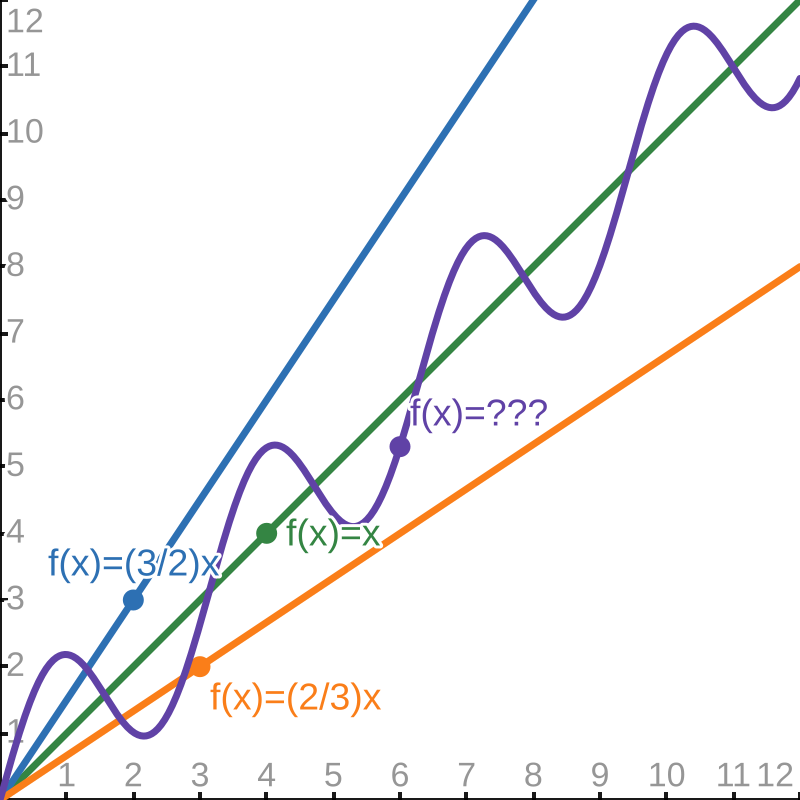

# Design and Analysis of Algorithms  

## Module 3: 

<center>

### The Bachmann-Landau family
### Best/worst/average case
### recursive algorithms
### Linear-time sorting

</center>

<br>
<br>

Slides © Grant Williams, [CC BY-SA 4.0](https://creativecommons.org/licenses/by-sa/4.0/).  

<br>

This is an open educational resource.
Feel free to submit fixes, improvements, and new material [here](https://github.com/grantwill74/notes-on-algorithm-design).


---

# Last Class

We talked about the definition of big-$O$:
$$f(n) \in O(g(n)) \iff
\exists C \gt 0, \exists n_0 \in ℕ,\forall n \geq n_0, f(n) \leq C\cdot g(n)$$

Then we used it to prove that certain functions had the big-$O$ we wanted.

We learned how to annotate big-$O$, too, for iterative procedures.

We learned how to prove correctness. We showed that an iterative version of insertion sort was correct.

---

# This class

We're going to learn about the rest of the Bachmann-Landau family:
little-$o$, big-$\Omega$, little-$\omega$, and big-$\Theta$

We're going to learn how to analyze recursive algorithms: both for correctness and for runtime complexity bounds.

We're going to get even sharper with induction.

---

# Back to insertion sort

Remember when I said insertion sort was very useful?

But we proved that it was $O(n^2)$

That is not great. We'll see mergesort next module, and it is $O(n \lg n)$.

So if insertion sort is slower than another simple, widespread algorithm, why would anyone use it?

---

# When is insertion sort useful?

Let's look at the code for insertion sort again. This is using the faster version that I suggested writing as a practice exercise:

```c
void ins_sort(int* arr, size_t n) {
    for (int i = 1; i < n; i++) {
        int t = arr[i]; int j = i;
        for (; j > 0 && arr[j - 1] > t; j--)
            arr[j] = arr[j-1];
        arr[j] = t;
    }
}
```
This version stores the unsorted value in $t$. Then finds where $t$ should go, and shifts everything above it to the right, making room.

Important question: [when is this function *not* quadratic?]

---

# When the inner loop doesn't run.

Look at the inner loop:
```c
for (; j > 0 && arr[j - 1] > t; j--)  // the inner loop
    arr[j] = arr[j-1];
```

This loop has two stopping conditions:
1. $j$ reaches $0$
2. $\mathrm{arr}[j - 1] \leq t$

If $j$ reaches $0$, the inner loop runs in $O(i)$, which is $O(n)$, making the sort $O(n^2)$
If $j$ reaches a *proportion* of $0$, *the same thing happens*.


--- 

# When the inner loop doesn't run (2)

Even if it only goes halfway before stopping, $n/2$ is still $O(n)$
Even if it only goes a *tenth* before stopping, $n/10$ is still $O(n)$

But if $j$ stops after a constant number (such as $0$), it becomes $O(1)$

The outer loop is still $O(n)$, making the sort $O(n)$ in total.

[And when does this happen? What situation is guaranteed to make the inner loop always get skipped?]

---

# When the inner loop doesn't run (3)

When $\mathrm{arr}[j - 1] \leq t$.

That is, when $\mathrm{arr}[i - 1] \leq \mathrm{arr}[i]$ for every $i \gt 0$

That is, when the array is already sorted.

---

# Why is that useful?

It's useful when we're measuring a natural process with some entropy, but not a lot. Like if a list is sorted but later you insert a constant number of things into it randomly.

When you need to sort transparent objects* in a 3D computer graphics scene, but the camera hasn't moved that much.

When you want to sort objects by their distance to a point in a physics simulation, but their relative orders rarely change from frame to frame. Example: a billiards game

When you want a server to respond to requests in order of priority, but almost all requests have the same priority except for a constant number.

<div class="footnote">

\* or any object on a system like the Playstation 1, which had no depth buffer.

</div>

---

# How good is that?

In all the previous examples, insertion sort runs in $O(n)$.

It turns out, this is the theoretical best running time possible for a sorting algorithm that doesn't know an unreasonable amount of information about the list.*

So this is *really* good. But the big-$O$ doesn't tell us that. The big-$O$ tells us that the algorithm is bad. We need more information!

<div class="footnote">

\* In the example of inserting a constant number of items into a list, if we also knew the locations at which they were inserted, and we knew the rest of the list were sorted, then we could sort in $O(1)$ time by just sorting those exact items. Since there are a constant number, it would be O(1).

</div>

---

# Big-$\Omega$

That's a Greek capital letter Omega, whose name confusingly means "Big 'O'" in Greek.

If I hadn't told you that, it wouldn't be confusing. I'm sorry.

Anyway, Big-$\Omega$ is the counterpart to Big-$O$.

In the same way that Big-$O$ gives us an *upper* bound\* of a function, Big-$\Omega$ gives us a *lower* bound\*\*.

<div class="footnote">

\* if multiplied by a constant
** again, if multiplied by a constant

</div>

---

# The definition of Big-$\Omega$

$$
f(n) = \Omega(g(n)) \iff
\exists C \gt 0, \exists n_0 \in \mathbb{N},\forall n \geq n_0, f(n) \geq C\cdot g(n)
$$


Look familiar?

<div class="footnote">

\* Note: Again, we're assuming that $f(x)$ and $g(x)$ have a positive co-domain. If either can be negative we need magnitude bars around them:
$|f(n)| \geq C \cdot |g(n)|$

</div>

---

# Comparison between Big-$\Omega$ and Big-O

$$f(n) = \Omega(g(n)) \iff
\exists C \gt 0, \exists n_0 \in \mathbb{N},\forall n \geq n_0, f(n) \geq C\cdot g(n)$$

$$f(n) = O(g(n)) \iff
\exists C \gt 0, \exists n_0 \in ℕ,\forall n \geq n_0, f(n) \leq C\cdot g(n)$$

What's the difference?

---

# The only difference

Big-$\Omega$ requires $f(n) \ge C \cdot g(n)$, while Big-$O$ requires $f(n) \le C \cdot g(n)$ 

This means that proofs of big-$\Omega$ use the same techniques.

But first, let's make sure we understand what it means for $f(n) = \Omega(g(n))$

---

# Knowledge Check

Find $f(n)$ such that the following statement is true: 
$$f(n) = \Omega(n)$$


---

# Knowledge check answers:

Some acceptable answers:
- $f(n)=n$
- $f(n)={n \over 2}$
- $f(n)=2n$
- $f(n)=n^2$
- $f(n)=n \lg n$
- $f(n)=n^{3/2}$
- $f(n)=2^n$
- $f(n)=n!$

---

# Knowledge check (2)

Find $g(n)$ such that $n \lg n = \Omega(g(n))$

---

# Knowledge check answers (2)

Some correct answers:
- $g(n) = n \lg n$
- $g(n) = {n \lg (n / 2) \over 2}$ 
- $g(n) = n$
- $g(n) = \lg n$
- $g(n) = (\lg n)^2$
- $g(n) = (\lg n)^k$ for any k
- $g(n) = 1

---

# Compare to our earlier knowledge check

Last module, I asked you to find $f(n)$ and $g(n)$ such that $f(n) = O(g(n))$

It turns out, you already understood big-$\Omega$, because $f(n)$ and $g(n)$ have this relationship: 
$$f = O(g(n)) \iff g = \Omega(f(n))$$

We're going to prove this, but how? Walk me through how we prove that proposition?

---

# Proving it:

Let's follow this strategy:
- Apply the definitions of $O(g(n))$ and $\Omega(f(n)))$
- Break the $\iff$ into two implications
- Break down the assumptions for their $C$ and $n_0$ in each implication.
- Show that the resulting implications about inequalities follow.

---

# Proving similarity between $O$ and $\Omega$

Subgoal: $f = O(g(n)) \implies g = \Omega(f(n))$
- Apply the definitions of $O(g(n))$ and $\Omega(f(n))$
  Now we must show:
  $\exists C \gt 0, \exists n_0 \in \mathbb{N}, \forall n \ge n_0, f(n) \leq C \cdot g(n) \implies$ $\exists C' \gt 0, \exists n'_0 \in \mathbb{N}, \forall n \ge n'_0, g(n) \geq C' \cdot f(n)$ 
- Suppose\* we have a $C > 0$, an $n_0 \geq 0$, and that $\forall n \geq n_0, f(n) \leq C \cdot g(n)$
  We must show: $\exists C' \gt 0, \exists n'_0 \in \mathbb{N}, \forall n \ge n'_0, g(n) \geq C' \cdot f(n)$ 
- Choose $C' = {1 \over C}$, $n'_0=n_0$, now we must show $\forall n \geq n_0,g(n)\geq{1 \over C}\cdot f(n)$ 
- This follows from our earlier assumption, after multiplying both sides by $C$.


<div class="footnote">

\* Remember that if our goal is $P \implies Q$, we "suppose" $P$. If we have an assumption of the type $\exists a, P(a)$, we also "suppose" we have some $a$ named whatever we want. So we're skipping right to that: we're supposing the whole hypothesis and then supposing we get the values of $C$ and $n_0$ out of it. This is the kind of shortcut you can take once you're comfortable writing proofs.

</div>

---

# Back to insertion sort

Now that we've learned about big-$\Omega$, let's show that insertion sort is $\Omega(n)$:

```c
void ins_sort(int* arr, size_t n) {
    for (int i = 1; i < n; i++) {               // Omega(n)
        int t = arr[i]; int j = i;
        for (; j > 0 && arr[j - 1] > t; j--)    // Omega(1)
            arr[j] = arr[j-1];
        arr[j] = t;
    }
}
```

We can justify these annotations as following:
- The outer loop always runs $n$ times, so let $C = 1$: it always runs *at least* $C \cdot n$ times
- The inner loop might terminate immediately, so it might never run. However, the little test that checks whether it should run still takes $\Omega(1)$ time.

---

# Practice

We've only proved one goal: $f = O(g(n)) \implies g = \Omega(f(n))$
If we want to show $f = O(g(n)) \iff g = \Omega(f(n))$, we must also prove $g = \Omega(f(n)) \implies f = O(g(n))$
**Do this as a practice exercise.**

Also, prove the following from the definition: $n^2 = \Omega(n \lg n)$ 

---


# Practice (2)
Practice, annotate this code for big-$O$ and big-$\Omega$:
```c
void arg_min(int* arr, size_t n);
void sel_sort(int* arr, size_t n) {
    if (n == 0) return;
    for (int i = 0; i < n; i++) {
        int min_i = i + arg_min(arr + i, n - i);
        swap(arr + min_i, arr + i);
    }
}
```

Write an `arg_min` and annotate it for big-$O$ and big-$\Omega$ also.

The answer should be $O(n^2)$ and $\Omega(n^2)$ in total for the whole sort.

---

<!-- _class: invert questions -->
# Questions?

---

# The classic joke

If I ask a question like "what is the big-$O$ of this algorithm", there is usually someone who enjoys saying "it's $O(n!!)$" (i.e., "factorial factorial") or something. 

This is technically true and completely useless, which is what makes it funny. 

You can do the same thing with $\Omega$: technically every algorithm we learn is $\Omega(0)$, so saying "it's $\Omega(0)$ is technically correct. It also gives no information at all.

---

# Bounds that can be tighter

Of course computer scientists are aware of this, which is why there are rigorous ways of saying "you could have a tighter bound".

Let's consider two statements of big-$O$:
1. $10n = O(n)$
2. $10n = O(n^2)$

First, let's give these a brief proof. What is a choice of $C$ and $n_0$ that will demonstrate membership in the order for both statements?

---

# Bounds that can be tighter (2)

Here are some answers:
1. For $10n = O(n)$, we can choose $n_0 = 0$, and then we have to be careful: we have to then choose some $C \geq 10$. Let's choose $10$, it follows: $\forall n \ge 0, 10n \leq 10n$.

2. For $10n = O(n^2)$, we can choose *any positive C we want*. It doesn't matter, it will just change our choice of $n_0$. $n^2$ grows so much faster than $n$, that we can choose $C = .001$, and: 
$\exists n_0 \in \mathbb{N}, \forall n \ge n_0, 10n = O(n^2) \impliedby$
$\exists n_0 \in \mathbb{N}, \forall n \ge n_0, 10n \le .001 \cdot n^2 \impliedby$ 
$\exists n_0 \in \mathbb{N}, \forall n \ge n_0,10 \le .001\cdot n \impliedby$
$\exists n_0 \in \mathbb{N}, \forall n \ge n_0, 10000 \le n$

So choose $n_0=10000$ and you're done. Clearly there's an $n_0$ even for $C=10^{-100}$

---

# Bounds that can be tighter (3)

Why does this happen? Why is the proof so much more flexible for $O(n)$ vs. $O(n^2)$?

Because the bound of $n = O(n)$ is tight. There are some choices of $C$ that will work and some that won't. So *some* linear functions bound $f(n)=n$, but some don't.

We can't chose a smaller power of $n$ or some other sub-linear function. This is as "good" a statement of $O$ as we can obtain for $f(n) = n$

But for $n = O(n^2)$, the bound has room for improvement. We could improve it to $n = O(n^{1.5})$ or $n = O(n \lg n)$, but the best choice is $O(n)$.

---

# Expressing that rigorously

We can understand intuitively what it means to say "that big-$O$ can be tighter".

But how can we express that mathematically?
- It's not good enough to say something like "it's not tight if $f(n)=O(n^k)$, but $\exists k' \le k,f(n)=O(n^{k'})$, because what if the function isn't a polynomial?
- It's also not good enough to say something like "it's not tight if $\exists g'(n), f(n)=O(g'n) \land \forall n, g'(n) < g(n)$, i.e., "if we can find a smaller function that is also in the order of $g(n)$. The reason this definition is not useful is that it would mean $n = O(n)$ is not tight, because $n=O(n / 2)$ (and so on).

So we want to express "that big-$O$ can be tighter" in a way that is rigorous, which could potentially apply to any kind of function, and which still has reflexivity (i.e., $f(n)=O(f(n))$ should be tight)

---

# little-$o$

For this, we introduce a new notation: $o(g(n))$. Its definition:
$$
f(n)=o(g(n)) \iff \forall c \gt 0, \exists n_0 \in \mathbb{N}, \forall n \ge n_0,f(n) \leq c \cdot g(n)
$$

Compare this to the definition of $O(g(n))$:

$$
f(n)=O(g(n)) \iff \exists C \gt 0, \exists n_0 \in \mathbb{N}, \forall n \ge n_0,f(n) \leq C \cdot g(n)
$$

What's the difference?

---

# little-$o$ (2)

$$
f(n)=o(g(n)) \iff \forall c \gt 0, \exists n_0 \in \mathbb{N}, \forall n \ge n_0,f(n) \leq c \cdot g(n)
$$

There are two differences:
1. We changed the $\exists$ to a $\forall$
2. We lowercased the $C$ into  a $c$ (to make it clear that it is quantified differently)

(The book's definition uses strict $\lt$ rather than $\le$. It doesn't really matter, and some of the proofs are slightly easier with $\le$, so that's the one I use.)

---

# Knowledge check 

Is $n = o(n^2)$? If so, prove it, if not, prove that it isn't.

[Take a second, how would we prove it?]

---

# Knowledge check (2)

It is. We can choose *any* $c \gt 0$, and eventually $n \le c n^2$.

Let's apply the definition to the goal. We must show:
$\forall c \gt 0, \exists n_0 \in \mathbb{N}, \forall n \ge n_0,n \leq c \cdot n^2$

There's a $\forall$ in front, so let's start with "suppose"

---

# Knowledge check (3)

- suppose we have a $c \gt 0$
  we must show $\exists n_0 \in \mathbb{N}, \forall n \ge n_0, n \leq c \cdot n^2$
- choose $n_0 = \lceil {1 \over c} \rceil$. New goal: $\forall n \ge \lceil {1 \over c} \rceil, n \leq c \cdot n^2$
- It is safe to divide both sides by $n$, because we know it is $\gt 0$,
  so our goal becomes $1 \le c \cdot n$
- Our assumption is $\lceil {1 \over c} \rceil \le n$. We can multiply both sides by $c$.
- $1 \le c\lceil {1 \over c} \rceil \le cn$, from which the goal follows. $\square$

---

# Important note about little-$o$ proofs

It's pretty important that, when choosing $n_0$, to incorporate $c$ in some way.

Remember, the goal needs to hold *for all possible choices of c*. Suppose we need to show $1 = o(n)$. If we just choose $n_0 = 0$ or $n_0 = 1$ like we did with the big-$O$ proofs, it won't work:

$\forall n \ge 1, \forall c > 0, 1 \le cn$ is not a true statement. What if $c=0.0001$? 

We need $n_0$ to be big enouch so that we can divide out the $c$, but also have it be a natural number. So we often choose some function of $c$ but rounded up.

---

# Little-$o$ practice

1. Show that $1 = o(n)$
2. Show that $1 = o(\lg n)$. Hint: consider if $n_0 = 2^{(1 / c)}$. Does a natural number work?
3. Use the previous result to show $n = o(n \lg n)$
4. Show that $\lnot (n = o(n))$
5. Is this true? Prove it one way or another:
   $f(n) = o(g(n)) \implies g(n) = o(h(n)) \implies f(n) = o(h(n))$

<div class="footnote">

Reminder: this is curried logic. $(P \implies Q \implies R) \iff (P \land Q \implies R)$
Note: $\implies$ is right associative, so this is also true: $(P \implies (Q \implies R)) \iff (P \land Q \implies R)$
However, this is **not** true: $((P \implies Q) \implies R) \iff (P \land Q \implies R)$

</div>

---

<!-- _class: invert questions -->
# Questions?

---

# What about loose $\Omega$ bounds?

Now we have a mechanism for showing that a big-$O$ bound could be tighter. What about big-$\Omega$ though?

Yes, and as you might expect, it's little-$\omega$.

We won't spend as much time on it, because if you understand little-$o$, you understand little-$\omega$, but for completeness sake, let's see the definition.

---

# Definition of little-$\omega$

$$
f(n)=\omega(g(n)) \iff \forall c \gt 0, \exists n_0 \in \mathbb{N}, \forall n \ge n_0,f(n) \geq c \cdot g(n)
$$

<br>

<div class="footnote">

Note: again, as usual, $f(n)$ and $g(n)$ represent times, so they are non-negative.

</div>

---

# little-$\omega$ practice

1. Prove that it is impossible that for some functions $f$ and $g$, that $f(n)=o(g(n)) \land f(n)=\omega(g(n))$?
  Hint: The easiest proof is probably to suppose that it's true and derive a contradiction. What does it mean for $\forall c, f(n) \le c\cdot g(n)$ and $\forall c, f(n) \ge c \cdot g(n)$? Remember that $f(n)\gt 0$ and $g(n) \gt 0$ was implied in our definition.
2. Prove that $f(n) = o(g(n)) \iff g(n) = \omega(f(n))$
   Hint: choose the same $n_0$, but apply the assumption to a different $c$
3. prove that $n = \omega(1)$. You can use your result from the little-$o$ practice and the previous answer here.


---

<!-- _class: invert questions -->
# Questions

---

# One more: big-$\Theta$

This one is super useful. Let's first look at the definition:

$f(n) = \Theta(g(n)) \iff$
$\exists C_1 \gt 0, \exists C_2 \gt 0, \exists n_0 \in \mathbb{N}, \forall n \ge n_0, C_1 \cdot g(n) \le f(n) \le C_2 \cdot g(n)$

<div class="footnote">

Note: as always, both functions are positive.

</div>

---

# Big-$\Theta$ (2)

Big-$\Theta$ is like a combination of big-$O$ and big-$\Omega$ at the same time. "$f(x) = \Theta(g(x))$ means that $f(x)$ and $g(x)$ differ by only a constant factor.



Notice how the wacky sinusoid is still contained between the two linear functions. Therefore, it's $\Theta(x)$. As x gets big, it's hard to distinguish it from a line.

---

# Why is it useful?

Because of this identity: $f(n)=\Theta(n) \iff f(n)=O(n) \land f(n)=\Omega(n)$
This follows immediately from using the same constants.

If I say $f(n)=\Theta(g(n))$, I have told you the big-O and big-$\Omega$ *at the same time*.

And there's one other reason why it's even more useful than just big-$O$ and big-$\Omega$ put together:

$f(n) = \Theta(g(n)) \implies \lnot(f(n) = o(g(n)) \lor f(n) = \omega(g(n))$

That is, $f(n) = \Theta(g(n))$ tells us not only that $f(n)$ is bounded by a constant factor of $g(n)$, but that this bound is *tight*. 

---

# Proof of big-$\Theta$ having a tight bound

$f(n) = \Theta(g(n)) \implies \lnot(f(n) = o(g(n)) \lor f(n) = \omega(g(n))$

suppose $f(n) = \Theta(g(n))$, by definition $\exists (C_1\gt 0, C_2\gt 0, n_0 \in \mathbb{N}), \forall n \ge n_0, C_1 \cdot g(n) \le f(n) \le C_2 \cdot g(n)$ \*

suppose we have some $C_1\gt 0, C_2\gt 0, n_0 \in \mathbb{N}$,
then we have the hypothesis $\forall n \ge n_0, C_1 g(n) \le f(n) \le C_2 g(n)$
we must show: $\lnot(f(n) = o(g(n)) \lor f(n) = \omega(g(n))$
Remember that $\lnot P$ is equivalent to proving $P \implies \mathrm{contradiction}$.

<div class="footnote">

\* We can combine "foralls" and "exists" together using tuple notation: $\exists(a, b, c, \ldots)$

</div>

---

# Proof of big-$\Theta$ having a tight bound (2)

So assume: $f(n) = o(g(n)) \lor f(n) = \omega(g(n)$
When you have an assumption of the form $P \lor Q$, you can break your proof into two subgoals, one where you assume $P$, and one where you assume $Q$.

So "suppose" $f(n) = o(g(n))$.
Let's show that assuming $f(n) = o(g(n))$ leads to a contradiction.

---

# Proof of big-$\Theta$ having a tight bound (3)
$f(n) = o(g(n))$ means $\forall c \gt 0, \exists n'_0 \in \mathbb{N},\forall n \ge n'_0, f(n) \le c \cdot g(n)$
and we have from our earlier assumption: $\exists (C_1\ge 0, C_2\ge 0, n_0 \in \mathbb{N}), \forall n \ge n_0, C_1 \cdot g(n) \le f(n) \le C_2 \cdot g(n)$

in the same way that we "suppose" a "$\forall$" in the goal and an "$\exists$" in an assumption, we "choose" a "$\exists$" in the goal and a "$\forall$" in an assumption.

Choose some $n' \ge n_0 + n'_0$
Choose $c={C_1 \over 2}$, from $c$ and $n'$ and the $o$ assumption, $f(n) \leq {C_1 \over 2} \cdot g(n)$
This implies that $\forall n \ge n'_0, C_1 \cdot g(n) \le f(n) \le {C_1 \over 2} \cdot g(n)$

---

# Proof of big-$\Theta$ having a tight bound (4)

$\forall n \ge n'_0, C_1 \cdot g(n) \le f(n) \le {C_1 \over 2} \cdot g(n)$
implies by transitivity, $\forall n \ge n'_0, C_1 \cdot g(n) \le {C_1 \over 2} \cdot g(n)$
and $g(n) \ge 0$, so this implies $C_1 \leq {C_1 \over 2}$
while implies $1 \le {1 \over 2}$, a contradiction. $\square?$

Not quite $\square$, we showed that $f(n) = \Theta(g(n)) \implies \lnot (f(n)=o(g(n)))$.

What about $\lnot(f(n) = \omega(f(n)))$?

---

# Big-$\Theta$ practice

1. We didn't finish the proof of big-$\Theta$ having a tight bound. We showed that $f(n) = \Theta(g(n)$ and $f(n) = o(g(n))$ were incompatible. Now prove $\lnot(f(n) = \omega(g(n))$

2. Prove this equivalence: $f(n)=\Theta(g(n)) \iff f(n)=O(g(n)) \land f(n)=\Omega(g(n))$

3. From 1 and 2, show:
$f(n)=\Theta(g(n)) \iff$
$f(n)=O(g(n)) \land f(n)=\Omega(g(n)) \land \lnot ( f(n) = o(g(n))) \land \lnot(f(n) = \omega(g(n)))$

---

<!-- _class: questions invert -->
# Questions?

---

# But we can't always use big-$\Theta$

Ideally, we'd always use big-$\Theta$ because of how much information it gives us.

But we *can't* always use it. Here are some facts about insertion sort:
- $T(n) = O(n^2)$
- $\lnot (T(n) = o(n^2))$
- $T(n) = \Omega(n)$
- $\lnot (T(n) = \omega(n))$

The $1^{st}$ two mean there are a $C_1$ and a $C_2$, $T(n) \le C_1 \cdot n^2$, but $T(n) \gt C_2 \cdot n^2$
The $2^{nd}$ two mean there are a $C_3$ and a $C_4$, $C_3 \cdot n \le T(n)$, but $C_4 \cdot n \gt T(n)$ 

From that, we get contradictions like $\forall n \ge n_0, C_4 \cdot n \gt T(n) \gt C_2 \cdot n^2$, which is clearly not true.

---

# Some algorithms don't have a general big-$\Theta$

And ain't that a shame; big-$\Theta$ is useful.

Is there some way we can redefine our problem so we can use it?

---

# Introducing cases

We can consider the *best*, *worst*, and *average* cases for an algorithm. 

This lets us acknowledge that there are certain kinds of inputs that will have very regular runtimes from the algorithm.

If we constrain our inputs like this, we can be much more precise with our bounds. So precise that we can usually use big-$\Theta$!

---

# Cases for insertion sort: best case

We know that if the list is sorted, the outer loop runs for every $n$ and the inner loop never runs. 

We already showed that this results in it being $\Omega(n)$.

However, if we say, ahead of time, "we're assuming the list is sorted", then it is also $O(n)$, because we know it will not go through the list more than once.

Therefore, if we say "best case" or "the list is sorted", we can say insertion sort is $\Theta(n)$.

---

# Cases for insertion sort: worst case

If the list is in exactly reverse order,
the inner loop runs $i$ times and the outer loop runs $n$ times.

We showed that this was $O(n^2)$, but now, because we specified explicitly that the list was out of order, we also know that it is $\Omega(n^2)$ as well.

Therefore it is $\Theta(n^2)$

---

# Cases for insertion sort: average case

This is the toughest one. What does average mean? There are different ways of defining it. The simplest is the expected time taken of a uniform-randomly chosen input.

This kind of analysis is tough and sometimes requires higher math. However in this case, we can observe that a randomly sorted list is likely to have some proportion of its pairs out of order.

This means that the inner loop will run a random, but proportional amount of iters. So $i/q$ iters for some $q$. This ends up being related by a constant to $n^2$.

So we can say, on average, insertion sort is $\Theta(n^2)$

---

# Practice

1. Is selection sort $\Theta(n^2)$ in all cases, or is there some case where it has a different bound? Support your answer.
2. What about linear search? 
2. Think of another algorithm that has no big-$\Theta$ in general, but does when you narrow the cases down.

---

<!-- _class: invert questions -->
# Questions?

---

# Switching gears

What is the worst-case big-$\Theta$ of this function?

```c
void ins_sort_rec(int* arr, size_t n) {
    if (n <= 1) return;

    ins_sort_rec(arr, n - 1);                   // Theta(???)
    int j = n - 1, t = arr[j];
    for (; j > 0 && arr[j - 1] > t; j--) {      // Theta(n)
        arr[j] = arr[j-1];
    }

    arr[j] = t;
}
```

---

# Recursive inseriton sort analysis

This is a fun one because in order to know the big-$\Theta$ of the recursive function, we have to know the big-$\Theta$ of the recursive function.

Let's start by showing the time function:
$T(0) = \Theta(1)$
$T(1) = \Theta(1)$
$T(n)= T(n - 1) + \Theta(n), \mathrm{if}\ n \ge 0$

Here, we're saying that running the function on the empty array or a singleton array just returns (which takes constant time). But running on $n$ means we first run on $n - 1$, which takes $T(n - 1)$, and then we have a loop that takes $\Theta(n)$.

---

# Don't bother with substitution

Obviously we could substitute if we wanted:
$T(n)= T(n - 1) + \Theta(n), \mathrm{if}\ n \ge 0$
$T(n)= T(n - 2) + \Theta(n) + \Theta(n), \mathrm{if}\ n \ge 0$
$T(n)= T(n - 3) + \Theta(n) + \Theta(n) + \Theta(n), \mathrm{if}\ n \ge 0$

But we're not getting anywhere. We *know* that there's an endpoint for any $n$ 

Whenever we see this kind of infinite substitution happen, where we know that if we had something to fill in for $P(n-1)$, we could show $P(n)$, that's a sign that we need induction.

---

# Deciding on the proposition

But induction is called "induction" because you have to determine the proposition before you do the proof. It's different from "deduction" where it just follows.

So how do we get an idea of what the worst case big-$\Theta$ should be?

It can be helpful to draw a diagram

---


---

# The diagram

There is a column for each place in the array, and each column has that many comparisons in it.  

As a result, the shape is triangular.

And a triangle has half the area of a square, so we're justified in thinking that this will end up being $\Theta(n^2)$.

But how do we prove it?

---

# Induction for big-$\Theta$

Remember the time function:
$T(0) = \Theta(1)$
$T(n)= T(n - 1) + \Theta(n), \mathrm{if}\ n \ge 0$

First, let's replace those $\Theta$ expressions with expressions for functions *in* that $\Theta$. This is rigorous if we make sure that our expressions can match the leading terms of every function in the set.

We'll replace $\Theta(1)$ with $c$ for some constant, and we know that $\Theta(n)$ is a linear function, so we'll call it $an$. To match every linear function, it could be $an + d$, but we only need to match the leading term. Adding $n + 1$ will have the same $\Theta$ effect as adding $n$. We also don't have to consider negative functions, because they represent time taken.

---

# Induction for big-$\Theta$ (2)

$T(0) = c, c \gt 0$
$T(n)= T(n - 1) + an, a \gt 0$

First, induction requires a goal. That goal is that in the worst case: $T(n) = \Theta(n^2)$

Is this a proposition that is inductive?

---

# Inductive propositions

Recall that propositions eligible for natural number induction look like this: $\forall n, P(n)$
But $T(n)=\Theta(n^2)$ looks like this: 
$\exists C_1 \gt 0, C_2 \gt 0, n_0 \in \mathbb{N}, \forall n \ge n_0,C_1 \cdot n^2 \le T(n) \le C_2 \cdot n^2$

It has a part that could be inductive, there really is a "$\forall$" buried in there. But if we tried to do induction here, we'd be committing a fallacy.

We're supposed to choose 3 constants *first*. If we did the "$\forall$" part first, we could make the constants different for each $n$, and we could prove that $T$ has any big-$\Theta$ whatsoever.

So what do we choose for the constants?

---

# Induction for big-$\Theta$ (2)

First, let's think about $n_0$, even though it's the third constant. 

They don't depend on one another, so we can move their order around mutually.

$n_0$ is a constant that is important for the base case. Consider $P(0)$:

Is it true that $C_1 \cdot 0^2 \le (T(0) = c) \le C_2 \cdot 0^2$?

No, and there are no positive $C_1$ and $C_2$ that will make that work. 

But $C_1 \cdot 1^2 \le (T(1) = c + an) \le C_2 \cdot 1^2$  does have solutions. So let's choose $n_0 = 1$.

---


# Induction for big-$\Theta$ (3)

$T(0) = c, c \gt 0$
$T(n)= T(n - 1) + an, a \gt 0$

We need to make sure that our choices of $C_n$ have enough "give" to accomodate $\Theta(n)$

Here's the thing: I could just tell you straight up that the correct choice is $a \over 2$ for $C_1$, and $a$ for $C_2$, but that looks like magic.

In reality, when writing proofs, we often let constants stay longer to figure out what to plug in. Let's just pretend we picked $C_1$ and $C_2$. We don't know what they are yet, but they're *constants*, not variables, so we can't pretend they can change.

---


# Induction for big-$\Theta$ (4)

Now that we "chose" $C_1$, $C_2$ and $n_0$, we have a nice proposition for induction:
$\forall n \in \mathbb{N}, n \ge 1 \implies C_1 \cdot n^2 \le T(n) \le C_2 \cdot n^2$

The proof starts with "By induction on $n$, we have two subgoals":
1. $0 \ge 1 \implies C_1 \cdot 0^2 \le T(0) \le C_2 \cdot 0^2$
2. $C_1 \cdot n^2 \le T(n) \le C_2 \cdot n^2 \implies C_1 \cdot (n+1)^2 \le T(n + 1) \le C_2 \cdot (n+1)^2$

---

# Induction for big-$\Theta$ (5)

Base case: $0 \ge 1 \implies C_1 \cdot 0^2 \le T(0) \le C_2 \cdot 0^2$
  Wait...what? Yes, this statement is true: vacuously true. Because $0$ is not $\ge 1$.
  If you recall to our principal of induction algorithm, it didn't care whether the proof of $P(n-1)$ was vacuous or not. True is true.

Remember that in classical logic, $P \implies Q$ is equivalent to saying $\lnot P \lor Q$. So $0 \ge 1 \implies C_1 \cdot 0^2 \le T(0) \le C_2 \cdot 0^2$ is the same as saying "either $n$ isn't big enough or $C_1 \cdot 0^2 \le T(0) \le C_2 \cdot 0^2$. In this case, $n$ isn't big enough, which is fine.

---

# Induction for big-$\Theta$ (6)

Now for the inductive case:
$C_1 \cdot n^2 \le T(n) \le C_2 \cdot n^2 \implies C_1 \cdot (n+1)^2 \le T(n + 1) \le C_2 \cdot (n+1)^2$

Suppose $C_1 \cdot n^2 \le T(n) \le C_2 \cdot n^2$ and simplify the goal:
$C_1 \cdot (n^2 + 2n + 1) \le T(n) + a(n + 1) \le C_2 \cdot (n^2 + 2n +1 )$

For this to be true, we need for $C_1 \cdot (n^2 + 2n + 1) - a(n + 1) \le C_1\cdot n^2$
If the lower bound gets even smaller, it's fine. But if it gets bigger, we can't justify the inductive argument: $C_1$ needs to be small enough that the lower bound can hold $n+1$

So this is the inequality that tells us valid choices of $C_1$:
$C_1 \cdot n^2 + C_1 (2n + 1) - a(n + 1) \le C_1 \cdot n^2$. Subtract $C_1 \cdot n^2$:
$C_1 (2n + 1) - a(n + 1) \le 0 \equiv C_1 (2n + 1) \le a(n + 1)\equiv C_1 \le {a(n + 1) \over (2n + 1)}$

---

# Induction for big-$\Theta$ (6)

But $C_1$ cannot depend on $n$. Luckily, we can bound it.

$C_1 \le {a(n + 1) \over (2n + 1)} \le {a(n+1) \over 2n + 2} \le{a(n+1) \over 2(n + 1)} \le {a \over 2}$. So we will go back and choose $C_1 = {a \over 2}$.

What about $C_2$? It's basically the same:
$T(n) \le C_2 \cdot n^2 \implies T(n) + a(n + 1) \le C_2 \cdot (n^2 +2n +1)$
We need $a(n + 1) \le C_2 \cdot (2n +1)\equiv {a(n + 1) \over(2n + 1)} \le C_2$ which is satisfied by $a(n + 1) \over (n + 1)$

We could choose $C_2 = a$

(Warning: remember the assumption that $a \gt 0$. If $a$ could be negative, these bounds would not hold. Luckily we don't have to worry about that)

---

# Induction for big-$\Theta$ (7)

That's the work done. The actual proof is short.

Goal: Given this definition of $T$:
$T(0) = c, c \gt 0$
$T(n)= T(n - 1) + an, a \ne 0$

Show that $T(n) = \Theta(n^2)$.
That is: $\exists C_1 \gt 0, \exists C_2 \gt 0, \exists n_0 \in \mathbb{N}, \forall n \ge n_0, C_1 \cdot n^2 \le T(n) \le C_2 \cdot n^2$


---

# Induction for big-$\Theta$: proof

Choose $C_1 = {a \over 2}, C_2 = a, n_0 = 1$
By induction on $n$:
- $n = 0, 0 \ge 1 \implies {a \over 2} n^2 \le T(n) \le a n^2$
  This is vacuously true.
- ${an^2 \over 2} \le T(n) \le an^2 \implies { a(n + 1)^2 \over 2} \le T(n + 1) \le a (n + 1)^2$
  Suppose the inductive hypothesis and simplify the goal:
  ${ a(n + 1)^2 \over 2} \le T(n) + a(n + 1) \le a (n + 1)^2 \equiv {an^2 \over 2} - {1 \over 2} \le T(n)\le an^2 + 3an$
  Which follows immediately from the inductive hypothesis (the bounds got wider).

$\square$

---

# Functional code and induction

This proof is a lot more complicated than the imperative one. We eyeballed the answer fairly quickly, but it took a lot of effort finding constants to prove it.

Rather than torture ourselves every time we want to do this, let's make an observation:

If a recurrence looks like this:
$T(0) = c$
$T(n) = T(n-1) + f(n)$, where $f: \mathbb{N} \to \mathbb{N}$ is non-decreasing, $f(n / 2) = \Theta(f(n))$\*

Then $T(n) = \Theta(nf(n))$

How can we prove this? Believe it or not, the proof is simpler than the previous one.

(Important note: that requirement that $f(n/2)=\Theta(f(n))$ holds for polynomials and logs, but not exponentials. They grow too fast. You'll see why we need this.)

<div class="footnote">


</div>

---

# Telescoping

Observe that our $T$ function is a sum.
$T(0) = c$
$T(1) = T(0) + f(1) = c + f(1)$
$T(2) = T(1) + f(2) = T(0) + f(1) + f(2) = c + f(1) + f(2)$
$\vdots$
$T(n) = c + \sum_{k = 1}^{n} f(k)$

This makes sense from the diagram, but let's make it rigorous with induction.


---

# Proof of T(n) as a telescoping sum

Show $\forall n \in \mathbb{N}, T(n) = c + \sum_{k = 1}^{n} f(k)$ 
Proof: by induction on $n$:
- $n = 0$, show $T(0) = c + 0$. This follows from the definition of $T(0)$
- show $T(n) = c + \sum_{k = 1}^{n} f(k) \implies T(n + 1) = c + \sum_{k = 1}^{n + 1} f(k)$
  suppose the inductive hypothesis. Simplify the goal to:
  $T(n) + f(n + 1) = c + f(n + 1) + \sum_{k = 1}^{n} f(k)$
  Simplify further by subtracting the $f(n + 1)$:
  $T(n) = c + \sum_{k = 1}^{n} f(k)$
  
  This is the inductive hypothesis.

$\square$

---

# Now what?

Now that we've proved $\forall n \in \mathbb{N}, T(n) = c + \sum_{k = 1}^{n} f(k)$.

Our goal was to show that $T(n) = \Theta(nf(n))$
Let's break that into $T(n) = O(nf(n))$ and $T(n) = \Omega(nf(n))$.

Recall that $f(n)$ was non-decreasing. Therefore, $f(k) \le f(k+1)$.
This means: $\sum_{k = 1}^{n}f(k) \le \sum_{k = 1}^{n}f(n)=nf(n)$

Because big-$O$ is reflexive, and because $f(n)=O(g(n))$ if $f(n) \le g(n)$ we can conclude T(n)=O($\sum_{k = 1}^{n}f(k)) \le O(\sum_{k = 1}^{n}f(n))=O(nf(n))$

This won't work for big-$\Omega$, though. Just because $f(n)=\Omega(\mathrm{smaller\ function})$ does not mean $f(n)=\Omega(\mathrm{bigger\ function})$.

---

# Big $\Omega$ proof

Okay, so $T(n) = c + \sum_{k = 1}^{n} f(k)$

We want to find a smaller function than $\sum_{k = 1}^{n} f(k)$ that also gets rid of the $k$.

There's a cool trick we can use: Take the sum of only the last half of terms:
$\sum_{k = 1}^{n} f(k) \ge \sum_{k = \lfloor n / 2 \rfloor}^{n} f(k)$

Imagine the sum looks like this: $f(1) + f(2) + f(3) + f(4) + f(5) + f(6)$
If we only take the last half: $f(4) + f(5) + f(6)$
Because $f$ is non-decreasing, all of those terms are $\le f(6)$, and the sum $\le 3\cdot f(6)$
So we obtain this bound: 
$\sum_{k = 1}^{n} f(k) \ge \sum_{k = \lfloor n / 2 \rfloor}^{n} f(k) \ge {n \over 2} \cdot f({n \over 2}) = \Omega(n f(n))$

Remember that we assumed $f(n/2) = \Theta(f(n))$. This is true for polys and logs.

---

# Wrapping it up

If T has a recurrence relation like this:
T(0) = c
T(n) = T(n - 1) + f(n)

We have shown: $T(n) = O(n\cdot f(n))$ and $T(n) = \Omega(n \cdot f(n))$

Therefore, $T(n) = \Theta(n \cdot f(n))$

There are many, many functions that have a recurrence relation like this. You can use this theorem any time one is on a test.  We will see another one soon.

---

# Practice

1. Consider your version of selection sort.
    1. Rewrite it as a recursive function. You can separate the arg_max function.
    2. Prove its correctness. (If you separated arg_max, prove it separately)
    3. Guess its big-$\Theta$ like you did before
    4. Prove it.

2. Write a recursive "maximum" function, which returns the largest value in an array.
    1. Prove that it's correct using induction.
    2. Determine its running bound in big-$\Theta$
    3. Prove its running bound.

---

<!-- _class: invert questions -->
# Questions

---

# Sorting *fast*

So far we've seen sorting algorithms that are $\Theta(n^2)$ in the worst case.

You've also seen quicksort, mergesort, and heapsort in the past. Those were $n \lg n$ average case. (Also worst case except quicksort, which is $n^2$ worst case).

It's possible to sort in $O(n)$. Not even possible, it's actually pretty easy.

Let's see how.

---

# Comparison vs. Distribution sorting

All the sorts we've talked about are comparison sorts. They work by comparing values and moving or swapping them based on the results of the comparison.

Comparison sorts are actually proven to be $\Omega(n \lg n)$. You can't do better than that.

But there's a different kind of sort: a distribution-based sorting algorithm.

---

# Distribution sorts

Distribution sorts involve trying to place the value by only looking at a property of that value, rather than comparing it to another value.

For example, sorting all the values with a particular digit in one array.

We'll cover more distribution sorts in the *divide-and-conquer* module. But for now, let's cover one in particular.

It's called counting sort, and it has a strange big-$\Theta$.

---

# Counting sort

Consider this array:
`0, 0, 1, 2, 4, 4, 2, 2, 1, 1`

Notice that all the values are between $0$ and $4$.

Let's create an array of counts. This array will store the number of each value. For example, `counts[0]` will store the number of 0s, `counts[1]` will store the number of 1s, etc.

How do we generate this array?

---

# Counting sort (2)

Imagine that the array of counts starts out empty: `[0, 0, 0, 0, 0]`

We iterate over the array of numbers, and add 1 to the count of whatever we point to.

`0, 0, 1, 2, 4, 4, 2, 2, 1, 1`, update `counts` to `[1, 0, 0, 0, 0]`
`^                           `  because we saw a $0$

`0, 0, 1, 2, 4, 4, 2, 2, 1, 1`, update `counts` to `[2, 0, 0, 0, 0]`
`    ^                         ` because we saw a $0$

`0, 0, 1, 2, 4, 4, 2, 2, 1, 1`, update `counts` to `[2, 1, 0, 0, 0]`
`       ^                      ` because we saw a $1$

The counts array of `[2, 1, 0, 0, 0]` means that so far, there are 2 zeros and 1 one.

---

# Counting sort (2)

`0, 0, 1, 2, 4, 4, 2, 2, 1, 1`, update `counts` to `[2, 1, 1, 0, 0]`
`          ^                   ` because we saw a $2$

`0, 0, 1, 2, 4, 4, 2, 2, 1, 1`, update `counts` to `[2, 1, 1, 0, 2]`
`             ~~~^             ` then 2 fours...

`0, 0, 1, 2, 4, 4, 2, 2, 1, 1`, update `counts` to `[2, 3, 3, 0, 2]`
`                   ~~~~~~~~~^             ` then 2 more twos and ones each.

So in total there were 2 zeros, 3 ones, 3 twos, no threes, and 2 fours.

But we didn't want an array of counts, we wanted a sorted array...

---

# Expanding the counts

Now we expand the counts down to an array of values.

So for our count array: `[2, 3, 3, 0, 2]`
We write 2 zeros: `[0, 0]`
Three ones: `[0, 0, 1, 1, 1]`
Three twos: `[0, 0, 1, 1, 1, 2, 2, 2]`
Skip the threes, and 2 fours: `[0, 0, 1, 1, 1, 2, 2, 2, 4, 4]`

Which is the sorted version of: `[0, 0, 1, 2, 4, 4, 2, 2, 1, 1]`

---

# The code

Here is my version of counting sort:
```c
// assumes that size(counts) >= maximum(arr)
// assumes that counts has been zeroed
void csort_count(size_t* arr, size_t n, int* counts) {
    for (size_t i = 0; i < n; i++)
        counts[arr[i]]++;
}

void csort_expand(size_t* out, size_t* counts, size_t n_counts) {
    for (size_t i = 0; i < n_counts; i++)
        for (size_t j = 0; j < counts[i]; j++) 
            *out++ = i;
}
```
---

# Using the code

To use it, you must create an array of counts. It's the job of the caller to allocate this array. It's possible to make a wrapper that does this for us:
```c
void csort(size_t* arr, size_t n) {
    int n_counts = maximum(arr, n) + 1; // you'll need to define 'maximum'
    int* counts = malloc(n_counts * sizeof(size_t));
    csort_count(arr, n, counts); csort_expand(arr, counts, n_counts);
    free(counts);
}
```

However, I actually prefer to not do this. IMO, if you don't know ahead of time what the maximum is, you probably shouldn't be using counting sort. Are you going to allocate a 1 billion element array if the number 999999999 appears? \*

<div class="footnote">

\* on Linux you can actually do this. The system doesn't commit pages to the process until they are actually accessed, so if you have lots of numbers in a small range and then lots of numbers around 1 billion, it will only use one extra page for the billion.

</div>

---

# Count performance

When we count, we loop through each element of the array. Let the array be size $n$.

It seems straightforward that generating the counts would be $\Theta(n)$.

Any disagreement?

---

# Expand performance

This one is more interesting: we loop over each cell in the $counts$ array.

How many elements are in the counts array? As many as you want. Usually we store the counts in an array of length $m + 1$, where $m$ is the maximum value in the input array.

Then, within each counts array element, we output that many integers. However, the total sum of outputs across all inputs is bounded by $n$. If the array has $100$ elements, we will output $100$ counts, whether they're split up between all the counts or there are $100$ of one value.

---

# Expand performance (2)

Therefore, we write this as $\Theta(n + m)$
We first do a $\Theta(n)$ operation, then we do something over every count, so it could be $\Theta(m)$, but if there are more elements of the array then counts, it's $\Theta(n)$. So really, it's $\Theta(\max(n, m))$

$\Theta(n) + \Theta(\max(n, m)) \equiv \Theta(n + m)$.

But how do we formalize that? How do we handle Bachmann-Landau notation with more than one variable?

---

# Definition of $\Theta(f(n, m))$

We add an extra "forall" to our definition. Here's what it was before:
$$
f(n) = \Theta(g(n)) \iff \exists C_1 \gt 0, \exists C_2 \gt 0, \exists n_0 \in \mathbb{N}, \forall n \ge n_0, C_1 \cdot g(n) \le f(n) \le C_2 \cdot g(n)
$$

Here's what it is with two variables:
$f(n, m) = \Theta(g(n, m)) \iff$ 
$\exists C_1 \gt 0, \exists C_2 \gt 0, \exists n_0 \in \mathbb{N}, \exists m_0 \in \mathbb{N},$
$\forall n \ge n_0, \forall m \ge m_0, C_1 \cdot g(n, m) \le f(n, m) \le C_2 \cdot g(n, m)$

---

# 2 variable big-$\Theta$ for expand

```c
for (size_t i = 0; i < n_counts; i++)       // Theta(m)
    for (size_t j = 0; j < counts[i]; j++)  // Theta(n), does not depend on m
        *out++ = i;                         // Theta(n + m). Don't multiply them! 
```

The outer loop clearly runs $m$ times.

The inner loop is a little strange. It runs once for every count. Luckily, we know that sum(counts) = len(array) = n, so The inner loop runs, in total, n times (regardless of how many times the outer loop runs).

Because the inner loop always  takes $\Theta(n)$ time, regardless of the time the outer loop takes, *we do not multiply them*!

---

# What if it were recursive?

The recurrence relation could look like this:
$T(0) = c, c \gt 0$
$T(i) = T(i - 1) + \mathrm{counts}[i] + d, d \gt 0$

$c$ is the base-cost of calling the function. $d$ is the base cost of the loop to expand.

We can't use our theorem from earlier here, though. `counts[m]` is not a non-decreasing function.

We can express it as a sum, though:
$T(m) = c + \sum_{i = 0}^{i = m}\mathrm{counts}[i] + dm$

---

# What if it were recursive? (2)

$T(m) = c + \sum_{i = 0}^{i = m}\mathrm{counts}[i] + dm$

Luckily, there's a nice equivalence here:
$\sum_{i = 0}^{i = m}\mathrm{counts}[i] = n$. There's one count for every element of the array.

So $T(m) = c + n + dm$

Can we prove this is $\Theta(n + m)$?

---

# Solving for the constants

Choose some $C_1$, $C_2$, $n_0$, and $m_0$.
By induction on $m$:
- Base case: $m \ge m_0 \implies \forall n \ge n_0, C_1(n + 0) \le c + n + 0 \le C_2(n + 0)$

Notice that we still have a $\forall$ in our proposition. We "peeled-off" the $\forall m$, but there's still a $\forall n$. We are allowed to mutually re-arrange adjacent non-dependent foralls, so we could have done induction on $n$ instead of $m$. Then our base case would start with $\forall m,$

I like doing induction on $m$ more, because of the $dm$ term. You'll see why it's easier.

To prove this sub goal, our proof will need to start with "suppose". We'll have to assume we have $n \ge n_0$ and that $m$ is an arbitrary natural number.

---

# Solving for the constants (2)

The inductive case is interesting. It gives us a "$\forall m$" in the inductive hypothesis:

$m \ge m_0 \implies \forall n \ge n_0, C_1(n + m) \le c + n + dm \le C_2(n + m) \implies$
$m + 1 \ge m_0 \implies \forall n \ge n_0, C_1(n + m + 1) \le c + n + d(m + 1) \le C_2(n + m + 1)$

Now there's enough information to choose good values of $C_1$ and $C_2$ and fully express the proof.

This is a practice exercise, but the answer is in Appendix A.
There is another approach, though. It is listed in Appendix B.

---

# Practice

- Finish the proof in the previous slides
- Read the appendices A and B to check your work
- Then, read appendix D for practice quizzes. 
- There will be a quiz for a grade next week!

---

<!-- _class: invert questions -->
# Questions?

---

# Why don't we use counting sort all the time?

Because you need the range of values to be quite limited. It's not general-purpose!

But, if the distribution of values is skewed, even if it's not 100% limited to a range, you can use it. Even if it's only a hybrid sort.

It's simple, elegant, useful, but not commonly used. A great opportunity for optimization!

---

# Appendix A: recursive counting sort is $\Theta(n + m)$

Let $C_1=\min(1, d)$, $C_2=\max(1, c, d)$, $n_0 = 0$, $m_0 = 0$
- Base case: $m \ge 0 \implies \forall n \ge 0, \min(1, d) \cdot (n + 0) \le c + n + 0 \le \max(1, c, d) \cdot (n + 0)$
  If $d \lt 1$, the lower bound is $dn \le c + n$, which is true, otherwise $n \le c + n$ (True). The upper bound follows the same way.
- Inductive case (ignoring the $m_0$ and $n_0$ hypotheses which are tautologies):
  $\forall n, (\min(1,d)\cdot(n + m) \le c + n + dm \le \max(1, c)\cdot(n + m) \implies$
  $\forall n, (\min(1,d)\cdot(n + 1 + m) \le c + n + 1 + dm \le (\max (1, c, d))\cdot(n + 1 + m)$
  The goal follows from the inductive hypothesis with some minor arithmetic.

$\square$

---

# Appendix B: nicer proof

This proof avoids the 2-variable induction.

We start with $T(m) = c + n + dm$
Goal: $T(m) = \Theta(n + m)\impliedby T(m)=O(n+m)\land T(m)=\Omega(n + m)$

Start by showing $T(m)=O(n + m)$. 
If $d \lt 1$, then $T(m) = c + n + dm \le c + n +m$, so $T(m)=O(n + m)$
If $d \ge 1$, $T(m) = c + n + dm \le c + dn + dm \le c + d(n + m) = O(d(n+m)) = O(n+m)$

To show $T(m)=\Omega(n + m)$, 
If $d < 1$, $T(m) = c + n + dm \ge c + dn + dm = \Omega(n + m)$
If $d \ge 1$, $T(m) = c + n + dm \ge c + n + m = \Omega(n + m)$
$\square$

---

# Appendix C: Microbenchmark results

```
running 3 benches with 1000 iterations each:

benching insertion sort
length 10: 0.073548 mean microseconds, stdev: 0.009183
length 100: 1.232503 mean microseconds, stdev: 0.311345
length 1000: 84.942303 mean microseconds, stdev: 32.327609

benching insertion sort (recursive)
length 10: 0.084384 mean microseconds, stdev: 0.009791
length 100: 1.666998 mean microseconds, stdev: 0.766676
length 1000: 112.733062 mean microseconds, stdev: 33.704407

benching counting sort
length 10: 0.280840 mean microseconds, stdev: 0.301999
length 100: 0.304964 mean microseconds, stdev: 0.007011
length 1000: 0.760517 mean microseconds, stdev: 0.026178
```


---


# Appendix D: Actual quiz next class

Next class we will have a quiz on this material.

This quiz counts! It's going to measure your understanding of this module.

**You must bring paper and a writing implement! This is your responsibility! Set six different reminders on your phone!**

---

# Appendix D: Actual quiz next class (2)

Start studying now, and try to resolve any feelings of meta-cognitive unease. If you feel like "I don't quite get this", listen to the feeling!

Test yourself. The quiz will be proctored, pen-and-paper, and timed (15 minutes). If you aren't studying at least a little bit under these time and resource controls, you aren't studying for the quiz!

The quiz will test the first learning mastery standard.

---

# Appendix D: How should I study?

Do all the practice exercises from this week and last week.

Then, take the following practice quzzes. Time yourself!

You will have a base-time of 15 minutes (unless accomodations were made in advance). If you aren't doing the practice sessions under the same time you will have in class, you aren't actually practicing for the quiz.

This is an open-written-materials quiz. You can bring your book, notes, a cheat sheet you printed off or wrote, anything written. No electronic devices

---

# Appendix D: How should I study? (2)

Remember: *if you aren't studying under time controls with pen and paper, **you aren't studying!*** So actually take these like quizzes.

The first practice quiz is worked. The others aren't.

And remember to bring pen and paper for the quiz next week!

---

# Appendix D: Practice Quiz 1

1. (20 points) Write a function in C that returns the smallest magnitude negative int in a given list, or 0 if there are no negative numbers.
 For example `lsmall({-2, -5, 2, 5, 7, -100}, 6) == -2`. `lsmall({}, 0) == 0`

2. (20 points) Prove that it is correct.
3. (20 points) Determine its big-$\Theta$
4. (20 points) Prove that it has that big-$\Theta$
5. (20 points) for accurate self grading. Rubric after answers.

---

# Appendix D: Quiz 1 answers

```c
int lsmall(int* arr, size_t n) {
    if (n == 0) return 0;
    int c = lsmall(arr + 1, n - 1);
    return arr[0] < 0 && (c == 0 || arr[0] > c) ? arr[0] : c;
}
```

Proof: by induction on n, if n == 0, it returns 0 as required.
If `lsmall(arr + 1, n - 1)` is correct, then we determine whether the new head is negative, if it is, we use it if it is larger than c, which will be negative.

It is $\Theta(n)$

Its recurrence relation is, $T(0) = c$, $T(n) = T(n - 1) + d$, which is $\Theta(n\cdot 1)=\Theta(n)$ by the linear recurrence relation lemma.

---

# Appendix D: Quiz 1 answers (2)

You could also do it iteratively:
```c
int lsmall(int* arr, size_t n) {
    int res = 0;
    // I: res = lsmall(arr[0..i), i)
    // I: res = maximum (filter negatives (arr))
    for (size_t i = 0; i < n; i++)                          // Theta(n)
        // if we found a negative, if it's the first one or it's > res
        if (arr[i] < 0 && (res == 0 || arr[i] > res))       // Theta(1)
            res = arr[i];
    return res;
}
```

---

# Appendix D: Quiz 1 self-grading rubric

1. give yourself 4 points for each edge case:
    1. `lsmall({}, 0) == 0`
    2. `lsmall({1, 2, 3, -20}, 4) == -20`
    3. `lsmall({-20, 1, 2, -21}, 4) == -20`
    4. `lsmall({-20, 1, 2, -19}, 4) == -19`
    5. `lsmall({1, 2, 3, 4}, 4) == 0`
    
2. If you used a loop invariant *or* and inductive hypothesis, give yourself 5 points base. The loop invariant or inductive hypotheses must be related to the returned value: give yourself 5 points if it is. You will have to be the judge of the remaining 10 points. Check for fallacies. If you randomly wrote something without trying to convince yourself, please do not award credit.

---

# Appendix D: Quiz 1 self-grading rubric (2)

3. You'll have to be the judge of big-$\Theta$, and we'll check. If you sorted the array first, you should have assumed that it took either $n + m$, $n \lg n$, or $n^2$ time. Otherwise you should expect $\Theta(n)$. This one is normally all or nothing. If you sorted first and made a bad assumption about the sort, deduct 10 points if that is your *only* error. Otherwise deduct all 20.

4. The proof should follow either from our linear recurrence lemma or from simple iterative multiplication. 20 points if so. If you went the hard route and tried to find $C_1$, $C_2$, etc., check for fallacies the same way as you did for number 2. If you did not state the recurrence correctly, -10. If you did not annotate a loop correctly, -10.

---

# Appendix D: Quiz 2

1. (20 points) Write a function in C that returns the sum of every even-index element, starting with index 0. e.g., `even_sum({1, 2, 3, 4}, 4) == 4`, `even_sum({}, 0) == 0`

2. (20 points) Prove that it is correct.
3. (20 points) Determine its big-$\Theta$
4. (20 points) Prove that it has that big-$\Theta$
5. (20 points) for accurate self grading. Try to be consistent with Quiz 1's rubric.

---

# Appendix D: Quiz 3

1. (20 points) Write a function in C that returns the largest sum of adjacent pairs of an array. For example, `{1,2,3,1}` has adjacent pairs (1, 2); (2, 3); and (3, 1). (2, 3) has the largest sum, 5, so it would return 5.
`max_adj_sum({1,2,3,4}, 4) == 3 + 4 == 7`
`max_adj_sum({1}, 1) == 0`
`max_adj_sum({}, 0) == 0`

2. (20 points) Prove that it is correct.
3. (20 points) Determine its big-$\Theta$
4. (20 points) Prove that it has that big-$\Theta$
5. (20 points) for accurate self grading. Try to be consistent with Quiz 1's rubric.

---

# Appendix D: Quiz 4

1. (20 points) Write a function in C that finds the last zero-based index of the lowercase letter 'q' in an ascii string. If the letter 'q' is not present, return -1. Otherwise, return the index of the last 'q'.
`rscan_q("hello world") == -1`
`rscan_q("quello quorld") == 7`
`rscan_q("") == -1`
2. (20 points) Prove that it is correct.
3. (20 points) Determine its big-$\Theta$
4. (20 points) Prove that it has that big-$\Theta$
5. (20 points) for accurate self grading. Try to be consistent with Quiz 1's rubric.

---

# Example table of Big-$\Theta$'s


| Big-$\Theta$| Kind of problem 
|-----------|----------------------------------------------
| $1$       | simple machine operation (arithmetic on int, boolean expression eval., etc.)
| $\lg n$   | binary search, search tree traversal
| $n$       | linear search, many string operations, arithmetic on BigInts, counting sort
| $n \lg n$ | fast comparison sorts
| $n^2$     | slow comparison sorts, vector matrix multiplication, convolution
| $n^3$     | linear optimization, simple matrix multiplication
| $2^n$     | any operation on all combinations of something
| $n!$      | any operation on all permutations (orderings) of something


---


# Source code for mermaid diagram

```mermaid
mermaid:
graph TB
  direction LR

  subgraph row4
    direction TB
    i4["i = 4+"] --> c41["Θ(1)"]
    c41 --> c42["..."]
    c42 --> c43["..."]
    c43 --> c44["..."]
  end

  subgraph row3
    direction TB
    i3["i = 3"] --> c31["Θ(1)"]
    c31 --> c32["Θ(1)"]
    c32 --> c33["Θ(1)"]
  end

  subgraph row2
    direction TB
    i2["i = 2"] --> c21["Θ(1)"]
    c21 --> c22["Θ(1)"]
  end

  subgraph row1
    direction TB
    i1["i = 1"] --> c11["Θ(1)"]
  end

  i4 --> i3 --> i2 --> i1 
  -->
```