# Design and Analysis of Algorithms  

## Module 8: Dynamic Programming

<br>
<br>

Slides © Grant Williams, [CC BY-SA 4.0](https://creativecommons.org/licenses/by-sa/4.0/).  

<br>

This is an open educational resource.
Feel free to submit fixes, improvements, and new material [here](https://github.com/grantwill74/notes-on-algorithm-design).

---

# Last week

Last week we learned about greedy algorithms.

These are algorithms that solve problems that appear combinatorial on the surface, but which have some simplifying "trick".

The algorithm can always choose according to simple function (like maximizing some variable) at each step.

So instead of something like exponential time, they are in P.

---

# This week

This week, we're going to learn about dynamic algorithms.

These are algorithms that solve actual tough problems, and there's no "trick".

However, they are divide and conquer algorithms where the sub-problems have overlap.

By being smart about what we compute (and usually by saving some data in a table), we end up running way less code.

---

# Divide and Conquer

Remember divide and conquer algorithms?

These are algorithms that break problems up into simpler sub-problems.

[What were some examples?]

---

# Divide and Conquer examples

Quicksort and mergesort were divide and conquer problems: they both involve splitting the list in half and sorting both sides independently.

Quick-select was a divide-and-conquer algorithm for finding the nth value in a list. It only searches one part of itself and ignores the other.

BST functions, like insert and lookup, are divide and conquer.

Heap insert, same thing.

---

# Divide and conquer speeds

While there isn't some rule that divide and conquer algorithms have to take a certain amount of time, we saw examples that ranged from logarithmic time to, typically, linear-logarithmic.

But let's look at a very simple problem, one that seems like it should be much easier, but that, if implemented in a straightforward way, is really, *really* slow.

---

# Fibonacci Sequence

A class example of a slow computation that can be sped up with a table is computing elements of the Fibonacci sequence. 

Named after [Leonardo Bonacci](https://en.wikipedia.org/wiki/Fibonacci) (called "Fibonacci" or "Fi'Bonacci", short for "Filius Bonacci", "son of Bonacci)

The sequence was originally introduced in the book, [Liber Abaci](https://en.wikipedia.org/wiki/Liber_Abaci), as a simple model of a rabbit population over time.

However, the mathematical sequence itself was already known in India, where it was the solution of problems involving 1 and 2 syllable language patterns. I would talk about these, but they make for good quiz material (hint hint)

The book itself was intended to introduce the European reader to the use of Arabic numerals, and to give reasons to do arithmetic without an abacus and Roman numerals. [This was surprisingly controversial]

---

# Fibonacci Sequence

The Fibonacci sequence is defined like this:
$F(0) = 0$
$F(1) = 1$
$F(n) = F(n - 2) + f(n - 1)$

That is, the nth Fibonacci number is the sum of the previous two numbers in the sequence.

Here's an example of the first few numbers:
0, 1, 1, 2, 3, 5, 8, 13, 21, 34, 55, 89, 144, 233, 377

---

# Calculating the Fibonacci Sequence

So, how do we calculate it?

We were given a definition, so it seems like the most obvious step is to implement it:
```c
size_t fibo(size_t n) {
    if (n <= 1) return n;
    return fibo(n - 2) + fibo(n - 1);
}
```

[Make sense?]

---

# How fast is it?

So, how fast is that code going to run?

Can we give it a runtime bound? Maybe a big O?

[Class?]

Let's look at a diagram to make it more obvious...

---



---

# What does it look like?

Each call is calling the function twice.

This means we double the amount of work we do each function call.

It's roughly a $O(2^n)$ growth rate (slightly better).

This is...bad.

How big can $n$ be before this is basically unworkable on a modern computer?

[Let's do some live coding to find out]

---

# Looking at it from the bottom up

To compute $F(2)$, we compute $F(1) + F(0)$
To compute $F(3)$, we compute $F(2) + F(1) = F(1) + F(0) + F(1)$
To compute $F(4)$, we compute $F(3) + F(2) = F(2) + F(1) + F(1) + F(0) = F(1) + F(0) + F(1) + F(1) + F(0)$
To compute $F(5)$, we compute $F(4) + F(3) = F(3) + F(2) + F(2) + F(1) = F(2) + F(1) + F(1) + F(0) + F(1) + F(0) + F(1) = F(1) + F(0) + F(1) + F(1) + F(0) + F(1) + F(0) + F(1)$

I didn't want it to run off the end of the slide there, but let's pretend it's intentional. It's too many calculations.

We keep calculating $F(1)$ and $F(0)$ over and over


---

# Questions?
<!-- _class: invert questions -->

---

# The fundamental issue

Computing Fibonacci numbers is not hard. We're just recomputing an enormous amount of data for no reason at all.

To see this, let's consider what our call-tree would look like if we didn't compute each number over and over again.

---


# More Tractable Growth

Notice what happens when we *don't* recompute the values each time.

Notice that the tree doesn't "fan out".

This is all we *need* to calculate. We didn't need to calculate $F(6)$ a bunch of times. We only should need to calculate it once.

So, how can we do this?

---

# Storing the result in a table?

The first thing that might occur to us would be to use a table. This is a fairly common solution to this problem (although there are better ones for Fibonacci in particular)

```c
long long saved[50] = { 0, 1 };

long long fibo(size_t n) {
    if (n <= 1) return n;
    if (saved[n] != 0) return saved[n];

    long long result = fibo(n - 2) + fibo(n - 1);
    saved[n] = result;
    return saved[n];
}

```

Make sure `n < 50` in this example.

---

# Storing the result in a table? (2)

Here, we're using a long long, because the standard guarantees that it's large enough to store 2^64 - 1. Fibo grows very quickly.

We have two base cases now. If we used a sentinel value like -1 to represent an uncomputed value, we could omit the first one and test for -1 instead. But then we couldn't use the auto-array initializer.

Crucially, once we calculate the result, we store it in the table. Now we will only ever calculate it once. If that fibo comes up again, we will find it in the table instead.

Now our call graph looks like the one on the previous slide. We don't recompute values.

---

# What is the big-O?

Previously it was $O(2^n)$. What did we improve it to?

[Thoughts?]

---

# The new big-$\Theta$

Consider the recurrence relation:
$T(\le 1) = 1$
$T(n) = T(n - 2) + T(n - 1) + \Theta(1)$

This was the naive recurrence relation. However, for this version, $F(n - 2)$ was already computed by $F(n - 1)$, so it doesn't show up again. Instead we get:
$T(\le 1) = 1$
$T(n) = T(n - 1) + \Theta(1)$

And from our earlier lemma about linear recurrence relations, we know that this is $\Theta(n)$.

---

# Questions?

<!-- _class: invert questions -->

---

# Dynamic programming

This technique is what we mean by dynamic programming (DP).

We originally had a problem that was based on "overlapping sub-problems". That is, $F(10)$ depended on $F(9)$ and $F(8)$.

But these sub-problems had many sub-problems in common. For example, $F(7)$.

We call it Dynamic Programming when we avoid re-computing the shared values.

---

# Top down vs. bottom up

In our example, we started with the value we wanted to compute, e.g., $F(10)$, and then recursively compute $F(9)$, $F(8)$, etc.

We store the intermediate recursive results in a data structure on the way back up. Doing this is called *memoization*. (not a misspelling)

This is called top-down dynamic programming. What makes it top-down?

We start our process by trying to obtain the value we want ($F(10)$) and work our way down the recursion tree.

---

# Bottom-up dynamic programming

Notice that when computing $F(10)$, we end up computing $F(9)$, and $F(8)$, all the way down to $F(2)$.

So, why don't we just compute those values iteratively, instead of recursively?

```c
long long saved[10] = { 0, 1 };

for (int i = 2; i < 10; i++) {
    saved[i] = saved[i - 2] + saved[i - 1];
}
```

We don't even need a function now. The 49th Fibonacci number is `saved[49]`. 

This is bottom-up dynamic programming. We compute the first value we need ($F(2)$), then the next, and the next, and so on, until reaching the actual value we want.ed

---

# Which one?

In this case, we end up computing the same values whether we use top-down or bottom-up.

So does it matter?

In theory no, in practice yes.

Which do you think is faster?

---

# Which one? (2)

Bottom-up is almost always faster in my experience.

A for-loop over adjacent memory cells is blazingly fast. Recursive function calls, less so.

It's not that the top-down one is *slow* per se, both are $\Theta(n)$, it's just that there is a major constant performance factor between the two.

It *is* possible for DP to be faster top-down with memoization than bottom-up with tabulation. Mainly when the actual number of calculations is much less than $n$.

We'll see some examples of problems that are potentially faster top-down in certain circumstances later in this module.

But if you have a choice: top-down is usually easier to reason about and prove, and bottom-up is usally easier to code in an imperative language and faster.

---

# Can we improve further?

Many of you might already see that we're wasting memory with our table.

We don't need a table. We just need the last two values. Becuase each element of the Fibonacci series is defined by the previous two elements.

How do we do this? How should we change the code to still do a bottom-up approach, but without needing a whole table? [Class]

---

# My answer

```c
#include <stdint.h>

uint64_t fibo(uint64_t n) {
    if (n <= 1) return n;

    uint64_t a = 1, b = 1;

    for (uint64_t i = 2; i < n; i++) {
        uint64_t c = a + b;
        a = b; b = c;
    }

    return b;
}
```

---

# My answer (2)

First, we're using `stdint.h` for access to the `uint64_t` typedef. It's a lot more convenient than writing `unsigned long long`.

We have a quick check for the `n == 0` and `n == 1` conditions. 

We can think of `a` as the previous value, and `b` as the current one.

Because we started by checking for `n == 0` and `n == 1`, we want `a` and `b` to start in a state where `n == 2`, which is why we chose to make both be `1`.

---

# My answer (3)

To get the next element of the series, we add `a` and `b`. Call it `c`.

We want `b` to be the "current" value, so we cycle them: The current `b` because the new `a`, and the current `c` (the sum) becomes the new `b`.

Our invariant is that `b` is the ith Fibonacci number and `a` is the $(i - 1)$th. It's true for `i == 2`, and if it's true for some `i`, then after adding and cycling, it's true for `i + 1`.

[Does that count as a proof? Does it make sense?]

---

# How fast is it now?

After removing the table, what's our big-$\Theta$?

---

# It's still $\Theta(n)$

We can use our basic iterative big-$\Theta$ analysis here. There's a for loop over roughly `n` elements, so it's $\Theta(n)$.

So, it doesn't change anything fundamentally.

But we're using less memory and we don't have to handle the case that there isn't enough (we never need to allocate).

---

# Questions?
<!-- _class: questions invert -->

---

# Improving further

You might think that $\Theta(n)$ is the best we can do, but the Fibonacci series appears in a lot of places, and it's heavily studied.

It might surprise you to learn that we can improve to sub-linear time. 

This is more advanced than you will likely be required to do in a typical technical interview, but it's a cool technique that demonstrates how linear algebra techniques can help us think about problems.

(Once we do this technique, it's not DP anymore, BTW. It's an algebraic technique.)

---

# Building a matrix

First, recall our technique of using `a` and `b` and using those values to compute the next element in the series.

As a linear transformation, it looks like this:
$$
\begin{pmatrix} b_{n + 1} \\ a_{n + 1} \end{pmatrix} = \begin{pmatrix} 1 & 1 \\ 1 & 0 \end{pmatrix}^n\begin{pmatrix}1 \\ 0\end{pmatrix}
$$

The $2 \times 2$ matrix in the middle is the fundamental linear transformation. 

Notice how we're still adding $b_n + a_n$ to get $b_{n + 1}$, and we're still setting $a_{n + 1} = b_n$. This is a way of encoding our simple iterative logic into a matrix equation.

But how does it help?

---

# Fast exponentiation

Two ways: first, multiplying two $2 \times 2$ matrices can be done in constant time. In fact, with SIMD, it can be a pretty fast constant time (4 dot products and stores). 

The critical insight is that we can use fast exponentiation to comptue exponents in logarithmic time.

For example, if $n = 100$ how do we compute $X^{100}$ where X is a matrix? If we multiply $X$ by itself $100$ times, then this ends up being linear time, because a matrix multiplication is constant, and we do it $n$ times.

However, notice that $X^{100}$ = $X^{50} \times X^{50}$. So we really only need to compute $X^{50}$, and then it's one more multiplication.

---

# Fast exponentiation

But $X^{50}$ is just $X^{25} \times X^{25}$. So we can compute $X^{100} = ((X^{25})^2)^2$. So really, once we get $X^{25}$, it's just two more operations.

But now we have an odd number, so we have to factor out an $X$ before we continue:
$((X^{25})^2)^2 = ((X\times X^{24})^2)^2 = ((X \times (X^{12})^2)^2)^2 = ((X \times ((X^{6})^2)^2)^2)^2$
$=((X \times (((X^{3})^2)^2)^2)^2)^2 = ((X \times (((X\times X^{2})^2)^2)^2)^2)^2$

We've got 8 operations now for $n = 100$. Each time, if our factor is odd, we add 2 operations, and if it's even, we add 1. Either way, this is logarithmic time.

---

# Practice

- Implement this method yourself. I've worked it in `code/mod8.c`.
- Roughly, how large do we expect $n$ to get before fibo overflows? 
- If we implement this in Python with its automatic BigInt promotion, would we still consider it $\Theta(\lg n)$? 
- Explain why or why not, and what the new big-$\Theta$ would be if not.
 (it might surprise you)

---

# Questions?
<!-- _class: questions invert -->

---

# Closed form Fibonacci

Of course, some of you already know the closed form equation to compute Fibonacci numbers:

$$
f_n = {1 \over \sqrt{5}}\left(\left({1 + \sqrt{5} \over 2}\right)^n-\left({1 - \sqrt{5} \over 2}\right)^n\right)
$$

This $\left({1 + \sqrt{5} \over 2}\right)^n$ term is called the golden ratio. 

[Deriving this equation](https://www.cantorsparadise.com/deriving-and-understanding-binets-formula-for-the-fibonacci-sequence-4cc2693838b0) involves some discrete math techniques that are a little more advanced than we've seen so far (the superposition principle), but nothing too wild. (You don't have to learn it for this class.)

However, does this mean that it's constant time?

---

# It's not constant time

That equation is cool, but it runs into the same problem as our matrix equation.

Once the exponent gets big, we start needing to use arbitrary precision floating point. We can't just throw doubles in there and expect to get the right answer for $n$ values that overflow the mantissa.

So, in practice, it's unlikely to be faster. We still need a logarithmic number of squares, but now our arithmetic involves big-floats instead of big-ints. It's still $\Theta((\lg n)^2)$ 

---

# Questions?

<!-- _class: invert questions -->

---

# Automatic DP in languages like Python

We're using C for this class, but I wanted to show you that DP techniques are so well-understood, that some languages actually have built-in support for them.

Python has a technique that lets you *automatically* turn a function into a DP version without having to actually re-code it.

Obviously I'm not going to test you on a Python technique, I just thought it was cool.

---

# Starting point

Let's imagine we're starting with this:
```python
def fibo(n):
    if n <= 1: return n	
    return fibo(n – 1) + fibo(n – 2)
```

It has the same problems as the original naive C code, except it can reach an `n` of probably a couple lower in a given time because it's in Python.

Recall that we used a table to store intermediate results before. We can still do that. However, there's an approach that does this automatically...

---

# Cache

Check this out:
```python
from functools import cache

@cache
def fibo(n):
    if n <= 1: return n
    return fibo(n - 2) + fibo(n - 1)
```

This magically works. It runs in $\Theta(n)$, like the memoized version (because it is memoized).

---

# Cache (2)

How does it work? `@cache` is something called a *decorator*.

Basically, when you write a decorator on top of a function, the decorator gets called like a function, and it receives the function it's on top of as an argument.

It then creates a hashtable and a local function that looks up its argument in the hashtable, and if it's there, returns it, and if not, calls itself again recursively.

This requires that the value be hashable, but otherwise, it's pretty flexible. It can really speed up a lot of common top-down DP problems.

---

# Questions?
<!-- _class: questions invert -->

---

# More DP

We spent a lot of time on Fibonacci. Let's look at some other problems too.

Let's start with the classic problem with a sometimes greedy solution: making change.

Suppose we have coins of denominations $d_i$, where $d_0$ is our largest coin, $d_1$ our second largest, and so on. A denomination is just the face value of a coin or bill.

In the US, the most common coins in circulation have denominations $25\textcent, 10\textcent, 5\textcent, 1\textcent$

---

# Greedy coin counting

This is commonly given as a basic programming problem.

We want to make change for a certain value in cents. What is the smallest number of coins we need, given our 4 denominations?

You've done this problem before, so here is the answer...

---

# Greedy coin counting (2)

```c
int greedy_fixed(int cents) {
    int n_coins = 0;

    n_coins += cents / 25;
    cents %= 25;
    n_coins += cents / 10;
    cents %= 10;
    n_coins += cents / 5;
    cents %= 5;
    n_coins += cents;

    return n_coins;
}
```

---

# Greedy coin counting (3)

Hopefully this makes sense. We try to use as many quarters as possible, then as many dimes, etc. The fact that we always pick the largest denomination first is what makes this a greedy algorithm.

But why is that optimal? 

[Can anyone prove that the greedy solution here is the best one?]

---

# Proving it

We cannot have more than $\lfloor n / d \rfloor$ quarters without overshooting. However, could we have *fewer* than that?

If we did, we would have to make up for it with some number of other coins. No coin is worth more than a quarter, so it would take $\gt 1$ other coins to make up for it.

Therefore, the total number of coins would increase. Therefore, we minimize the number of coins by starting with $\lfloor n / d \rfloor$ quarters.

The rest of the proof proceeds similarly for each denomination.

Like most greedy proofs, we show that an alternate strategy must be inferior.

---

# When does it break?

Currency systems have been surprisingly complicated in history. It is only recently that most countries use a decimal system (where you have a main denomination broken into 100 cents, or alternatively, the smallest denomination is the main one).

Consider that the United Kingdom only switched to a decimal system in 1971. Before that, they used the system that England inherited from the roman empire.

This was called the called the Lsd system or £sd, which stood for "Librae, solidi, denarii", the three major coins of the Roman empire.

A libra (the L, of which the £ is a stylized variant) was a pound of silver, which is the origin of the currency "pound". A solidus and denarius were made of various amounts of gold or silver depending on how much they had been debased at any point in time.

---

# When does it break? (2)

The English version used different names: "pound" instead of "libra", "shilling" instead of "solidus", and "penny" instead of "denarius" (plural "pence"). 

There was an even smaller unit: they split a penny into 4 farthings.

The standard values, standardized after the Norman conquest, were as follows:
- 1 pound was 20 shillings
- 1 shilling was 12 pence
- 1 penny was 4 farthings

Therefore, 1 pound was 20 shillings, 240 pence, or 960 farthings

---

# When does it break? (3)

[The actual coins in circulation were often odd-sized and strange](https://en.wikipedia.org/wiki/List_of_British_banknotes_and_coins). Here are my favorites:
- 2 farthings was a halfpenny (pronounced "haypenny")
- 3 pence was a thruppence
- 12 pence was a shilling, as mentioned before, but it was often called a "bob"
- 2 shillings was a "two bob bit" or a "two bit bob". Also called a "florin".
- 5 shillings was a "crown"
- 2s / 6d (two shillings and 6 pence) was a "half-crown"
- 21 shillings (1£ / 1s / 0d) was a [guinea](https://en.wikipedia.org/wiki/Guinea_(coin)). This one is the weirdest; according to [this person](https://www.projectbritain.com/moneyold.htm), it was considered a more "gentlemanly" amount of money. Professional fees, such as doctor or lawyer fees, would be invoiced in guineas. Apparently it was originally worth 1 pound, but because it was made of gold, its price fluctuated.

---

# When does it break? (4)

Where on earth am I going with this? The point is that, with such a variety of currency, it is entirely possible that you would not be able to make exact change, and even if you were: the greedy algorithm might be *wrong*

Suppose you're a shopkeeper in pre-decimilized UK. 

Prices were written as £ / s / d. So something that cost 2 pounds, 7 shillings, and 3 pence would be: 2 / 7 / 3. 

Let's imagine that you normally have the following denominations: 
pound, crown, shilling, tenpenny for some reason\*, penny. 

<div class="footnote">

\* Tenpennies weren't really used except during very specific points in history, but please work with me.

</div>

---

# When does it break? (5)

To make this easier, let's express prices in pence. 
Our denominations are: 240, 60, 12, 10, 1

Suppose something costs 31 pence.

The greedy algorithm will try to use two shillings, leaving us with 7 pence remaining. So a total of 9 coins.

However, the correct answer is four coins: 3 10-pence pieces and a penny.


---

# Why was it wrong?

What was wrong with the greedy algorithm?

The issue was that not all of the denominations can divide the next one.

If we had these denominations: 240, 60, 12, 3, 1
Then the greedy algorithm would always give the same results as the non-greedy one.

Why? Because the optimal strategy is always to use the biggest coin you can. If you use a smaller coin when you could have used a bigger coin, you will end up needing to make the same amount of smaller change, but you will use more coins.

But because one of our denominations does not divide the previous one, we have combinations that are sub-optimal. 

---

# Practice

Find some more cent values which make the greedy algorithm wrong.

---

# Questions?

<!-- _class: invert questions -->

---

# Fixing it

Okay, so the real solution isn't greedy, what's our next idea?

Well, Naively we could try every possible combination.

How would that work?

Well, suppose we're making change for something that is 31 p.

We could ask the question: what happens if we use a shilling? Then it's one more the number of coins we use for 19 pence.

What happens if we use a tenpenny? Then it's one more than the solution for 21 p.

What happense if we use a penny? Then it's one more than the solution for 30 p.

---

# Fixing it (2)

So that's an algorithm that seems like it would return the answer.
For $n$ pence, take the minimum of:
- $C(n - 240) + 1$
- $C(n - 60) + 1$
- $C(n - 12) + 1$
- $C(n - 10) + 1$
- $C(n - 1) + 1$

We need a base case, too: $C(1) = 1$

Does it make sense why this would give us the correct answer? 

---

# Sketch of an implementation

```c
int slow_change(int n) {
    // the - 1 is to avoid the overflow later
    if (n < 0) return INT_MAX - 1;
    if (n <= 1) return n;

    int solution = INT_MAX - 1;
    solution = min(solution, 1 + slow_change(n - 240));
    solution = min(solution, 1 + slow_change(n - 60));
    solution = min(solution, 1 + slow_change(n - 12));
    solution = min(solution, 1 + slow_change(n - 10));
    solution = min(solution, 1 + slow_change(n - 1));

    return solution;
}
```

This is a janky solution with weird magic numbers. We'll talk about how to improve it.

---

# How fast is it?

So, suppose we implement this algorithm. How long does it take?

[Class?]

---

# Exponential time

How exponential?

We have 5 denominations. The number of invokations grows by a factor of 5.

So a very loose bound is $O(5^n)$

We can do better than that, given that the larger coins end up reducing the argument more. However, the result will still be exponential.

Exponential time? No way. We can do much better. Let's pick a DP approach. Why is this problem so slow naively and how can we do better?

---

# The repeating sub-problems

Suppose we determine that the best way to make change for 20p is 2 tenpence. 

It took time to do that. We had to try different combinations like 1 shilling, 8 pence; 20 pence; etc.

Now that we've done that, we shouldn't have to do it over again.

However, suppose we want to know how to make change for 50p. Then we might end up at 20p from many different angles:
- 30p minus 10p
- 21p minus 1p
- 36p minus 12p
etc.

---

# The repeating sub-problems (2)

As a result, we end up re-calculating $C(20)$ over and over.

And, just like Fibonacci, we don't have to. We can just compute it once and save it.

[So, how do we do that?]

---

# Improving it

Two ways: bottom-up or top-down. Let's do top down.

```c
int denoms[] = {240, 60, 12, 10, 1};
int dp[0x10000] = {};
int dyn_change(int p) {
    if (p <= 0) return 0;
    if (dp[p]) return dp[p];

    int sol = INT_MAX;
    for (int i = 0; i < N_DENOMS; i++) {
        if (denoms[i] > p) continue;
        int sub = dyn_change(p - denoms[i]);
        if (sub == -1) continue;
        if (1 + sub < sol) sol = 1 + sub;
    }
    dp[p] = sol == INT_MAX ? -1 : sol;
    return dp[p];
}
```
---

# Explaining it

It works for solutions smaller than $2^{20}$ (`0x100000`)

We store all of our solutions in the array `dp`. 

Our base cases are that either that there are no coins needed, or 

Once a solution is calculated, we don't re-calculate it.

[So what is a good time-bound now?]

---

# The new bound

The new time bound is linear. $O(n)$.

Why? Because once we compute a particular value, we never compute it again.

Therefore, the largest number we could compute is $n$. 

And each time, we're doing a constant amount of work. Some table lookups and additions.

---

# Questions?
<!-- _class: invert questions -->

---

# Practice

- I've shown the top-down solution. Now write the bottom-up solution.
- Which one do you expect to be faster and why? There's a clear answer with the denominations we've given.
- What would change if we didn't just track denominations, but also the amount we had of each coin? How would we analyze that problem? Is there still a DP solution? Suppose you have as much memory as you want.


---

# One more problem

Suppose we work for a company that cuts and sells aluminum rods.

|Length | 1  | 2  | 3  | 4  | 5  | 6  | 7  | 8  | 9  | 10 |
|-------|----|----|----|----|----|----|----|----|----|----|
|Price  | 1  | 5  | 8  | 9  | 10 | 17 | 17 | 20 | 24 | 30 |


Your job: write an algorithm that tells the company the max amount of money they can make with a given length of aluminum, assuming that they can freely cut it into pieces that make more money.

---

# Example price

What's the best price we can get with a length of 7?

|Length | 1  | 2  | 3  | 4  | 5  | 6  | 7  | 8  | 9  | 10 |
|-------|----|----|----|----|----|----|----|----|----|----|
|Price  | 1  | 5  | 8  | 9  | 10 | 17 | 17 | 20 | 24 | 30 |

- We could sell it as-is and make $17.

- At the very least, we could shave off a length of 1, because 6 and 7 have the same price. Now we make 18 instead.

- We could also do 2 + 2 + 3. That makes 18 also.

---

# How tractable is this?

Can we come up with a basic algorithm for doing this?

[Let's start with a naive one.]

---

# Naive algorithm

- If the length is $\le 0$, just return 0
- If the length is 1, we can't cut anymore, so return the price of a length 1.
- Otherwise, try cutting every possible length $l$. We obtain two rods: one of length $l$ and one of length $n - l$.
- We get that pair for every length. So choose the pair with the maximum profit.

---

# Naive algorithm example

|Length | 1  | 2  | 3  | 4  | 5  | 6  | 7  | 8  | 9  | 10 |
|-------|----|----|----|----|----|----|----|----|----|----|
|Price  | 1  | 5  | 8  | 9  | 10 | 17 | 17 | 20 | 24 | 30 |

Suppose we're trying to solve $n = 7$ again.
Choose the maximum of:
- 17 from price[7]
- price[6] + rod_price(1)
- price[5] + rod_price(2)
- price[4] + rod_price(3)
- price[3] + rod_price(4)
- etc...

---

# Naive problem

Just like before, the issue is that this scales exponentially.

Furthermore, we have a lot of repeated sub-problems. For example, `rod_price(10)` will need to know `rod_price(7)`, but so will `rod_price(9)` and `rod_price(8)`.

So, this is a problem that can be solved with DP.

How do we do it?

---

# DP array

A top-down approach will store our `rod_price(n)` solutions in an array. 

Now, we can look up a value we've already computed.

We can, again, do this top-down or bottom-up.

Let's start with top-down...

---

# Rod cutting in C

Starting out:

```c
const int N_LENGTHS = 10;
int lengths[] = {1, 2, 3, 4, 5, 6, 7, 8, 9, 10};
int rod_prices[] = {1, 5, 8, 9, 10, 17, 17, 20, 24, 30};
int rod_dp[0x10000] = {};

int rod_price(int l) {
    if (l <= 0) return 0;
    if (rod_dp[l] != 0) return rod_dp[l];
```

We initialize our DP array and we have our base cases.

---

# Rod cutting in C (2)

```c
// ...
    int best_price = 0;
    for (int i = 0; i < N_LENGTHS; i++) {
        int length = lengths[i];
        int other = l - length;
        if (other < 0) continue;
        
        int potential = rod_prices[i] + rod_price(other);
        if (potential > best_price) best_price = potential;
    }

    rod_dp[l] = best_price;
    return rod_dp[l];
}
```

For the rest, we try cutting off one of every length we can sell. If that results in more money than any other combination, we take it. We store the result.

---

# Practice questions
- Derive your own, bottom-up version of rod-cutting.
- Again, when would we expect bottom-up to be faster?
- When could the rod-cutting problem be greedy? That is, when could we always choose a particular length?

---

# Questions?
<!-- _class: invert questions -->

---

# Quiz format

The quiz will look like this:

1. (100%) Here is a problem. Write a C algorithm that solves it which uses DP and runs in polynomial time.

That's it. The quiz will have one question.

However, grading will be strict. If there is no attempt at DP, or if the DP is not logical, there will be no partial credit. The learning goal is for you to know DP.

I may require that it be bottom-up or top-down as well. This will be for half credit.

---

# Practice quiz 1

The Jaborkinacci sequence is defined like this:
$J(0) = 0$
$J(1) = 1$
$J(2) = 2$
$J(n \gt 2) = 3 \cdot J(n - 1) + 2 \cdot J(n - 2) + 17$

Write a DP algorithm in C that computes the Jaborkinacci sequence for a given integer in polynomial time.

For full credit, the answer must be bottom-up.

---

# Practice quiz 2

Suppose Alice is taking a motorcycle trip across the country. She can go `k` kilometers on one tank of gas.

At certain points along her trip, there are gas stations. At a gas station, she can fill her tank up to full, but it takes time, so she wants to minimize it.

Alice can make it to a gas station `d` km away if she has `d`  km of fuel. Alice has planned her route so that she knows, how far away each gas station is from the previous one. Given a `k` and a list of gas station distances, write a DP algorithm in C that runs in polynomial time and returns the fewest number of gas stops. Her destination is the last gas station. You may assume the array of stations is global.

Example:
`k = 50` and `a = {49, 50, 100, 101, 150}` returns 2: she stops at 50 and 100

---

# Practice quiz 3

Suppose Alice is the draft manager for a sports team. She and her scouts have identified a list of players, and their ability $a_i$ for each player. However, each player has a salary of $s_i$. Furthermore, each player also has unlimited identical twins who are available to draft as well.

The team owner wants the best team for a maximum salary $m$. That is, he wants the highest sum of ability scores, but the sum of salaries must be $\le m$

Write a DP algorithm in C, which runs in polynomial time that returns the highest obtainable sum of ability scores. You may assume that the arrays `int[] a = {...}` and `int[] s = {...}` for ability scores and salaries are global. 

Example: `a = {1, 10, 100}`, `s = {1, 20, 1000}`, `m = 42` will return 22, because the best solution is to draft 2 twins of the player with score 10, and 2 of the player with 1.

---

# Questions?
<!-- _class: questions invert -->

---

fibo 1 source:
```
flowchart TD
    F10("F(10)")
    F9("F(9)")
    F8_1("F(8)")
    F8_2("F(8)")
    F7_1("F(7)")
    F7_2("F(7)")
    Dots1("...")
    Dots2("...")
    Dots3("...")
    Dots4("...")
    Dots5("...")
    Dots6("...")
    Dots7("...")

    F10 --> F9 & F8_1
    F9 --> F8_2 & F7_1
    F8_1 --> F7_2 & Dots5
    F8_2 --> Dots1 & Dots2
    F7_1 --> Dots3 & Dots4
    F7_2 --> Dots6 & Dots7
```

---

fibo 2 source:
```
flowchart TD
    F10("F(10)")
    F9("F(9)")
    F8("F(8)")
    F7("F(7)")
    F6("F(6)")
    F5("F(5)")
    
    F10 --> F9
    F9 --> F8
    F8 --> F7
    F7 --> F6 
    F6 --> F5
    F10 --> F8  
    F9 --> F7
    F8 --> F6
    F7 --> F5
```