# Design and Analysis of Algorithms  

## Module 9: Graphs and Paths

<br>
<br>

Slides © Grant Williams, [CC BY-SA 4.0](https://creativecommons.org/licenses/by-sa/4.0/).  

<br>

This is an open educational resource.
Feel free to submit fixes, improvements, and new material [here](https://github.com/grantwill74/notes-on-algorithm-design).

---

# Last week

Last week we learned about dynamic programming.

We saw some simple 1-dimensional DP problems.

We saw how DP is important when solving overlapping sub-problems.

For example, to avoid re-computing Fibonacci terms over and over again, we could save them in a table. To avoid counting-out the same amount of change, we could save it in a table. 

Generally, DP involves some amount of tables.

---

# This week

Now it's time to put that knowledge to the test. DP is a very common algorithm approach when dealing with graphs.

A lot of graph algorithms would otherwise be combinatorial, but they become fast, efficient P-time algorithms when we find ways to define sub-problems and tabulate or memoize them.

But first, let's recall how to work with graphs at all...

---

# How to store a graph

There are fundamentally four ways to store a graph:
- Local adjacency lists
- Global edge lists/maps/sets
- Adjacency matrices
- Implicitly

All are common, all are useful for different kinds of graphs.

There are also two kinds of graphs: directed and undirected.

We'll look at each one, but first, consider this graph...

---

![a diagram of a directed graph. The start node is A, which has only outbound arrows. A is connected to B with weight 5. A is connected to C with weight 4. A is connected to D with weight 1. D is connected to G with weight 1. B is connected in both directions with C with weight 1. C is connected to F with weight 10. G is connected to F with weight 2. F is connected to E with weight 1. B is connected bi-directionally with E with weight 3. E is connected to Z with weight 5. G is connected to Z with weight 10.](digraph1.svg)

This is a directed graph. Some of the connections are symmetric, but it is only considered undirected if every connection is symmetric.

We don't have any bi-directional connections with non-symmetric weights, but we could. It's permitted to do that (I just thought the diagram would look nicer without).

---

# Adjacency lists

Recall that one way to store the graph was with adjacency lists. This means that we associate a list of neighbors with each node. Typically, this list is also where we store the edge weights.

```c
struct node_t; // forward declaration so we can refer to node_t* in edge_t

typedef struct edge_t {
    struct node_t* neighbor;
    int weight;
} Edge;

typedef struct node_t {
    size_t n_neighbors;
    Edge*  neighbors;
    // We can have per-vertex data here too if we want: void* vert_data;
} Node;
```

---

# Creating the graph from before

Let's use our structs to build the graph from before. It's easiest if we first create our nodes, and then define our edge lists, both on the stack.

First, the nodes, the number is the number of neighbors:
```c
Node a = {3, NULL};
Node b = {2, NULL};
Node c = {2, NULL};
Node d = {1, NULL};
Node e = {2, NULL};
Node f = {1, NULL};
Node g = {2, NULL};
Node z = {0, NULL};
```

Notice how the edges are all null. We'll overwrite the `NULL`s with valid edge lists soon.

---

# Creating the graph from before (2)

Now we need to create the neighbors. I'll define some of them; I'll leave the rest to you.

```c
Edge a_neigh[] = {{&b, 5}, {&c, 4}, {&d, 1}};
Edge b_neigh[] = {{&c, 3}, {&e, 1}};
Edge c_neigh[] = {{&f, 10}};
// ... fill in the rest
```

Once we create these edge lists, we can hook them into the graph by setting the neighbors field in each node:

```c
a.neighbors = a_neigh;
b.neighbors = b_neigh;
c.neighbors = c_neigh;
// ...
```

At this point, our graph is ready to use

---

# Short note about memory management

However, having to define everything on the stack is rather limiting. What if we're loading graph data from a file, and therefore we don't know exactly which nodes we need ahead of time?

In that case, we can allocate a big array of nodes:
```c
Node* arena = malloc(number_we_need * sizeof(Node));
```

And then, because our nodes are laid out in an arena in a defined order, we can also iterate over that for loop and `malloc` the neighbors, too.

This also gives us the flexibility to refer to nodes by an ID instead by pointer. This is useful both for stability (e.g., when serializing/deserializing) and also to save space: if we have fewer than about 4.2 billion nodes, we can use an unsigned 32-bit integer.

---

# Memory management (2)

We can also use our pool-based memory managent here if we want, because each node is the same size in memory. 

We can also store the neighbors in an array list, linked list, hashtable, or tree. All of these data-structures can grow dynamically so we don't need to pre-allocate space for all our neighbors. Here it is as a linked list:

```c
typedef struct edge_t {
    struct node_t* neighbor;
    struct edge_t* next; // in linked list
    int weight;
} Edge;
typedef struct node_t {
    Edge* first_edge; // don't need n_neighbors since it's implicit now
} Node;
```

---

# Summary of adjacency lists

So the key to using adjacency-list graphs is that we store nodes.

Each node has a list of neighbors inside of it.

We often attach a weight to each neighbor, using an edge struct.

Memory management is complex: we need to decide where nodes will live and where their adjacency list will live.

If we need to store per-node information and the graph is sparse, this is a reasonable way to store graphs. Also if we need to answer questions about who a vertex is connected to, or to do basic vertex-based searching, such as DFS.

Otherwise, one of the other ways might be better...

---

# Questions?
<!-- _class: invert questions -->

---

# Edge lists

Some algorithms are very "edge focused", like [Kruskal's Algorithm](https://en.wikipedia.org/wiki/Kruskal%27s_algorithm), which computes a minimum spanning tree from a given graph.

A minimum spanning tree is a subset of a graph that connects to every node while having the smallest possible sum of edges. It has no cycles and is undirected, which is why we call it a tree. 

You could imagine this being useful for connecting houses into a telecom network.

---

# Edge lists (2)

Kruskal's algorithm operates over a sorted list of edges, so it's much more efficient if we just store our graph as a list of edges, rather than requiring the algorithm to search through all the adjacency lists inside all the nodes.

Another example is the [Bellman-Ford](https://en.wikipedia.org/wiki/Bellman%E2%80%93Ford_algorithm) shortest path algorithm, which finds the shortest path from one node to every other node by gradually finding shorter edges.

Finally, it's common for file formats that store graphs to store them in this style. For example, the mermaid diagrams that I use in these lectures are textual edge-lists.

---

# Simplest edge list

The simplest way to store an edge list is with an array:
```c
typedef struct edge_t {
    int source;
    int dest;
    int weight;
} Edge;

Edge edge_list[] = {{0, 1, 100}, {1, 2, 50}, {0, 2, 25}, ...};
```

Notice that I'm storing the source and destination nodes as integers.

There is no "node" structure here. There *could* be, but there doesn't have to be. In this representation, we usually just care *that* two nodes are connected, rather than putting data inside the nodes themselves.

---

# Node IDs

Here, the fact that two nodes have different integers makes them different.

However, there's no reason why we couldn't use string IDs: there might be some memory management, but we can still compare them efficiently with SIMD if we avoid making the names too long.

We could also have node structures as before if we need to associate data with nodes, and have pointers to them in our edge structure. It's permitted but not required.

---

# Using the list

One issue with edge-lists, though, is that we need to organize the list.

If the list is not ordered, then any kind of query will be $\Theta(|E|)$ time on average, which is unacceptable for most applications.

Kruskal's algorithm relies on the list being sorted by edge weight. So why not sort the edges using `qsort`? This will take $\Theta(|E| \lg |E|)$ on average, but we only need to do it once. We just need to iterate over this list in order.

Alternatively, what if we want to determine who the neighbors of a particular node are? Then we can sort by the source id instead. Now a quick binary-search through the list will let us find all the edges out of source.

---

# Drawbacks

This raises the biggest drawback of edge lists, though: the need for the edge lists to be in a particular order.

Sorting isn't *slow*, and if we know something about our distribution of source or dest IDs, there might be shortcuts (like counting sort). 

We could also store our edges in a tree instead, sorted by the index we choose (like weight or source). We could also use a hashmap, but then we wouldn't be able to get every neighbor of a particular node (if that's not required, this is a good solution)

If we want to have multiple kinds of queries, we would need multiple copies of edge lists, sorted differently. This can be problematic if we need to insert a new edge. Workflows with random insertion and deletion probably require using a tree.

---

# Practice

- Implement the two techniques for graphs that we've talked about so far.
- Define our graph from earlier as an edge list.
- Write a qsort routine that sorts an edge list by edge weight.
- How could we easily implement undirected graphs using the previous two techniques? Would it be better to store each edge twice, once for each direction, or should we find ways to only store it once?

---

# Questions?

<!-- _class: invert questions -->

---

# Adjacency matrices

So far, we've seen two graph data-structures that are based on lists, or some other data structure that supports iteration.

However, in most graph applications, two nodes are connected at most once. 

If this is true, there is a limit to how many connections there can be.

Suppose there are $|V|$ nodes. What is the limit to the number of edges ($|E|$)?

---

# Adjacency matrices (2)

It turns out, $|E| \le |V|^2$.

That is, every vertex can be connected to every other vertex, which means that there are $|V|$ vertices for every vertex, hence $|V|^2$.

If every vertex is connected to every distinct vertex in a graph, we call it *complete*.

If *most* vertices are connected, we call the graph *dense*. This is a subjective term, of course, but generally there's a point at which a graph is *complete enough* for the following representation to be effective...

---

# Adjacency matrices (3)

An *adjacency matrix* is basically a giant matrix of numbers, where each number tells us the weight of one edge.

The row is typcially the source and the column is typically the destination, simply because row-major is a common way of laying out 2D arrays in most languages.

To look up an edge value, we typically write `matrix[row][col]`.

---

# Another graph



---

# Adjacency matrix

This matrix corresponds to the graph in the previous slide:

| - | A | B | C | D |
|---|---|---|---|---| 
| A | - | 10| 15| 10|
| B | - | - | 2 | - |
| C | - | 3 | - | 2 |
| D | 1 | - | - | - |

The row is the source, and the column is the destination.

---

# Why?

Adjacency matrices are very fast at answering one, specific question:
What is the weight of the edge between A and B.

They can be wasteful: if we have 100 vertices, that's a 100 by 100 matrix. What if the graph is sparsely connected? Like, maybe there are 200 edges. Then we've wasted a ton of memory.

It might be worth it though: edge lookups in this format are constant time.

So what defines whether a graph is dense, or the opposite, sparse?

---

# Counting memory

The only real downside to an edge matrix is its memory consumption.

Suppose we use the edge data structure we looked at previously for the edge-list representation. How much space does an edge take to represent?

```c
typedef struct edge_t {
    int source;
    int dest;
    int weight;
} Edge;
```

What do we expect sizeof(Edge) to be on a typical 32 or 64-bit machine?

---

# Counting memory

In this case, 12 bytes. If we used pointers for source and dest, it would be 24 bytes (because 4 bytes of padding would be inserted after weight. [Read this](http://www.catb.org/esr/structure-packing/) to learn why.)

On the other hand how big do we expect the adjacency matrix to be?

[Class?]

---

# Size of adjacency matrix

In this case, there is space allocated for $4 \times 4 = 16$ edges.

Each weight is an int, and `sizeof(int)` is usally 4. Therefore we expect it to use 64 bytes.

Is that a lot? Well, there are 7 edges. So, amortizing it: roughly $9.14$ bytes per edge.

On the other hand, our edge struct required $12$ bytes per edge. So the matrix is more efficient for this particular graph.

We can think of one definition of *dense* as being a graph with enough edges so that the matrix is more efficient than the list.

---

# Seems too good to be true?

But our graph only has 7 out of 16 edges! And it's still more efficient? Why even bother with edge lists if the matrix is so good?

Because what happens if we add another node?

Now we have $5 \times 5 \times 4 = 100$ bytes to store instead of 64. And if we add another?
$6 \times 6 \times 4 = 144$ bytes. It's quadratic, so we keep adding more and more each time we add one node.

In applications where we might have a lot of sparsely connected nodes, this does not work at all. Imagine if there were 1 million nodes? How many ints would we need to allocate?

---

# Too much space

A million nodes is completely forseeable. A GPS or pathfinding database can easily have more. 3D scenes, connectivity graphs, many different realistic data structures can easily exceed this.

And yet, that's 1 trillion ints. How many ints can fit in your computer if you have 64 GB of ram? Exactly $68\;719\;476\;736$ ints.

That's around 69 billion. So it wouldn't even fit in RAM even with lots of it and with theoretically your entire memory dedicated to storing this one graph.

However, this is assuming the graph is sparse (meaning: the matrix wastes space). If the graph is dense, then the matrix *doesn't* waste space, and it might just be impossible to store the whole thing in RAM at once. It might need to be broken up.

---

# And yet...

And yet the adjacency matrix is super easy to use. Just allocate a big 2D array (or a 1D and do the math for row-column access). 

If you're doing a competitive programming or interview problem, and it's clearly a graph problem with $\le 1000$ nodes, that can be a hint that an adjacency matrix is appropriate.

It's easy to set up, easy to use, and maximally fast at determine whether two nodes are connected and what that connection's weight is.

If the graph is dense, iterating over all the neighbors of a node is going to be on average $\Theta(|V|)$, which is as good as an adjacency-list.

---

# Questions?

<!-- _class: invert questions -->

---

# Using adjacency matrices

There are two basic data layouts we typically use for an adjacency matrix:
1. A 2D array: works in C, but in some languages, either not available, or involves indirection, which is slow.
2. A 1D array: works in any language with arrays

In C, we can easily allocate a 2D array on the stack:
```c
int mat[200][200];
```

Unfortunately, we often *can't* do this. Stacks have limited sizes, and matrix representations of graphs can easily overflow it. Even for static memory, especially on Windows, there are limits. So how can we fix that?

---

# Dynamic allocation

If we know the size of the matrix, we can store it as a fixed-size array of rows:

```c
int (*mat)[200] = malloc(200 * sizeof *mat);
```

Pay close attention to the parentheses on the left. This is **different**:
```c
int *mat[200] = malloc(200 * sizeof(int*)); // wrong
```

The first one defines `mat` to be a pointer to arrays of 200 ints. That means we can index `mat[row]` to get one of these arrays, and `mat[row][col]` to get an element. This is what we want, because it means the array is densely packed.

[What is the second one?]

---

# Dynamic allocation

The second one defines mat to be an array of 200 pointers. However, then the malloc is erroneous, because the array of poitners is on the stack. Instead, we would have to iterate over that array and malloc a row for each pointer. Accessing an edge weight would require extra indirection: we would need to follow a pointer first.

The first one is singly-indirect. It also only requires one `malloc` and one `free`.

[Read this](https://c-faq.com/decl/spiral.anderson.html) if the syntax is confusing. We generally start with the variable name, and go right to left, inside parentheses to outside. The author relates it to a spiral shape.

In C, higher-dimensional arrays are still densely packed. That is, we can treat 1000 adjacent ints as if they were a $10 \times 100$ array or a $200 \times 5$ array, etc. But if we use dynamic allocation, we typically treat the pointer as pointing to a single row with a width equal to the number of columns.

---

# Using it

To use it, just set the row and col weights like this:
`mat[row][col] = weight;`

When you're done, just free the whole array: `free(mat)`

If you used the array of pointers, you would need to free each one:
```c
for (int row = 0; row < N_ROWS; row++) {
    free(mat[row]);
}
```

So for a graph representation, the 2D array is more convenient.

Unfortunately, we often can't use it!

---

# Using it (2)

The main inconvenience is passing to functions:

```c
void do_something_to_graph(int (*mat)[200]) { ... }
```

We have to know the inner dimensions at compile time. In this case, the number of columns. But what if our graph is dynamically sized?

C (in theory) has variable length arrays (VLAs), so we could do this:
```c
void do_something_to_graph(int dim, int (*mat)[dim]) { ... }
```

Unfortunately, VLA support is optional as of C11, and Microsoft Visual C does not support it. It is also C only (C++ prefers heap-based vectors rather than alloca-based VLAs). So how do we use matrix representations of graphs with dynamic size?

---

# Using 1D addressing

We do it ourselves! It was nice having compiler support for mat[row][col], but the math the compiler was doing behind the scenes is not that hard.

With square matrices of size `dim * dim`:
- For each row we go down, we add `dim` columns.
- Once we've got the address of the correct row, we just add `col` to get the element we want.

---

# Using 1D addressing (2)

So if we want the element at row 24, col 15 of a 30 node graph, we do:
`mat[24 * 30 + 15]`

And in general, 
```c
static inline int to_1d(int row, int col, int dim) {
    return row * dim + col;
}

void somewhere_else(int* mat) {
    mat[to_1d(24, 15, 30)] = ...;
}
```

---

# Using 1D addressing (3)


Fun fact: this is why we like 0-based indexing in computer science. Any time we need to "flatten" a higher-dimensional array, or an array of structures, the math is easier if we start at 0. Otherwise we have to subtract 1.

Instead of the `to_1d` function, we might sometimes see a macro. Nowadays, an inline function would be preferable. The macro looks like this:
```c
#define IDX(r,c,ncols)  ((r)*(ncols) + (c))
```

Note the parentheses. Text macros do all kinds of weird things, which the parenethesis are supposed to foil. For example, if I wrote: `IDX(row, col, dim + 1)`
we would not want the inside to evaluate as (r * ncols + 1 + c). They don't foil every weirdness, though: `if IDX { ... }` without parentheses unfortunately works now.

---

# Questions?

<!-- _class: invert questions -->

---

# implicit storage

Recall that there were three ways we've dicussed to store graphs:
- Adjacency list
- Edge list
- Adjacency matrix

But there's one more, and it's very important: implicit storage

---

# Let's make a game

Raise your hand if you've seen a game that uses tile-based graphics?

[examples?]

---

# Let's make a game (2)

 

Here's an example of a tile-based game: one of the Gen1 pokemon games on Gameboy.

Notice the repeating rocks, trees, grass, and flowers. They can only exist at certain defined points on the screen, and there are few graphics, which is why they repeat.

We store this as a matrix of tiles. Each `mat[row][col]` stores a number that tells us what image to draw.

---

# Is this a graph?

So my question to you is: is this a graph?

If not, why not? If so: really? How could it be represented?

[class?]

---

# Yes, this is a graph

...but it is not an adjacency matrix. 

Yes, we usually store a tile-grid as a matrix, but the elements of the matrix do not tell you the distance or weight between any two nodes on the graph.

Instead, they just store what tile to draw.

We actually don't store edge weights anywhere.

You can clearly see the difference if you imagine that adjacency matrices are usually dense: that means if we have a 100 by 100 matrix, usually each element is connected to 100 others.

But here, each tile is certainly not connected to 100 other tiles!

---

# Yes, this is a graph (2)

Think about who a tile's neighbors are: the 4 tiles surrounding it.

Games that allow diagonal movement would consider a tile to have 8 neighbors.

However, we are not storing specifically which neighbors a tile is: the neighbors are implied by the tile's location:

A tile at location 24, 19 has neighbors: (24, 20), (25, 19), (24, 18), and (23, 19)
A tile at location 0, 0 only has two neighbors: (0, 1) and (1, 0).

---

# Implied graphs

In this case, the neighbors are implied. We don't store them.

That means their weights are implied too: the graph doesnt' store them.

If we need weights, for example, to make it so that some terrain is more expensive to walk through, we can either use the terrain in the tile we're walking into, the tile we're walking from, or some kind of function of the two.

---

# Implied graphs (2)

Alternatively, we could store the edge weights for each tile separately:

```c
typedef struct tile_t {
    int weights[4]; // east, south, west, north
    int tile_id; // which graphic to use
} Tile;
```

This is still an implied graph, though, because we don't store *which* nodes are the neighbors. It's whichever tiles are adjacent!

---

# Questions?
<!-- _class: invert questions -->

---

# Practice 

- Is it possible to represent one of the graphs from earlier as a tile graph?
- Implied graphs seem convenient: why don't we always use them?
- What are their speed characteristics? How long does it take to check if two nodes are connected?

---

# Basic traversal

Regardless of which representation we use, searching or traversing a graph is a little more complicated than searching a tree.

(Note: traversing a graph means iterating over every node. Searching means looking for a given node.)

Why? Because the graph might have cycles in it.

If we naively iterate through a graph like we do a tree, we'll end up going in loops forever for any cyclic graph. Cyclic graphs are common.

We fix this problem by marking which nodes we've searched, and refusing to search a node that has already been visited.

---

# Searching orders

Just like for trees, there are two orders to iterate over a graph:
- Depth first
- Breadth first

Both will eventually visit every reachable node, so often it doesn't matter.

However, sometimes one is more desirable. I have an example later of where we must use breadth first.

Let's use an example: the flood fill algorithm in most painting programs.

---

# Basic demo

[Let's open up MS Paint and use the paint bucket tool.]

This paint bucket tool searches for every pixel in a same-color region and changes their color to the selected color.

This is the basic version of the algorithm: image editors like Photoshop let you treat similar colors like they are in a common region. But the simple version just sets every pixel of an exact color that are all in a mutual region (i.e., reachable from each other).

The algorithm used here is the flood-fill algorithm. But how does it work?

---

# The flood fill algorithm

Imagine that our image is an array of colors. We'll treat each unique color as a unique integer. (In computer graphics class we learn that this is a reasonable thing to do)

Suppose we have an image that looks like this:

```
0 0 0 0 0 0 0 0
0 0 1 1 1 1 0 0
0 1 2 2 1 2 1 0
1 1 2 2 2 2 1 1 
1 1 2 2 1 2 1 1
0 1 1 1 1 1 1 0
0 0 1 1 1 1 0 0
0 0 0 0 0 0 0 0 
```

It's an abstract image. A circle of 1s with some 2s in a blotchy pattern inside.

---

# The flood fill algorithm 

Let's say the user has the paintbuck tool active, and the current color is `1`.

They click in the lower left `2` pixel of the wide part of the blotchy pattern. So they want the whole blotch to be color `3` instead of color `2`.

In code, we now have two sets we want to consider:
- The set of pixels we need to change.
- The set of pixels that has been visited.

Technically, we can change the pixels immediately so that we don't have to store which ones have been visited, but let's not do that so that our algorithm matches a canonical search. Sometimes we won't be allowed to modify the graph (i.e., flood select instead of flood fill).

---

# Flood fill (2)

```c
// array list of pixels to search. we treat each element as a (row, col) pair
arr_list* search = al_new();
// image that stores the pixels already searched. 
bool* visited = malloc(rows * cols * sizeof *visited);
memset(visited, 0, rows * cols); // zero it out
```

Here, I'm pretending we have an array list already. They are easy to make if you don't.

We need these functions:
```c
ArrList* al_new(); // malloc space for an ArrList with some default capacity.
void al_delete(ArrList* l); // free the list
void al_push(ArrList* l, void* data); // push onto the list
void* al_pop(ArrList* l); // remove and return the last value
size_t al_size(ArrList* l); // return the number of elements pushed
```

---

# Flood fill (3)

`search` stores all of the pixels we need to visit. And `visited` is a big 2d array of bools tracking which pixels have been visited. We could use a hashset for `visited` too.

For simplicity, let's assume we're using 1 dimensional pixel locations (i.e., using the `to_1d` function from earlier.)

We start by inserting our clicked pixel into search.
```c
// in our flood fill algorithm
al_push(search, to_1d(start_row, start_col, img_width));
```
I'm re-interpreting an `int` as a `void*`, which is technically not standards compliant, but will work on almost any 32 or 64-bit platform.

At this point, we have one pixel to search, and we've visited no pixels.

---

# Filling the pixel

As long as there are pixels to search, we color the most recent one:
```c
while (al_size(search) > 0) {
    int which_pixel = (int)al_pop(search); // next pixel to search
    if (visited[which_pixel]) continue; 
    visited[which_pixel] = true;
    the_image[which_pixel] = active_color; // color it

    // now search neighbors 
    // ...
}
```

But after coloring the pixel, we now need to queue up its neighbors which haven't been searched yet. How do we do that?

---

# Searching the neighbors 

For each neighbor there are three requirements:
1. It's inside the image
2. It hasn't been searched yet
3. It's the same color as we started with (call it `start_color`)

If all those conditions are met, we add the neighbor to the list of pixels to be searched.

---

# Searching the neighbors

```c
// now search neighbors. start with top:
int top_neighbor = which_pixel - img_width; // why do you think this works?
if (in_bounds(top_neighbor, n_pixels) && !visited[top_neighbor] && 
    the_image[top_neighbor] == start_color
) {
    al_push(search, top_neighbor);
}
 // right neighbor:
int col = from_1d_col(which_pixel, img_width) + 1;
if (col < img_width && !visited[which_pixel + 1] &&
    the_image[which_pixel + 1] == start_color
) {
    al_push(search, which_pixel + 1);
}
```

I'll leave the bottom and left neighbors to you.

---

# How does this work?

We start with some pixel, and we change its color.

Then we check its neighbors: those that are in bounds, the old color, and which have not been changed, and pushed onto the stack to visit.

Eventually, we will visit those neighbors, and change their colors, and when we do, we will mark them as visited (so we don't repeat), and we will add all *their* neighbors, too.

Eventually, every connected pixel will be visited exactly once and will have its color changed.

---

# Practice

- Implement this algorithm yourself. You'll need to write:
    - An array list
    - `in_bounds`
    - `to_1d`
    - `from_1d_col` for detecting if the pixel is on the edge
    - Some kind of image (you can define your own in an array)
- Make sure to free the visited array and anything else `malloc`'d

---

# Breadth-first or depth first?

So back to our discussion on breadth-first vs. depth-first, which one is our flood fill algorithm and why?

[Class]

---

# Breadth-first or depth first? (2)

It's depth first: the next pixel to search comes from the top of a stack ()`al_pop`)

Does that matter? Here, no it doesn't.

However, I'm about to show an example of where it does matter, so how do we change it?

[class?]

---

# Breadth-first or depth first? (3)

We use a queue instead of a stack!

Queues are slightly more advanced, because implementing them efficiently requires using a rope (i.e., a linked list of arrays). 

However, if you understood our pool memory allocator from earlier in the semester, you should be capable of doing this.

---

# Implementing a dequeue

The most common kind of array-based queue is a dequeue. Pronounced either "deck" or "dee-kyoo". It stands for double-ended queue, because it's equally fast at inserting or removing from either end.

A dequeue will have two pointers, one to the start and one to the end. We can insert in either direction, making the start pointer move left or the end pointer move right. When we remove from one end, we move its pointer the other way.

The issue is, if we kept inserting left and removing right (or vice versa), our pointers would keep moving in one direction, and eventually we'd have a very large pointer with tons of empty, wasted space on the other side.

---

# Implementing a dequeue

It's a little out of scope for this lecture, but for your own benefit, I recommend seeing how a dequeue works in practice: [here is a link to one on GitHub](https://github.com/Seng3694/Deque).

They are a useful structure in practice that you might not be aware of.

---

# Building a bridge

Earlier I promised that I would cover an example problem where you had to use BFS.

Consider [this Leetcode problem](https://leetcode.com/problems/shortest-bridge/description/).

It asks you to connect two islands together with the shortest possible bridge.

The islands are connected regions of 1s on a tile grid. Everything that is not an island is sea (a 0). 

There are exactly two islands.

---

# Building a bridge (2)

You are supposed to flood-search one of the islands to mark all of its sea-borders. Then, starting with the search-list of the border of the island, we visit each neighbor. 

Set a secret length value to 1 for every tile on the border. Then for their neighbors we set it to 2. Every time we insert a neighbor into the queue to visit, we set the number higher.

This number represents how long a bridge would be to reach that point from the island.

Once we reach the other island, the bridge length is the answer. Because we're moving breadth-first, we always visit the cells around the island in equally-spaced rings. Each cell in the ring has the same distance. Once one of the rings touches the other island, that's the smallest bridge we have to build.

[whiteboard]

---

# Practice

[Do it!](https://leetcode.com/problems/shortest-bridge/description/)

The number of cells is limited, so you can allocate a giant array that could store every cell, and keep to pointers, and use that as your queue. That's what I did.

Alternatively, you can use a linked list as a queue.

---

# Questions

<!-- _class: questions invert -->

---

# Dijkstra's algorithm

One incredibly important thing we can do with graphs is to find the shortest path between two nodes. 

Many of you made video games for CS 320, and this is often a sticking point. Doing path finding is challenging.

Dijkstra's algorithm is a simple, useful algorithm for doing it. It can be modified to make it practically faster on real maps (A*), and it can also be modified to search through complex, interactive systems (graph modelling).

It's honestly ridiculous how useful Dijkstra's algorithm is for how simple it is. And it features prominently in code interviews and competitive coding, too.

First, let's repeat the graph from earlier you we don't have to scroll up...

---

# The graph to be searched

![repeated alt text from the first digraph: a diagram of a directed graph. The start node is A, which has only outbound arrows. A is connected to B with weight 5. A is connected to C with weight 4. A is connected to D with weight 1. D is connected to G with weight 1. B is connected in both directions with C with weight 1. C is connected to F with weight 10. G is connected to F with weight 2. F is connected to E with weight 1. B is connected bi-directionally with E with weight 3. E is connected to Z with weight 5. G is connected to Z with weight 10.](digraph1.svg)

Suppose we want to know the shortest path from `A` to `Z`.

First: what is it? Second: how do we *know* for sure that we found it?

---

# Shortest paths

In general, the problem of shortest paths can be defined inductively.

What is the shortest path from node `Z` to `Z`?

Answer: the empty path. We're already there.

So where does the induction come in?

If we know the shortest path to `E` and `G`, we can make an intelligent choice:
- Let `sE = shortest(E)` and `sG = shortest(G)` be our paths.
- If `length(sE) + 5 < length(sG) + 10`, then we know that the shortest way to get to Z is through E. If it's greater, then we go through G instead. Otherwise same.

Why? Lets say the shortest path to E is 100, and the shortest path to g is 90. Then to go to Z through E takes 105 (edge is 5), and from g takes 100 (edge is 10).

---

# Shortest paths (2)

So, we've simplified our problem. Now, instead of solving the problem of getting to Z, we've solved the problem of getting to E and G.

Wait, why is that simpler? Now we have *two* paths to consider!

It's simpler because both nodes are closer to our starting node!

If the start and end are connected, then each time we repeat this step, we get closer to our starting point.

---

# Shortest paths: issue

But there's a problem: our arrows don't go that way.

To do this kind of analysis, we need to know all the nodes that go into the destination.

If we're using, say, an adjacency list, we don't have access to this information. We only know outbound edges.

This isn't a fundamental issue. We can traverse the graph and build a new graph with flipped edges if we want.

However, in principle, is there any reason we can't flip this problem around?

---

# Going from source to dest

Instead of starting at the destination, and reducing the problem to getting to one of the neighbors, what if we start at the source?

We can compute the shortest path from the source to each of our neighbors, and then to each of the neighbors' neighbors, and so on, until we reach the destination.

For example, consider this very simple graph:
```
a --- 5 --> b
|           | 1
---- 10 ----c
```

In English, a is connected to b with weight 5, a is connected to c with weight 10, and b is connected to c with weight 1. So what's the fastest rout from a to c?

---

# Going from source to dest

It's to go through b. The length is 6 if we go through b, but it's 10 if we jump straight from a to c.

So, if we start at a, we might believe that the shortest route to visit b is 5, and the shortest rout to visit c is 10. But, once we visit b, we see that there is a path to c in 1.

Therefore, we update our estimate to visit c to 6. We've found a shorter path.

---

# Remember the bridge

Remember the bridge problem, where we went in a breadth first direction? This caused us to explore in rings around the island.

Here, we're going in a breadth first direction too. We kept moving outward from the neighbors of the start node, to the neighbors of those nodes, etc. And when we find a shorter path through a newly searched node to a previous node, we update it.

But this breadth-first shortest path algorithm isn't actually the one we typically use, because there is a tiny modification we can make to make it much better.

The problem: we can't currently stop as soon as we reach the destination. What if we find a shorter path later that goes through some nodes we haven't seen yet?

---

# Remember the bridge (2)

The nice thing about the bridge problem was that we could stop as soon as we reached the second island. At that point, we knew the exact length of the shortest bridge.

Why? Because we always explored paths from the order of short to long.

And that is the key insight that motivates Dijkstra's algorithm: if we just *order* our paths so that we always search from shortest to longest, then we can stop as soon as we find the destination.

How do we keep them ordered? By storing them in a priority queue.

We've already made a heap, which is a valid priority queue, so we're good there! (but be sure to upgrade it so that it can sort structures using a comparison function instead of just ints)

---

# Dijkstra's algorithm

Dijkstra's algorithm requires the following:
- A set of visited nodes. Could be an array of bools, one element per node.
- A map that stores the *predicessor* of each node. This is the node through which we reach the node in the shortest time if we follow the shortest path.
- And the key that makes it Dijkstra's algorithm: a priority queue of paths.
  Each path is a structure that stores the node we're visiting from, the node we want to search, and the total cost to reach the search node so far.

The priority queue will be sorted by the total cost of each path. That means, when we remove a path from the priority queue, we will get the one that is the least total cost of every remaining path.

---

# Dijkstra's algorithm

Here are the basic steps:
1. Insert the start node into the priority queue.
2. Repeat the following:
    1. Remove the path from the queue. This is the lowest cost path remaining.
    2. Check to see if the node we're visiting has been visited. If it has, continue, otherwise, mark it as visited and set predicessor of this node to path source.
    3. Check to see if this path ends at the destination. If it does, we're done!
    4. For each unvisited neighbor:
        1. Compute the cost to visit the neighbor if we follow the current path. 
        2. Create a new path, coming from the current node, with the neighbor as the destination. Its cost: `current_cost` + cost of edge to neighbor.
---

# Working it on paper

![repeated alt text from the first digraph: a diagram of a directed graph. The start node is A, which has only outbound arrows. A is connected to B with weight 5. A is connected to C with weight 4. A is connected to D with weight 1. D is connected to G with weight 1. B is connected in both directions with C with weight 1. C is connected to F with weight 10. G is connected to F with weight 2. F is connected to E with weight 1. B is connected bi-directionally with E with weight 3. E is connected to Z with weight 5. G is connected to Z with weight 10.](digraph1.svg)

It's a bit easier to understand if we walk through it together, so let's apply Dijkstra's algorithm to this graph to find the shortest path from `A` to `Z`.

I'm going to walk through this with Paint, but the following notes cover it exhaustively.

---

# First steps

First, imagine we have a priority queue `Q`, our visited set `v` is empty, our predicessor map `p` is empty.

Now, we add a path to the queue starting with `null` and ending at `A` of length zero (because `A` is the start node, there's nothing before it, and it takes no cost to reach it)

`heap_insert({prev: null, end: A, cost: 0})`

I'm using psuedocode. We're storing our path as a structure with a previous node, an ending node, and a total cost.

The total cost represents the complete cost to follow that path from start to end. But prev just represents the immediate previous node in sequence. We don't store the entire path inside this structure.

---

# The algorithm

Now, we remove the path from the Q: `{prev: null, end: A, cost: 0}`

This is not the destination. It has not been visited. Mark it as visited: `v = { A }`

Our previous node is null, so we record `p = { A: null }` in the predecessors.

There are three neighbors, all unvisited: B, C, and D. We create a path for each one and push it into the heap. I will keep the heap ordered when I write it down:
```
Q = {
    {prev: A, end: D, cost: 0 + 1 = 1},
    {prev: A, end: C, cost: 0 + 4 = 4},
    {prev: A, end: B, cost: 0 + 5 = 5},
}
v = { A }
```

---

# The algorithm (2)

Now there are three paths on our "frontier" (set to search). The next one will be:
`{prev: A, end: D, cost: 1}`

We heap_pop, and it returns this path. It's not the destination. We mark it as visited. We set `p[D] = A`, because the fastest way to get to `D` is to go through `A`.

Now we consider the neighbors of `D`. There is only one: `G`. To reach `D`, we had a cost of 1. The edge from `D` to `G` has distance 1. Therefore, the total cost to enter `G` from `D` is 2. Insert it in the queue:

```
Q = {
    {prev: D, end: G, cost: 1 + 1 = 2},
    {prev: A, end: C, cost: 4},
    {prev: A, end: B, cost: 5},
}
v = { A, D }
```

---

# The algorithm (3)

Next up is path `{prev: D, end: G, cost: 2}`

Is `G` the destination? No. Is it visited? No. Mark it visited and set `p[G] = D`

G has two unvisited neighbors: `F` and `Z`. Insert them in `Q` after adding the edge cost:

```
Q = {
    {prev: A, end: C, cost: 4},
    {prev: G, end: F, cost: 2 + 2 = 4},
    {prev: A, end: B, cost: 5},
    {prev: G, end: Z, cost: 12}
}
v = { A, D, G }
```

Notice that `G` to `F` has the same cost as `A` to `C`. Most heaps will not re-order if they don't have to, so this order is most likely, but it works either way.

---

# The algorithm (4)

Now we're searching `{prev: A, end: C, cost: 4}`.
Is C the dest? No. Is it visited? No. Mark it visited and continue.
`v = { A, D, G, C }, p[C] = A`

Now search the unvisited neighbors. There are two: `B` and `F`. Update `Q`:
```
Q = {
    {prev: G, end: F, cost: 4},
    {prev: A, end: B, cost: 5},
    {prev: C, end: B, cost: 4 + 1 = 5},
    {prev: G, end: Z, cost: 12},
    {prev: C, end: F, cost: 4 + 10 = 14}
}
```

---

# The algorithm (5)

Now we're searching `{prev: G, end: F, cost: 4}`
Mark it visited and note that it's not the destination:
`v = { A, D, G, C, F }, p[F] = G`

Only one neighbor, E, which is not visited. Add it to the queue:
```
Q = {
    {prev: A, end: B, cost: 5},
    {prev: C, end: B, cost: 5},
    {prev: F, end: E, cost: 1 + 4 = 5},
    {prev: G, end: Z, cost: 12},
    {prev: C, end: F, cost: 14}
}
```

---

# The algorithm (6)

Now we're searching `{prev: A, end: B, cost: 5}`.
Mark `B` as visited, and it's not the destination:
`v = { A, D, G, C, F, B }, p[B] = A`

This time, we have two neighbors, but one is `C`, which is already visited. Therefore, we don't have to add it, we already found a faster path to it. We do have to add E, though.

```
Q = {
    {prev: C, end: B, cost: 5},
    {prev: F, end: E, cost: 5},
    {prev: B, end: E, cost: 8},
    {prev: G, end: Z, cost: 12},
    {prev: C, end: F, cost: 14}
}
```

---

# The algorithm (7)

Now we're searching `{prev: C, end: B, cost: 5}`

But what's that? `B` has already been visited?

Then there's no point searching it again!

Just continue instead.

```
Q = {
    {prev: F, end: E, cost: 5},
    {prev: B, end: E, cost: 8},
    {prev: G, end: Z, cost: 12},
    {prev: C, end: F, cost: 14}
}
v = { A, D, G, C, F, B }
```

---

# The algorithm (8)

Now we're searching `{prev: F, end: E, cost: 5}`
Not visited, so update `v = { A, D, G, C, F, B, E }, p[E] = F`

`E` has two neighbors:
1. `B`, which we've already visited, so we ignore
2. `Z`, which is the destination. We don't stop here though: in theory there could be another path to `Z` which is faster (there isn't, but there could be)

Insert `Z` into the queue:
```
Q = {
    {prev: B, end: E, cost: 8},
    {prev: E, end: Z, cost: 5 + 5 = 10},
    {prev: G, end: Z, cost: 12},
    {prev: C, end: F, cost: 14}}
```

---

# The algorithm (9)

We would search `{prev: B, end: E, cost: 8}`, but `E` is visited, so skip it.
Now we search `{prev: E, end: Z, cost: 10}`
Mark as visited and set p: `visited = { A, D, G, C, F, B, E, Z}, p[Z] = E`

And what's that? `Z` *is* the destination. Since we've ordered our paths shortest-to-longest, that means, as soon as we visit `Z`, we've found the shortest path.

It has a length of 10, but what is the actual path?

To reconstruct it, we need to look at the map of predecessors, `p`. Go through the previous steps and write down all the predecessors we set...

---

# The predecessors
```
p[A] = null (it's the start)
p[D] = A
p[G] = D
p[C] = A
p[F] = G
p[B] = A
p[E] = F
p[Z] = E
```

Every time we visited a node, because of our shortest-to-longest order, we knew that we had found the shortest path to that node from the original source.

And therefore, the node we entered it from was the shortest way to get there.

Therefore, the shortest path to `Z` goes through `E`. And the shortest path to `E` goes through `F`.

---

# The precessors (2)

Just work your way backwards from the destination and you'll reconstruct the whole graph:
$Z \leftarrow E \leftarrow F \leftarrow G \leftarrow D \leftarrow A$ 

Therefore, the shortest path from `A` to `Z` is:
$A \to D \to G \to F \to E \to Z$

And we know it costs 10.

---

# Questions?
<!-- _class: questions invert -->

---

# Summary

Technically, the version of Dijkstra's I showed you was Lazy Dijkstra's. 

There's a more complex version that only allows one path to a given node to be in the heap at a time. It replaces it with a faster one if it finds it.

The lazy version just lets there be a wasted path in the heap.

The eager version is the original, canonical version, but it's a bit more work, and it requires storing the minimum lengths next to the predecessor array, so I like the lazy one more.

---

# Next time

Dijkstra's algorithm is already powerful for computing shortest paths. 

Next time, we'll improve it further, using A*, for optimizing common use-cases (like games).

We'll also see how we can use it to solve graph modelling problems. These problems are often extremely hard to solve otherwise, but using Dijkstra's and some clever transformations, we can solve them in polynomial time.

---

# Practice

- It's very important to be good at Dijstra's algorithm. Try modifying my graph or generating your own and find shortest paths between arbitrary points.
- Implement the algorithm in C. You'll need to do this for project 5 anyway. How do you need to modify the heap to make it work on paths? (we can discuss this if there is time)

---

# Questions?

<!-- _class: questions invert -->

---

Marp source 1 (digraph):

```
flowchart LR
    A -->|5| B 
    A -->|4| C 
    A -->|1| D
    B <-->|3| E
    F -->|1| E
    C -->|10| F
    G -->|2| F
    C <-->|1| B
    D -->|1| G
    E -->|5| Z
    G -->|10| Z
```

---

Marp source 2 (digraph 2):

```
flowchart LR
    A -->|10| B
    A -->|15| C
    C -->|2| D
    C -->|3| B
    D -->|1| A
    B -->|2| C
    A -->|10| D
```