# Design and Analysis of Algorithms  

## Module X2: Heaps, Heapsort, and Priority Queues

<br>
<br>

These notes are © Grant Williams, [CC BY-SA 4.0](https://creativecommons.org/licenses/by-sa/4.0/).  

<br>

This is an open educational resource.
Feel free to submit fixes, improvements, and new material [here](https://github.com/grantwill74/notes-on-algorithm-design).

---

# Heaps

We are going to need heaps.

Not now, but later.

And now's as good a time as any!

---

# The name is overloaded

Last small-module was about memory management.

There, we talked about *the* heap.

Don't get confused: those are completely different things.

*The* heap refers to a pile of bytes that is organized by whatever allocator you use. It's called the heap because it's like just a pile of data you can request when you need it.

*A* heap refers to a data structure with a specific property...

---

# The heap property

Heaps are binary trees.

Note: they are *not* binary search trees.

Binary search trees have the property that a node's left child has a smaller value than it, and its right child has a larger value than it (if either exist).

[What property do heaps have?]

---

# The heap property (2)

Min-heaps have the property that every element is no larger than its children.
Max-heaps have the property that every element is no smaller than its children.

There is another property that practical heaps have that we will mention soon, but the heap property is the main one.

It is also called the "heap invariant", because it is expected to be preserved after each heap operation.

---

# Storing heaps

So how do we store a heap?

They're trees, right, so we do this?

```c
typedef struct heap_node_t {
    struct heap_node_t *l, *r;
    int value;
} HeapNode;
```

[What do we think?]

---

# No

We *could* do that, but it would be inefficient.

First, every node is mostly overhead. 

We have 2 pointers and one int. In a 64-bit executable that's 20-bytes, minimum. 

24-bytes more likely due to padding. Wasteful. 

Even if memory is plentiful, fast memory is not.

---

# No (2)

Second, when you use chained data structures, you typically use malloc. Good malloc implementations will put values near to each other when they are small and allocated at similar times.

But what if the tree hangs around? The values will get scattered, and your cache locality will be poor.

(or you could use a pool like we discussed earlier, then this problem isn't as bad. But the first problem is still an issue.)

---

# So what to do?

Instead, heaps usually do something weird: they store the tree as an array.

Normally that would be very wasteful: trees can be all kinds of strange shapes, and we don't want every gap to be taking up space.

But heaps don't have to worry about gaps. Heaps usually have another property: 
they are complete

---

# Completeness

A complete tree is "as full as possible". It does not have gaps.

What do I mean?

A tree is complete, if and only if:
* all levels except the last are completely full
* the last level, if it is not full, is filled from left to right. (no gaps)


Let's look at some diagrams

---

# Incomplete trees

This tree is incomplete.

It is missing the right child of B.

It would also be incomplete if it were missing B or C entirely.




---

# Complete trees

This tree is complete.

The lowest level is not completely full, but it is filled from left to right.



---

# Why?

Heaps are typically complete trees. Why?

So they can be implemented as an array.

The tree in the previous slide is represented as:
`[A, B, C, D, E, F]`

Because the tree is complete, there are no gaps. That means no cell is wasted. The array just lists the nodes from left to right.

---

# How?

The key to understanding the array representation is how to compute the parent and child.

We want to be able to know, for any index in the array, who its parent is and who its children are.

So, first of all, where is the root?

---

# The root and friends

The root is at index 0. Its left child is at index 1, its right child is at index 2

But, in general, how do we get the left and right child of a node?

[We can diagram these and future concepts if necessary.]

---

# Parent, lc, rc

```c
size_t parent = (i - 1) >> 1; // for everyone but root
size_t l_child = (i << 1) + 1;
size_t r_child = l_child + 1;
```

You can convince yourself of these identities with some examples:
- Who is the left child of the root (= 0)? 1
- Who is the roots right child? The very next node: 2.
- Who is the parent of 1 and 2? 0 for both.


Proving it is more involved. If you want to do it, try starting by considering how many nodes are between a node $i$ and the end of its row, and then how many nodes there are up to its left child. 

---

# Putting things in a heap

So how do we put things in a heap?

At first, we just stick them at the end. But that might violate the heap invariant...

```c
// heap must have room for n + 1
void heap_ins(int* heap, size_t n, int v) {
    heap[n] = v;
    heap_up(heap, n);
}
```

---

# Putting things in a heap (2)

There is a critical function to understand:
```c
void heap_up(int* heap, size_t i) {
    if (i == 0) return;

    size_t parent = (i - 1) >> 1;
    if (heap[parent] > heap[i]) {
        swap(heap + parent, heap + i);
        heap_up(heap, parent);
    }
}
```

This function restores the heap invariant between a pair of numbers.

Random fact: heap-up is also called "bubble-up", "percolate", and "sift-up".

---

# Heap up

Why?

Suppose we put a really small number at the end of the heap. That means it's on the bottom row.

If a child is larger than its parent, this breaks the rule. So we swap them.

Does that fix it? Well, maybe not. After swapping, the new number might be smaller than its new parent (originally the grandparent), so we swap again.

We keep swapping until it stops being smaller or it hits the root. Now the invariant is restored.

---

# Why would we put things in a heap?

Because the top of the min-heap is always the smallest element.

As long as it's cheap to put things into the heap, we have a cheap and convenient sorting algorithm.

Is it cheap? To find out, we'll need to consider how to remove things from the heap.

---

# Questions?
<!-- _class: invert questions -->

---

# Taking things out of a heap

We know that the smallest value is at the top.

We could just remove it. Then there would be a gap we would have to fill. 

The problem is that if we did that, we might end up with an incomplete tree. We need to control where the gap is introduced.

So, take the last value in the heap. Put it at the top, then push it down. That way there are no gaps.

---

# Taking things out of a heap

```c

void heap_down(int* heap, size_t n, size_t i) {
    size_t l_child = (i << 1) + 1;
    size_t r_child = l_child + 1;
    if (l_child >= n) return;

    if (r_child >= n) { // 1 child case
        if (heap[i] > heap[l_child])
            swap(heap + i, heap + l_child);
    } else { // 2 child case
        size_t min_child = heap[l_child] <= heap[r_child] ? l_child : r_child;
        if (heap[i] > heap[min_child]) {
            swap(heap + i, heap + min_child);
            heap_down(heap, n, min_child);
        }
    }
}
```

---

# Understanding it

We compute the left and right children.

If the left child is outside the heap, we know that we're a leaf, so we terminate.

If only the right child is in bound, we're at the last row before the end of the heap. We see if the value at $i$ is smaller. If it is, swap. No recursive call, because we're at the bottom. [We can diagram this]

If there are two children, we swap the value with the smaller of the two. Why the smaller? Because the larger would violate the heap property against the smaller.

Once we do this, we might not be at the bottom of the heap, so we recurse.

---

# Summary of heap removal

- We take the top (root) value out of the heap.
- We replace it with the very last value (highest index value).
- We swap that value down as far as it will go

---

# Heap pop


``` c
int heap_pop(int* heap, size_t n) {
    assert(n > 0);

    int top = heap[0];
    heap[0] = heap[n - 1];
    heap_down(heap, n - 1, 0);

    return top;
}
```

---

<!-- _class: questions invert -->
# Questions?

---

# Sorting?

I mentioned sorting before. How can we sort with a heap?

Answer: 
1. Insert all the numbers into the heap
2. Then remove them. They will be in order.

We're being light on proofs in this lecture because we have a lot to go through in only a mini-lecture. But most of the proofs come out of the heap invariant. 

If every operation leaves it intact, then we always remove the mininum from a min-heap, so it should be easy to trust this algorithm

Another useful function constructs a heap in place. This is called heapify...

---

# Heapsort code

```c
// convert an array into a heap by inserting its elements
void heapify(int* data, size_t n) {
    for (size_t i = 0; i < n; i++)
        heap_ins(data, i, data[i]);
}
void heapsort(int* data, size_t n) {
    heapify(data, n);
    int* buf = malloc(n * sizeof(int));
    for (size_t i = 0; i < n; i++)
        buf[i] = heap_pop(data, n - i);
    memcpy(data, buf, n * sizeof(int));
    free(buf);
}
```

<div class="footnote">

(note: this is a basic heapsort. Fancier versions can be done in place without the allocation. As an optional exercise, consider constructing a max-heap backwards, so that the max is at the right end of the array.)

</div>

---

# Remaining questions

Hopefully heapsort makes sense. It's very useful and we will be using heaps heavily later when we get to graph modelling. 

There are a few remaining questions

1. How fast is heapsort theoretically?
2. What are its advantages?
3. What are its disadvantages?
4. What is its practical speed, considering the above?
5. How do we build a priority queue?

The first one seems like it would be hard to answer, but luckily, we have a tool for answering it...

---

# How fast is heapsort

Heapsort is composed of two operations in sequence: 

1. insert
2. pop

And what are their recurrence relations?

---

# Recurrence: insert:

Insert: depends entirely on heap-up. 
Worst case:
$T(0) = 1$ $\leftarrow$ from inserting into an empty heap
$T(n) = T(n / 2) + 1$

In the worst case, the value we inserted at the bottom was the smallest value, so it must swap every single row. Each row swap moves us half of the way up the remaining number of elements (hence $n / 2$).

Do we have a strategy for solving this recurrence?

---

# Master theorem

Yup, it's a divide and conquer.

In this case, $f(n) = 1 = \Theta(1) = \Theta(n^0)$  
$c_\mathrm{crit} = \lg 1 / \lg 2 = 0$
$c_\mathrm{crit} = c$, so this is a Case 2. 
$T(n) = \Theta(n^0 (\lg n)^1) = \Theta(\lg n)$

It's logarithmic, which makes perfect sense. Every time we heap-up a node, we're skipping it forward by $n/2$-ish nodes. So worst case, it's $log_2$ swaps. Best case it's in the correct position right off the bat ($\Theta(1)$).

---

# Recurrence: pop

When we remove something from a heap, the best case is that either it's the only node, or that the node we replace it with is in position already. The worst case is that when we load the last value into the top, we end up having to swap it all the way back down to the bottom

We only have one recursive call, and it's to swap the value with one of its children.

We're swapping in the other direction here, but it doesn't matter. There are the same number of rows, so the recurrence looks similar (if it bothers you, realize that $T(n) = T(i * 2) + \ldots, T(n) = 1$; is related to $T(n) = T(n / 2) + \ldots, T(1) = 1$):

$T(1) = 1$
$T(n) = T(n / 2) + 1$

---

# Theoretical speed:

It ends up being the same: $\Theta(\lg n)$ in the worst case.

So, to heapsort, we first insert $n$ items, with $\Theta(\lg n)$ time for each insert. Then we remove $n$ items, for $\Theta(\lg n)$ each time.

$n \Theta(\lg n) + n \Theta(\lg n) = \Theta(n \lg n) + \Theta(n \lg n) = \Theta(n \lg n)$

Just like mergesort and average-case quicksort.

---

# Why heapsort?

Heapsort has some unique advantages:

- It has a tight bound at $\Theta(n \lg n)$ like mergesort, but it can be done in-place (we didn't, but it's possible).
- It has great best-case behavior.
- It's *online*. An online sort is one where you can sort one more value without having to re-run the whole algorithm. If we quicksort a giant list, and then want to add one more value later, we basically have to insert them at $O(n)$ each, or run quicksort again. If we have a heap, we can keep the data-structure and add some more values for $O(\lg n)$ each.

---

# Why not heapsort?

Heapsort also has a unique disadvantage: it has terrible (almost worst possible) cache locality.

Cache locality is very important to modern computers. Basically, your CPU is not reading data out of RAM: only cache. Being as efficient with cache as possible is very important to overall performance.

When we read data in order of memory address, most of our reads will be cache-hits, and the prefetcher will keep the right bits in memory.

Heaps compare nodes to their parents and children, and these are massively far away from each other. A node at position 1 million will have a parent close to position 500k. Those values are very far apart in memory, and will likely not be in cache. Cache misses are very expensive.

---

# Practical speed

Practically, heaps are very fast when they are small. If the whole heap fits into a cache page, the one major downside of heapsort goes away.

Therefore it's common to use heapsort as a kind of intermediate sorting algorithm.

For example, gcc's C++ implementation uses Introsort. It starts by running quicksort, but only to a certain maximum recursion depth to avoid worst-case behavior.

Once it hits the limit, it looks at how many more values it needs to sort. Small numbers (e.g., 16) can be done extremely quickly with insertion sort (especially with vector support). Larger values can be done with heapsort. As long as we didn't get extremely unlucky, after a few rounds of quicksort-splitting, we likely have small spans that will work well with heapsort.

---

# Questions?
<!-- _class: invert questions -->

---

# Priority queues

One last thing: heaps are priority queues.

Or rather, they are the main structure that enables them.

Instead of inserting raw integers, imagine that we have a heap of structures like this:

```c
typedef struct prio_q_node_t {
    int priority;
    void* data;
} PrioQNode;
```

We can insert these into a heap like this...

---

# Inserting priority nodes

```c
void heap_ins(int priority, void* data, PrioQNode* heap, size_t n) {
    heap[n] = {priority, data};
    heap_up(heap, n + 1, n);
}

void heap_up(PrioQNode* heap, size_t i) {
    // ... check conditions, compute parent ... (omitted)
    if (heap[i].priority < heap[parent]) {
        swap(heap + i, heap + parent);
        heap_up(heap, i);
    }
}
```

---

# Satellite data

We're using priority as the value that determines where something is sorted.

The data is just along for the ride.

So if we wanted to, say, compute the turn order in a turn-based game, the data could be the character itself, and the priority could be the negative speed stat or something.

The heap ignores the data, it's just along for the ride.

So a priority queue is just a heap with extra data attached to the value we're sorting that we ignore inside the heap.

---

# Summary

You've probably been introduced to heaps before. But since we will need them when we get to graph algorithms, I thought I'd give us a review.

This was a whirlwind tour, but hopefuly it's clear:
- What a heap is
- How it works
- Why it works
- How fast they are
- Why we like them
- When they are appropriate
- And how to make a priority queue

---

# Questions?

<!-- _class: invert questions -->


---

# Appendix: mermaid source: incomplete tree

```
---
config:
      theme: redux
---
flowchart TD
  A --> B & C
  B --> D
  B -.-> E["\-"]:::dotted;
  C --> F & G

  classDef dotted stroke-dasharray: 5, 5;
```

---

# Appendix: mermaid source: complete tree

```
---
config:
      theme: redux
---
flowchart TD
  A --> B & C
  B --> D
  B --> E;
  C --> F
  C -.-> G["\-"]:::dotted;

  classDef dotted stroke-dasharray: 5, 5;
```